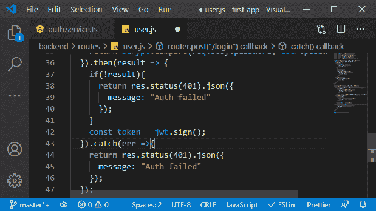

# 均值栈中 SPA 认证的实现

> 原文：<https://www.javatpoint.com/implementing-spa-authentication-in-mean-stack>

在上一节中，我们了解了 **SPA 认证**。现在，在本节中，我们将在我们的项目中实现 SPA 认证。

我们的目标是创建这样一个令牌，并在成功登录后将其返回给用户。我们将使用以下步骤向我们的项目或应用程序添加 SPA 身份验证。

1)我们将回到我们的 **service.js** 文件，在这里，我们需要创建一个拟合路线。到目前为止，我们只获得了一条允许我们创建新用户的路线。在路由文件夹的 **user.js** 文件中，我们将在这里用路由器创建另一条路由。也是发文路线，但是我们会听**/登录**或者实际上**/API/用户/登录**我们知道。在这里，我们有一个包含请求、响应和下一步的方法，当请求到达该路由时，我们会做一些事情。

```

router.post("/login",(req, res, next)=> {

});

```


2)在方法中，我们将创建这样一个令牌。但是首先，我们要验证凭证是否有效。这将是一个多步骤的过程:

a.我们需要找出电子邮件地址是否存在，为此，我们将使用我们的用户模型，并在数据库中找到该模型的实例。我们将传递一个对象来缩小我们想要查找的结果，并寻找一个数据库中的电子邮件地址与我们的请求所附的电子邮件地址相匹配的用户。

```

user.findOne({email: req.body.email});

```


b.现在，我们将使用它链接一个 then block 来处理我们得到响应的情况，该响应将是用户，如果我们有用户，那么我们知道我们有该电子邮件地址。另一方面，如果我们没有找到用户，我们就没有用户。现在，我们将检查用户是否存在。如果用户不存在，我们将返回一个响应，其中我们将状态代码设置为 404，因为我们没有找到用户，或者 401，因为身份验证被拒绝，如果我们愿意，我们将发回一些 JSON 数据。

```

.then(user1=>{
    if(!user1){
      return res.status(401).json({
        message: "Auth failed"
      });
    }
  }));

```


c.我们将在那里返回一个响应，我们之前没有这样做，因为我们在“if”语句之后添加了代码。我们可以把它包装成一个 else 语句，但这意味着多了一层嵌套，我们只想检查我们是否没有用户，返回一个响应，否则继续。我们知道我们确实找到了具有该电子邮件地址的用户，这允许我们将用户在登录表单中输入的密码与存储在数据库中的密码进行比较。

存储在数据库中的密码的问题是，我们用 bcrypt 对其进行了哈希处理，我们知道这样的哈希可以被去哈希。但是如果我们有相同的输入，我们将总是得到相同的散列。因此，我们将使用 bcrypt 的一个有用的函数 **compare** ，即比较函数来比较输入和加密值，bcrypt 将告诉我们该输入是否会产生相同的值，而不需要解密加密值，这是不可能的。

在此功能中，我们将传递来自用户请求的密码和密码，如下所示:

```

bcrypt.compare(req.body.password, user.password);

```

我们实际上会返回一个新的承诺，所以我们只返回比较操作的结果。

```

return bcrypt.compare(req.body.password, user.password);

```


d.我们链接另一个然后阻塞，在那里我们将得到比较操作的结果。如果我们确实比较成功，结果将是真的，如果我们失败，结果将是假的。此外，我们可能会遇到其他错误，因此我们还添加了一个 catch 块。在这里，我们也返回我们不成功的信息。在随后的块中，我们将检查结果是否为真。如果它返回 false，那么我们也返回我们的响应，其中我们拒绝身份验证，如下所示:

```

then(result => {
    if(!result){
      return res.status(401).json({
        message: "Auth failed"
      });
    }
  }).catch(err =>{
    return res.status(401).json({
      message: "Auth failed"
    });

```


e.现在，如果我们有了密码，我们将继续创建 [JSON](https://www.javatpoint.com/json-tutorial) 网络令牌。如果你想了解更多关于 JSON 网络令牌的信息，你可以访问 **io** ，在那里你可以阅读更多关于的信息，在那里你也可以看到这样的令牌会是什么样子。我们不需要从头开始构建，有一个包可以帮助我们，这个包就是**“jsonwebtoken”**。我们将使用以下命令安装此软件包:

```

npm install --save jsonwebtoken

```


这是一个第三方包，帮助我们创建和验证这样的令牌。

f.然后我们将在**下面导入这个包，并在登录路径中使用它来创建一个新的网络令牌。在我们知道用户发送了有效密码的 then 块中，我们将通过运行 **jsonwebtoken** 的符号**方法来创建一个新的令牌。该方法将基于我们选择的一些数据创建一个新的令牌。

```

const jwt = require("jsonwebtoken");
const token = jwt.sign();

```



g.现在，我们选择的输入数据将是一个 javascript 对象，我们在其中存储用户的电子邮件，而不是密码，因为我们不想将数据发送回用户，即使它是加密的。我们还希望发送回该标识，因为这将在以后的前端非常有用，如下所示:

```

const token = jwt.sign({email: user.email, userId: user._id});

```


h.现在，我们必须通过第二个论点。除了有效载荷，我们还需要输入我们自己的秘密，比如我们用来创建这些散列的密码。这将仅存储在服务器上，并将用于验证这些哈希。这就是它们不可破解的原因。通常，这应该是一个很长的单词或很长的字符串组合。

```

const token = jwt.sign({email: user.email, userId: user._id},
      'A_very_long_string_for_our_secret');

```


I .我们还将传递一个允许我们配置该令牌的参数。它将是一个 javascript 对象，我们在其中设置了几个值。其中之一是 expireIn 属性，它允许我们定义这应该持续多长时间。如果我们想查看所有可用的选项，我们可以使用**【智能感知】**查看我们可以设置的值，并可以深入查看该包的官方文档。**expire**用一个字符串来描述持续时间，我们输入类似 1h 的值，这是一个很好的值。那个令牌不应该持续太久，因为我们不能伪造它。当然，它存储在前端。

```

const token = jwt.sign({email: user.email, userId: user._id},
      "A_very_long_string_for_our_secret", 
      { expiresIn: "1h"}

```


如果我们的应用程序不容易受到跨站点脚本攻击，它在那里应该是安全的，但它仍然是一个额外的安全机制，以确保它不会永远持续下去。

这样，我们将获得一个一小时后到期的令牌，现在，我们正在创建该令牌。现在，让我们将它发送回前端，并将前端连接到后端，在下一节课中，连接到这条新路线。

* * *