# 添加令牌来验证平均堆栈中的请求

> 原文：<https://www.javatpoint.com/adding-token-to-authenticate-requests-in-mean-stack>

上一节我们成功实现并使用了我们的 **check-Auth** 中间件来保护某些路由免受未经身份验证的访问。现在，我们希望在前端使用该令牌，并在登录时实际存储它，然后将它附加到我们在后端发送的请求中。我们将使用以下步骤添加令牌来验证请求:

1)首先，我们将转到我们的 auth.service.ts 文件，在那里我们进行登录。我们将定义一个新的属性，它将是字符串类型。最初，这个属性是未定义的，但是在我们获得响应的 login()方法中，我们知道这个响应将保存令牌。因此，我们应该能够从响应中提取令牌。应该有一个令牌属性，我们可以将这个 post 请求配置为如下所示:

```

private token: string;
this.http
      .post(
        "http://localhost:3000/api/user/login",
        authData
      )
      .subscribe(response => {
        const token = response.token;
        this.token = token;
      });

```

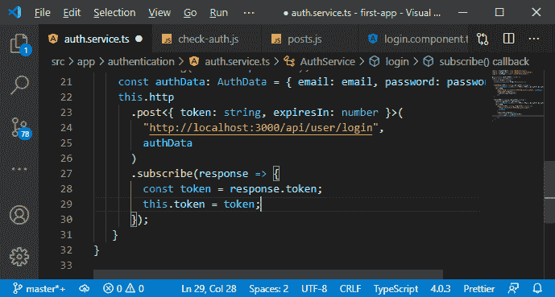

2)我们希望在应用程序的其他部分使用该令牌。我们希望在特定请求的 posts 服务中使用它。为此，我们将在我们的 auth service 文件中添加一个新方法，因为令牌字段是私有的。我们可以把它变成一个公共的，但是我们将在这里简单地添加一个新的方法，即 **getToken()，**，在那里我们将返回这个令牌。

```

getToken(){
    return this.token;
  }

```

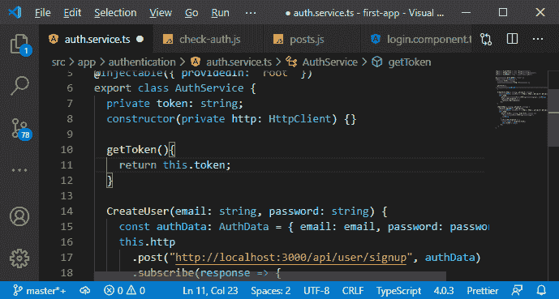

3)现在，我们将返回到我们的 **service.ts** 文件，并获取该令牌来使用它。现在要使用它，我们需要将身份验证服务注入到 posts 服务中，然后向所有发出的 [HTTP 请求](https://www.javatpoint.com/http-request)添加一个头。我们将使用一种不同的方式，我们将为我们的 [HTTP](https://www.javatpoint.com/http) 客户端创建一个所谓的拦截器，这是 angular http 客户端提供的一个特性。我们可以添加一个拦截器，它是将在任何传出的 HTTP 请求上运行的函数，然后我们可以操纵这些传出的请求，例如，附加我们的令牌，这正是我们想要做的。

因此，我们将在身份验证文件夹中创建一个新文件，并将其命名为 auth-interceptor.ts，以表明我们在其中有一个拦截器。

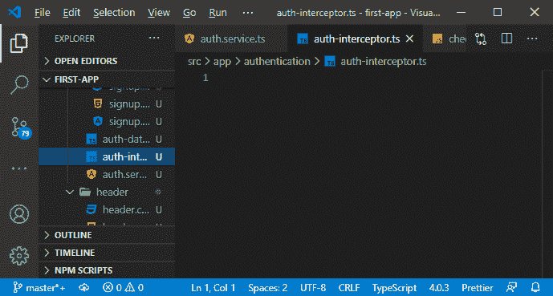

4)现在，这是 angular http 客户端提供的一个官方特性，我们通过创建一个普通类并赋予其名称 **AuthInterceptor** 来创建这样一个拦截器。这个类必须实现 angular 提供的接口，即 **HttpInterceptor，**，我们定义 **intercept()** 方法如下:

```

import { HttpInterceptor } from '@angular/common/http';

export class AuthInterceptor implements HttpInterceptor{
  intercept()
}

```

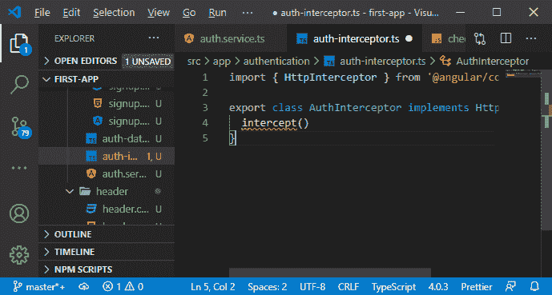

5)这个 intercept()方法接受两个参数。第一个是我们正在拦截的请求，因为我们提到这是为传出请求运行的，这是 HttpRequest 类型，这是一个静态类型，可以包装所有类型的信息和数据。

```

intercept(req: HttpRequest){

  } 
```

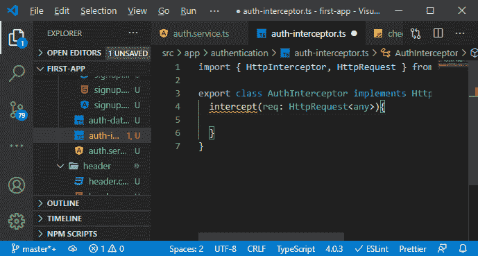

6)第二个论点是我们可能从[节点](https://www.javatpoint.com/nodejs-tutorial)端的中间件中了解到的。我们还有下一个论点，这个拦截器的工作原理很像中间件，只是用于传出请求，而不是传入请求。因此，我们没有响应对象，因为我们无法配置响应。我们只是参与发送请求。

但是我们确实得到了这个请求，然后我们得到了允许我们离开拦截器并允许我们的应用程序的其他部分，例如，我们订阅响应的部分。我们允许这些部分接受该请求及其响应。因此，这就是为什么我们需要 next 来允许拦截器或该拦截器中的请求继续通过我们的应用程序，并且下一个参数的类型是 HttpHandler。

```

intercept(req: HttpRequest, next: HttpHandler){

  } 
```

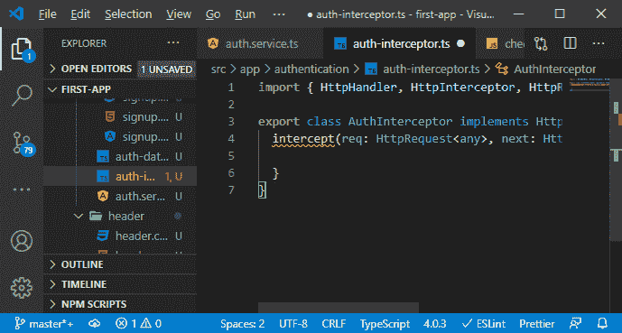

7)这个方法必须返回一些东西，这个方法将返回对 next.handle()的调用。next 提供了这个句柄方法，这里我们允许请求继续它的旅程。因此，我们可以在 handle 方法中传递请求，这将是一个有效的拦截器，不会做任何事情。这将只接受请求，并允许它在不被更改的情况下继续。

```

intercept(req: HttpRequest, next: HttpHandler){
    return next.handle(req);
  } 
```

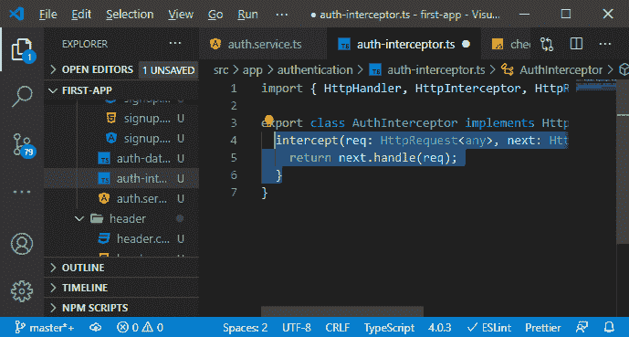

8)现在，我们将改变它，我们将创建一个新的常量来保存我们的令牌，为此，我们需要将我们的身份验证服务注入到这个拦截器中，因为我们可以从那里获得令牌。接收该注入服务的服务必须具有@ Injectable 注释，以便将服务注入到其他服务中。因为我们提供服务的方式，我们把它加到了所有其他服务中。我们将以不同的方式提供拦截器，因为 angular http 客户端要求我们以不同的方式提供它。

但是我们仍然需要添加一个空的可注入注释，这样我们就可以将服务注入到这个服务中，这是 angular 的要求。

```

import { Injectable } from '@angular/core';
@Injectable()
constructor(private authservice: AuthService){}

```

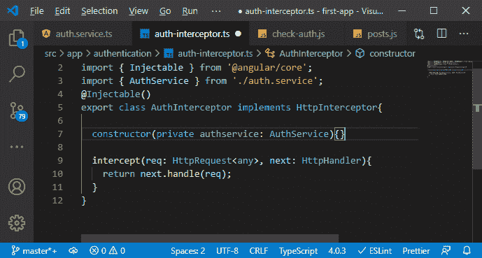

9)现在，我们将在这个拦截器类中使用 authservice。我们将使用它来创建一个新的令牌，只需调用 authservice 类的 getToken()方法，如下所示:

```

const authToken = this.authservice.getToken();

```

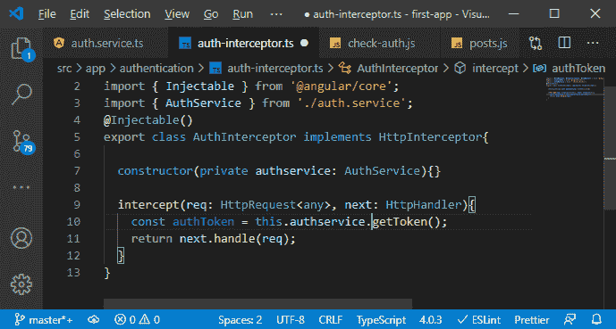

10)现在，我们操纵持有这个令牌的请求，我们应该在操纵它之前克隆它。我们必须这样做，因为如果我们直接编辑那个传出的请求，由于请求在内部工作和内部处理的方式，我们将导致不必要的副作用和问题。因此，我们将创建一个新的常量，并在那里调用请求的 clone()方法，该方法将创建该请求的副本。我们可以通过克隆的配置不仅克隆请求，还可以编辑克隆。我们想编辑它，实际上，我们想精确地编辑它的标题。

标题应该是我们最初的请求标题，但是我们也想看到一个额外的标题，我们可以用集合来完成。

```

 const authRequest = req.clone({
      headers: req.headers.set
    });

```

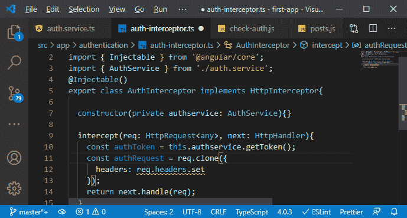

11)该设置听起来像是会覆盖所有旧的标头，但它不会。它只添加一个新的头，并为其设置值，但如果该头已经存在，它将覆盖它。因此，在克隆函数中，我们将设置授权头，该值将是我们的 authToken。

```

headers: req.headers.set("Authorization", authToken)

```

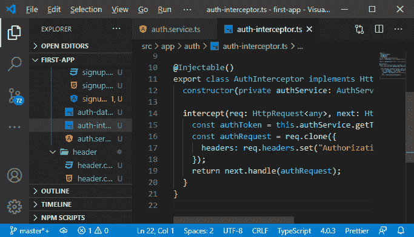

这将创建一个请求，该请求包含我们令牌的授权头，现在是我们想要转发的授权请求，现在应该离开我们的应用程序。

12)现在我们接受或处理一个传入的请求，并在授权头上添加我们的令牌。准确地说，这是行不通的。还记得我们提到的不记名词吗？我们的值实际上应该是载体，然后是空白，然后是 authToken，如下所示:

```

headers: req.headers.set("Authorization", "Bearer"+ authToken)

```

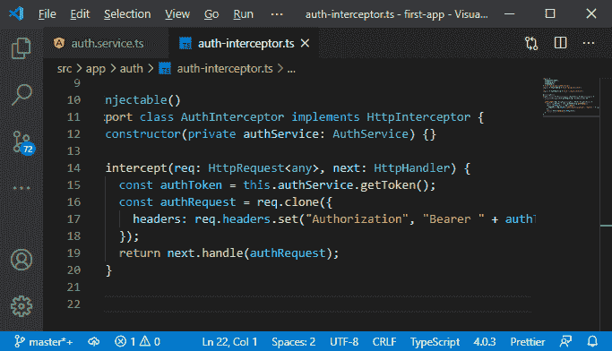

这是我们在后端提取数据的方式，我们可以省略这一点，这只是我们经常看到的约定。

13)所以，现在我们添加了这个，但是忽略了我们的中间件。我们不需要将其添加到我们的 Angular 应用程序中。要添加它，我们必须将它作为服务注入或者作为服务提供，但是不是用提供的根，而是有点不同。我们将转到我们的 **module.ts** 文件，在那里我们向提供者的数组中添加一个新对象或一个 javascript 对象。这个对象必须有几个属性。

a.第一个属性是 provide 属性，在这里我们提供一个令牌，即 **HTTP_INTERCEPTOR** 。这个令牌是从@angular/common/http 导入的。

```

providers: [{provide: HTTP_INTERCEPTORS}],

```

b.因为现在我们告诉 angular，嘿，对于 angular 要寻找的标识符，angular http 客户端会寻找它，对于这个令牌，我们想要提供一个新的值。然后这个值被提供了 useClass 属性，在这里，我们必须指向我们的拦截器，即 **Auth-interceptor** 。

```

providers: [{provide: HTTP_INTERCEPTORS, useClass:AuthInterceptor}],

```

c.现在，我们可以在一个应用中有多个拦截器，所以我们设置第三个值，即 **multi** ，并将其值设置为 true。

```

providers: [{provide: HTTP_INTERCEPTORS, 
    useClass:AuthInterceptor, multi: true}],

```

这只是告诉 angular 不会覆盖现有的拦截器，而是将其添加为一个附加的拦截器，angular http 客户端将处理内部事务。

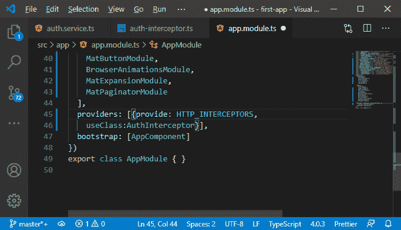

现在，我们的拦截器已注册，每个传出的请求都将收到该令牌。这也意味着不需要该令牌的请求将会收到它，但是会有未定义的，应该不会有问题。

我们将返回到我们的应用程序，并尝试在登录后插入一个新帖子。

#### 注意:我们将获得“预检响应中的访问控制-允许-标题不允许请求标题字段授权”。我们会得到这个错误，因为我们不允许这个标题。因此，我们将在 app.js 文件的后端允许这个头，并将 Authorization 头设置如下:

```

res.setHeader(
    "Access-Control-Allow-Headers",
    "Origin, X-Requested-With, Content-Type, Accept, Authorization");

```

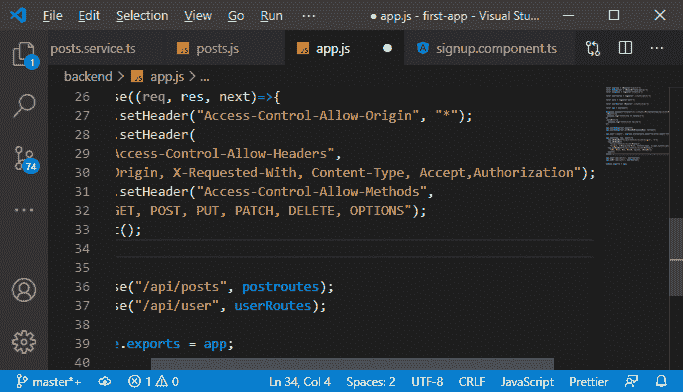

现在，如果我们转到我们的 angular 应用程序，我们没有得到这个错误。

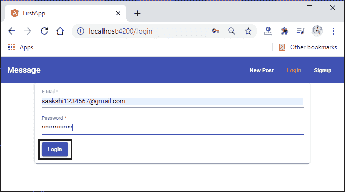
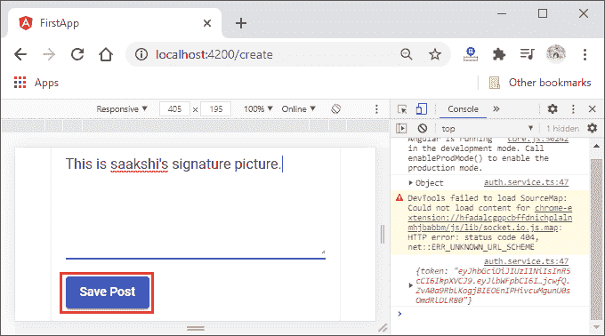
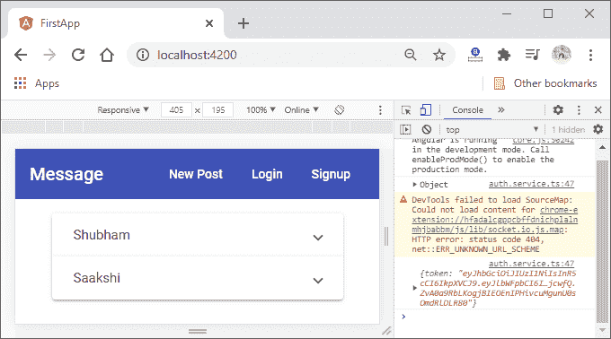

现在，一切都很好，但是我们的头球看起来很糟糕。我们将在下一节中改进 UI 头，以反映身份验证状态。

* * *