# 改进用户界面头以反映 MEAN 栈中的认证状态

> 原文：<https://www.javatpoint.com/improving-ui-header-to-reflect-authentication-status-in-mean-stack>

在前面的部分中，我们成功地添加了令牌来验证请求。理论上，我们的应用程序现在是从身份验证的角度进行的。从用户体验的角度来看，没有那么多。我们无法判断我们是否被认证，也无法判断我们被允许做什么或不被允许做什么。所以，我们要做的是，如果我们登录了，我们需要隐藏登录和注册按钮。我们需要显示一个删除令牌的注销按钮。我们还有一个问题，我们看不到我们是否被允许删除或编辑文章。我们总是看到这些按钮，新帖子也是如此。我们看到即使我们没有被认证。

因此，我们希望调整 UI 头以反映我们的身份验证状态，因为这将防止一些不必要的错误。如果我们重新加载页面，我们的令牌就没了，这是另一个问题。我们的令牌没有了，因为我们只把它存储在 angular 服务中，而那只是存储在正在运行的 [JavaScript](https://www.javatpoint.com/javascript-tutorial) 中，所以在内存和重载中，页面重新启动 angular app，因此，所有的东西都存储在服务中，因此内存没有了。因此，我们还希望将该令牌存储在其他地方，以便它可以在页面重新加载时存活。接下来我们将做所有这些事情。

现在，我们将首先更新用户界面。我们将执行以下步骤来更新用户界面:

1)我们将令牌存储在 auth 服务中，因此我们可以将该服务注入到任何需要该令牌来更新 UI 的组件中，其中一个这样的组件是 header 组件。在标题组件中，我们有几个链接，我们只想显示用户是否经过身份验证。另一方面，我们想添加一个新的列表项，允许我们注销。这不应该是一个环节；它应该是一个按钮，因此不会有路由器链接。

```

<li>
     <button mat-button>Logout</button>
</li>

```

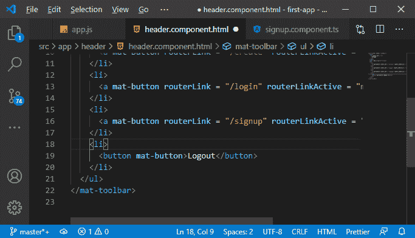

2)现在，我们将返回到我们的**组件. ts** 文件，在这里我们将身份验证服务注入到我们拥有令牌的地方。之后，我们使用该身份验证服务来获取该令牌。

```

export class HeaderComponent {
  constructor(private authService: AuthService){}
}

```

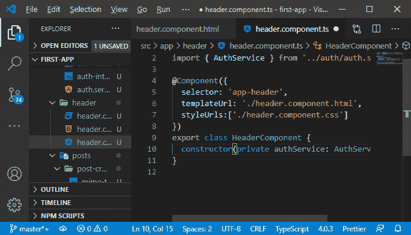

3)我们也应该有一些听众，就像我们的帖子一样，因为这当然会改变。例如，如果我们注销并清除该令牌，那么我们希望能够将该令牌信息推送到我们感兴趣的组件。因此，我们将首先转到我们的 **service.ts** 文件，除了在那里存储令牌之外，我们还希望有另一个值或属性，即 **authStatusListener** 。这个侦听器将是一个新的主体，它将被用来将身份验证信息推送到感兴趣的组件。这个主题将是一个泛型类型，目前，它将包装一个布尔值，因为我们并不真正需要我们的另一个组件中的标记。我们只需要在拦截器中使用它。

```

import { Subject } from "rxjs";
private authStatusListener = new Subject(); 
```

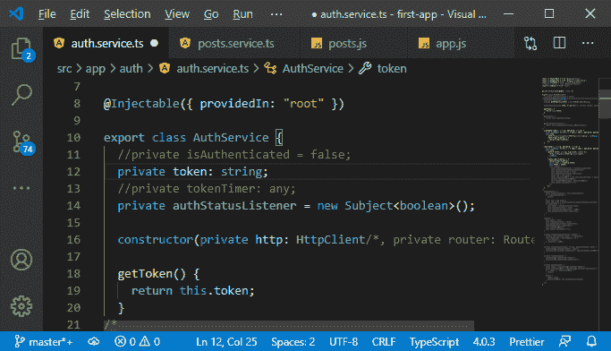

4)我们会增加一个新的方法，即 **getAuthStatusListener** 。这是一个私有属性，因为我们只想返回该侦听器的可观察部分。因此，我们将返回 AuthStatusListener 作为可观察的，这样我们就不能从其他组件发出新的值。我们只希望能够从服务内部发出声音，当然也希望能够从应用的其他部分听到声音。

```

getAuthStatusListener() {
    return this.authStatusListener.asObservable();
  }

```

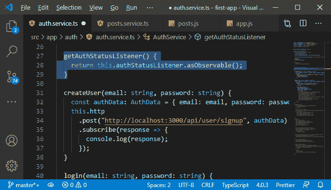

5)现在其他部分可以调用这个方法来获取监听器。我们想要在获得令牌后，在我们的 **login()** 方法中发出一个新值。我们将使用侦听器并调用 next()方法。在这个方法中，我们像这样传递 true 值:

```

this.authStatusListener.next(true);

```

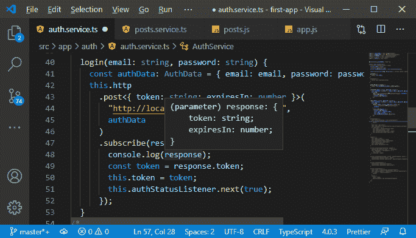

6)我们得到了一种通知每个对被认证的用户感兴趣的人的方法，现在我们回到我们的头组件，在那里我们注入了认证服务。这里，我们现在将实现 **OnInit，**，它将从@angular/core 导入。我们将通过添加 ngOnInit 方法来实现它。

```

export class HeaderComponent implements OnInit{
  constructor(private authService: AuthService){}
  ngOnInit(){ 
  }
}

```

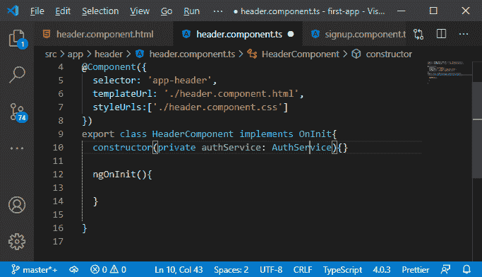

7)现在，在这个方法中，我们将设置对 AuthStatusListener 的订阅。我们知道我们管理的可观察对象或主题的订阅也需要管理，所以如果组件被破坏，我们应该取消订阅。因此，我们也将实现 onDestroy，这迫使我们也添加了 ngOnDestroy 方法。

```

export class HeaderComponent implements OnInit, OnDestroy{
  constructor(private authService: AuthService){}
  ngOnDestroy(){
  }
}

```

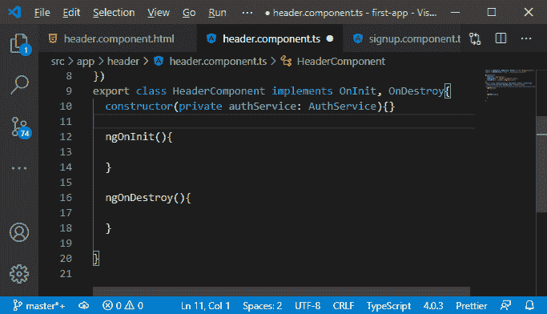

8)我们将添加新的私有属性，即 authListenerSubs，该属性将是订阅类型。之后，在 ngOnInit()方法中，我们将这个属性设置为我们从 authService 的 getAuthStatusListener()方法中设置的订阅，然后订阅如下:

```

private authListenerSubs: Subscription;
this.authListenerSubs = this.authService.getAuthStatusListener().subscribe();

```

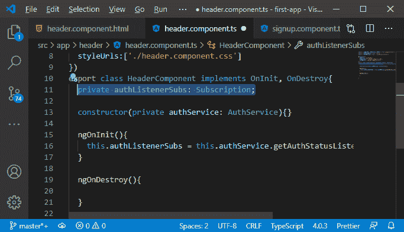

9)在 ngOnDestroy()方法中，我们将接受该订阅并取消订阅。

```

ngOnDestroy(){
    this.authListenerSubs.unsubscribe();
  }

```

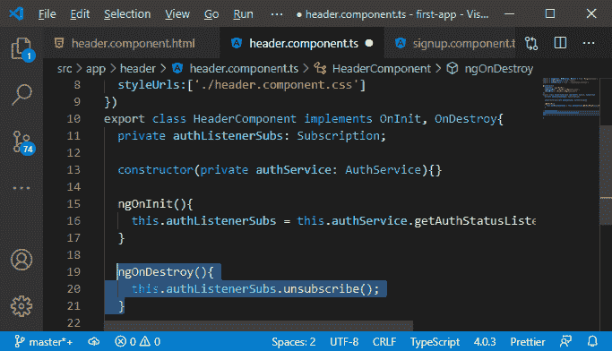

10)在订阅方法中，我们会得到结果，我们在这里做一些事情。我们将设置另一个属性来存储订阅结果。该属性最初为假。

```

public userIsAuthenticated = false;
.subscribe(isAuthenticated=>{
      this.userIsAuthenticated = isAuthenticated;
    });

```

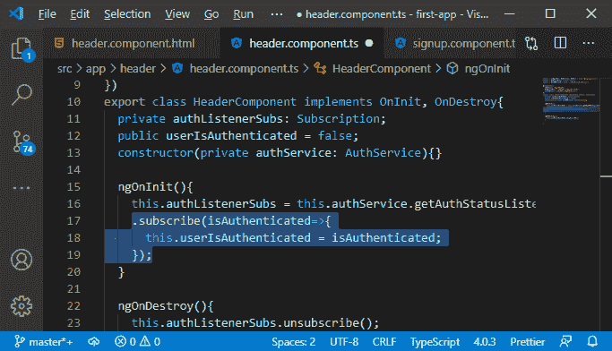

11)因此，现在我们可以将这些信息推送给组件，并在组件中使用它们，比如这个头组件。现在，我们将在 header.component.html 文件中使用 userIsAuthenticated 属性。对于新的帖子列表项，我们将添加 ngIf 并将其设置为 userIsAuthenticated。因此，如果用户仅经过身份验证，那么我们将看到这一点。

```

<li *ngIf = "userIsAuthenticated">
      <a mat-button routerLink = "/create" routerLinkActive = "mat-accent"> New Post</a>
    </li>

```

同样，我们将为我们的注销按钮添加这个。对于登录和注册按钮，我们将设置*ngIf 等于"！用户身份验证”如下所示:

```

<li *ngIf = "!userIsAuthenticated">
      <a mat-button routerLink = "/login" routerLinkActive = "mat-accent">Login</a>
    </li>
    <li *ngIf = "!userIsAuthenticated">
      <a mat-button routerLink = "/signup" routerLinkActive = "mat-accent">Signup</a>
    </li>
    <li *ngIf = "userIsAuthenticated">
      <button mat-button>Logout</button>
    </li>

```

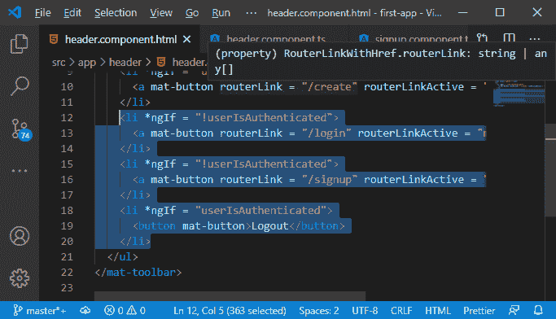

现在，我们保存所有文件，回到我们的 angular 应用程序。我们将只看到登录和注册按钮，成功登录后，我们将看到新的发布和注销按钮。

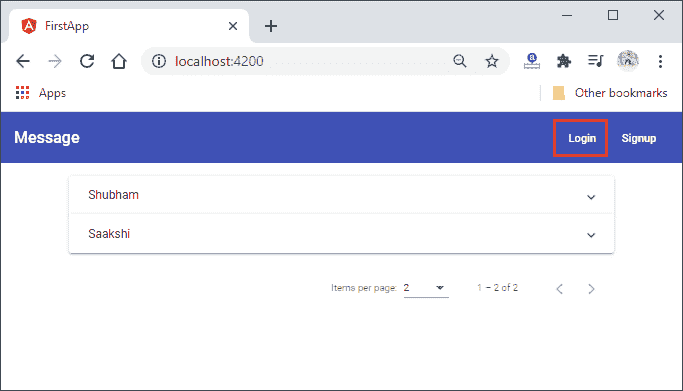
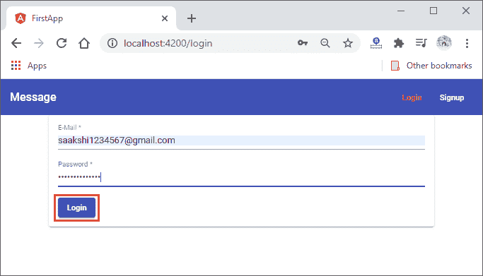
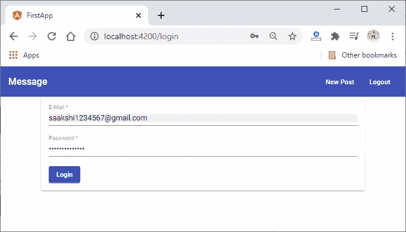

一切都运行良好，我们需要做的是，我们需要改进 UI 消息以反映身份验证状态。这是我们在下一节将要做的事情。

* * *