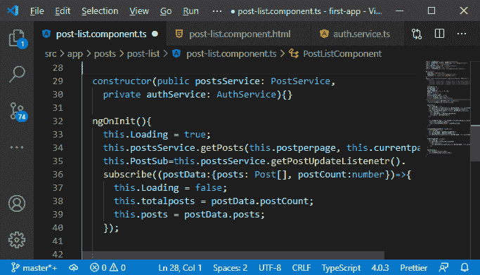
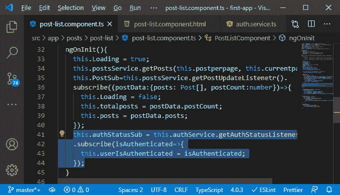
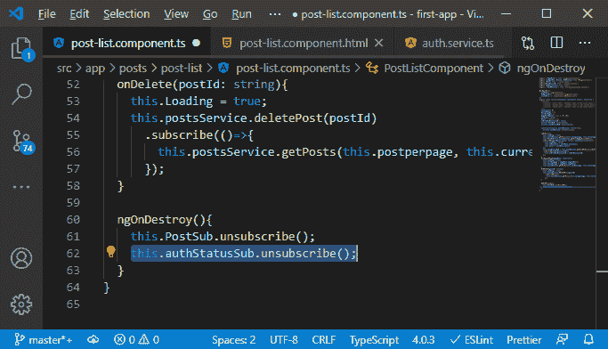
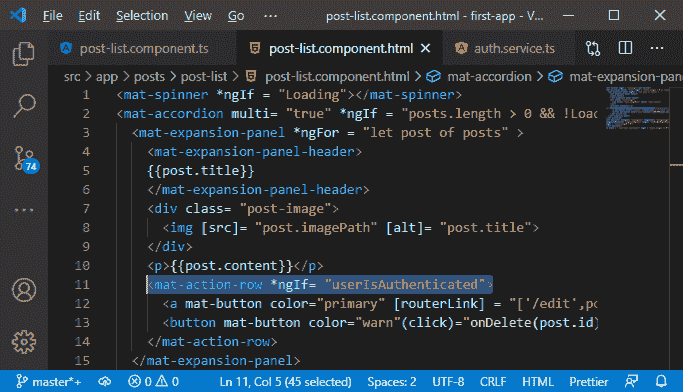
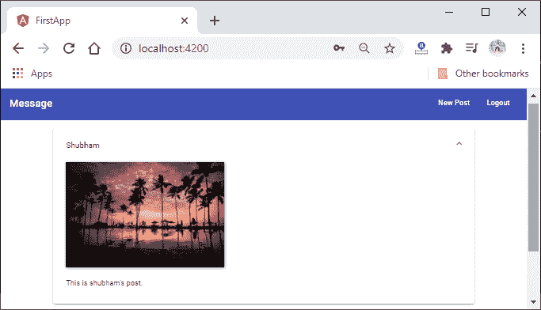
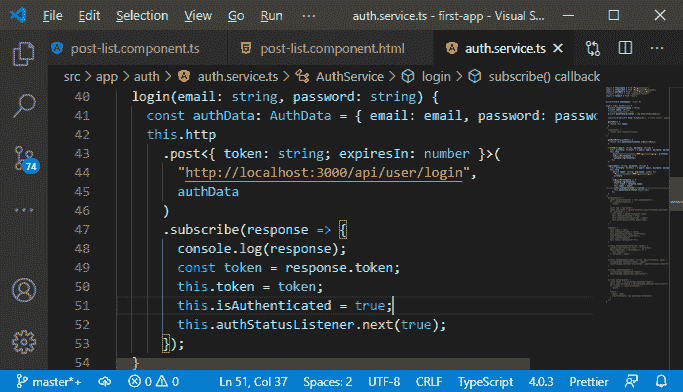
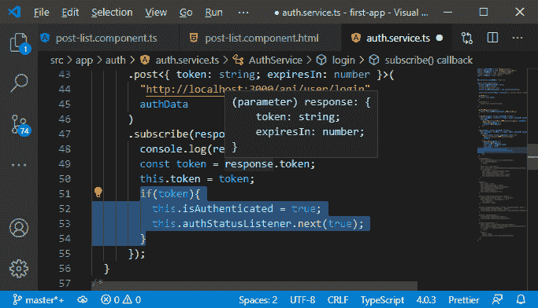
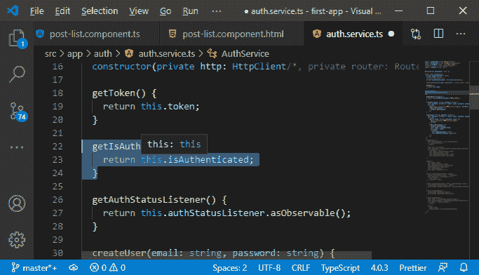
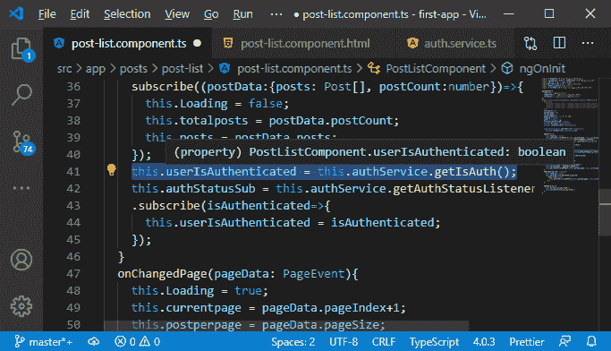
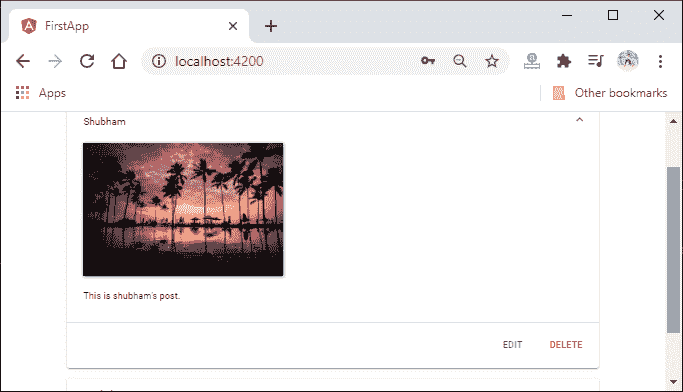

# 改进用户界面消息以反映MEAN 栈中的认证状态

> 原文：<https://www.javatpoint.com/improving-ui-messages-to-reflect-authentication-status-in-mean-stack>

在前一节中，我们成功地改进了 UI 头。我们将对我们的信息做同样的事情。我们希望仅在通过身份验证时显示编辑和删除按钮。我们将实现与我们在改进 UI 头时实现的逻辑相同的逻辑。为此，我们将执行以下步骤:

1)我们将转到 **post-list.component.ts** 文件，并将我们的身份验证服务注入构造函数，如下所示:

```

constructor(public postsService: PostService,
    private authService: AuthService){}

```



2)现在，我们再次需要设置一个侦听器，所以我们将为订阅添加一个私有属性，即**authstatusubs**，它将是订阅类型。在这个组件中，我们已经设置了 ngOnInit()和 onDestroy()方法。我们将转到 ngOnInit()方法，这里我们将在服务后订阅旁边设置侦听器。我们将调用我们的 authservice 的 **getAuthStatusListener()** 方法，并将 subscribe 方法附加到它上面。

```

private authStatusSub: Subscription;
tthis.authService.getAuthStatusListener()
    .subscribe();

```

我们知道订阅调用结果就是订阅，我们将它存储到**authstatusub**属性中。

```

this.authStatusSub = this.authService.getAuthStatusListener()
    .subscribe();

```

我们需要在 subscribe 方法中做一些事情。在 subscribe 方法中，我们知道我们得到了布尔类型的结果。我们将把结果存储在一个新的属性中，即 **userIsAuthenticated** 。

```

this.authStatusSub = this.authService.getAuthStatusListener()
    .subscribe(isAuthenticated=>{
      this.userIsAuthenticated = isAuthenticated;
    });

```



3)我们还需要取消订阅 onDestroy()上的**authstatusub**。我们将以下列方式进行:

```

this.authStatusSub.unsubscribe();

```



4)现在，我们将在模板中使用该用户身份验证属性。所以，我们将回到我们的 **post-list.component.ts** 文件，我们知道我们需要限制那个 **mat-action-row** ，它有编辑和删除按钮。因此，我们将设置 ***ngIf** 等于**用户认证**。

```

<mat-action-row *ngIf= "userIsAuthenticated">

```



现在，编辑和删除按钮应该只在我们通过身份验证时显示。我们保存所有文件，并转到我们的 angular 应用程序。如果我们没有登录，我们将看不到编辑和删除按钮。因此，在未经身份验证的用户的情况下，它可以正常工作，但是如果用户在登录后访问它，他也不会看到按钮。



现在，问题出在后列表部分。我们正在设置侦听器，这意味着每当我们推送身份验证信息时，都会在这里进行更新。问题是后列表组件是在我们登录后加载的，因为我们已经导航到了它。ngOnInit()方法只在我们验证了自己之后运行。因此，这意味着在创建后列表组件后没有新信息被推送，我们在这里不获取当前信息，我们只是推送新信息。

5)有几种方法可以解决这个问题。使用不同类型的主题是其中之一。有一个主题会自动产生我们之前的值，但是我们将使用一个非常直接的方式来代替。在 authservice 中，我们将添加一个新属性。即**是经过身份验证的**，我们最初会将其设置为 false。我们将在推送该信息的相同位置将其设置为真。

```

private isAuthenticated = false;
this.isAuthenticated = true;

```



6)如果我们有代币，我们想这样做。我们将首先检查我们是否有那个令牌，因为我们可能会得到一个不包含令牌的响应。因此，只有我们有一个令牌，我们将设置**为真，并设置监听器。**

```

if(token){
          this.isAuthenticated = true;
          this.authStatusListener.next(true);
}

```



7)现在，我们有了这个经过身份验证的属性。我们可以在顶部添加一个新的方法，即 **getAuthStatus()** ，在那里我们将返回这个 **isAuthenticated**

```

getIsAuth() {
    return this.isAuthenticated;
  }

```



8)现在，我们将调用此方法来了解用户是否经过身份验证。因此，在后列表组件中，我们将简单地调用该方法来获取该信息。

```

this.userIsAuthenticated = this.authService.getIsAuth();

```



现在，我们保存所有文件，并尝试在登录后查看消息。



一切正常，现在我们需要连接注销按钮。我们还有另一个问题，那就是如果我们没有通过身份验证，我们仍然可以通过手动输入网址来创建一个新的帖子，我们希望防止这种情况。我们将在下一节稍后做所有这些事情。

* * *