# 连接注销按钮并在均值堆栈中重定向用户

> 原文：<https://www.javatpoint.com/connecting-logout-button-and-redirecting-user-in-mean-stack>

在我们前面的部分中，我们成功地改进了 UI 头和 UI 消息。在本节中，我们将学习如何连接注销按钮以及如何将用户重定向到 [MEAN Stack](https://www.javatpoint.com/mean-stack) 。我们将一步一步地学习这两个东西，我们首先学习如何将注销按钮连接到应用程序。我们将使用以下步骤来做到这一点:

1)我们将返回到我们的**组件. ts** 文件，并在注销按钮上添加一个点击监听器。我们将在按钮点击上执行**在线登录()**方法。

```

<li *ngIf = "userIsAuthenticated">
      <button mat-button (click)= "onLogout()">Logout</button>
    </li>

```

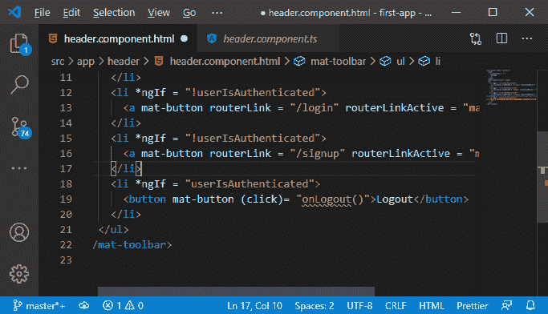

2)现在，我们需要在 **component.ts** 文件中添加这个方法。该方法应该清除令牌，并将更改的身份验证状态通知页面上所有感兴趣的部分。

```

onLogout(){

  }

```

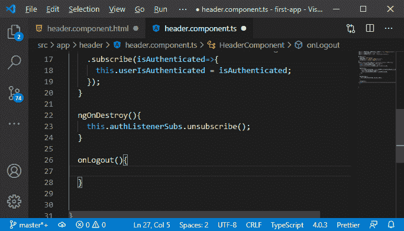

3)我们需要再次编辑身份验证服务，这里我们需要一个新的方法，即注销。在这个方法中，我们想做两件主要的事情，也就是说，我们将把令牌设置为空来清除它，并把 isAuthenticated 设置为 false。

```

logout() {
    this.token = null;
    this.isAuthenticated = false;
  }

```

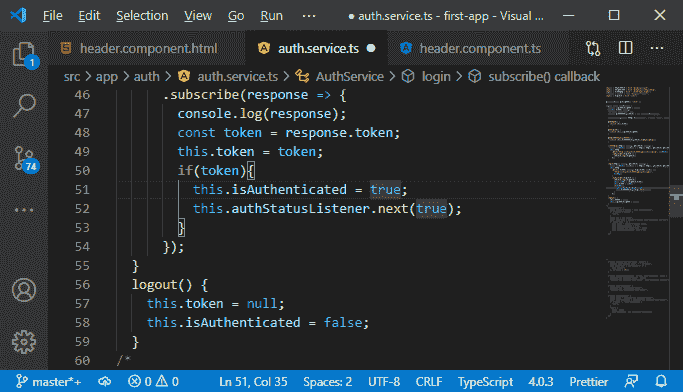

4)现在，我们需要将这些信息传递给任何感兴趣的人。因此，我们将使用我们的 authStatusListener 主题并推送一个新值，该值为 false，因为用户现在不再经过身份验证。

```

this.authStatusListener.next(false);

```

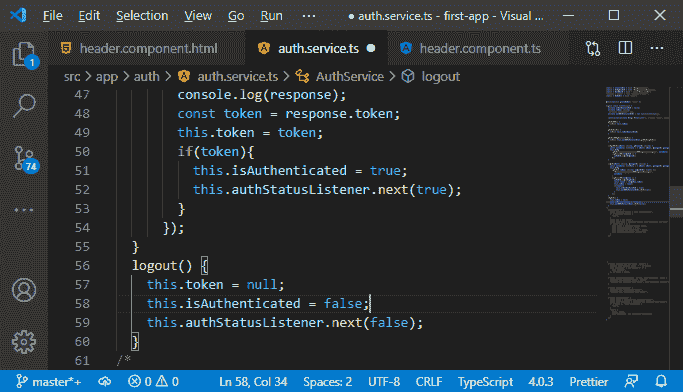

5)应该从标题组件中的 onLogout()方法中调用注销方法。因此，我们将到达我们的 authservice，然后调用 logout()方法。

```

onLogout(){
    this.authService.logout();
  }

```

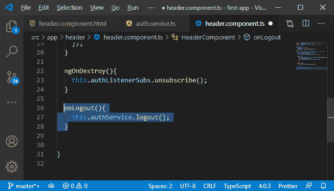

我们将保存所有文件并转到我们的 angular 应用程序。

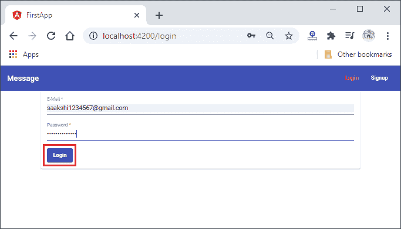
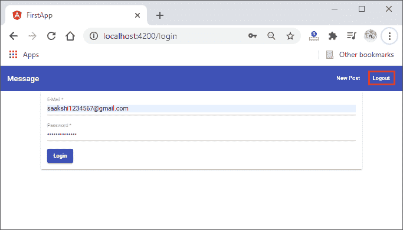
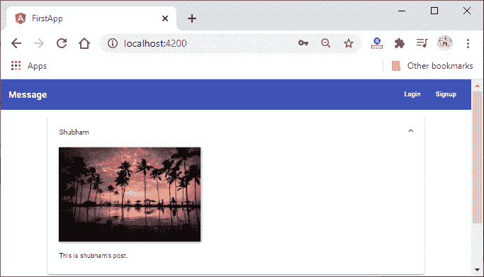

一切都很好，现在我们将学习如何重定向用户。我们将使用以下步骤来重定向用户:

我们将在我们的身份验证服务中实现重定向逻辑，身份验证服务是一个很好的地方，因为在那里我们可以登录和注销。

1)因此，为了重定向用户，我们必须注入@angular/router。我们将向构造函数添加一个新的参数，它属于路由器类型。路由器是从@angular/router 导入的对象或类。

```

import { Router } from "@angular/router";
constructor(private http: HttpClient, private router: Router) {}

```

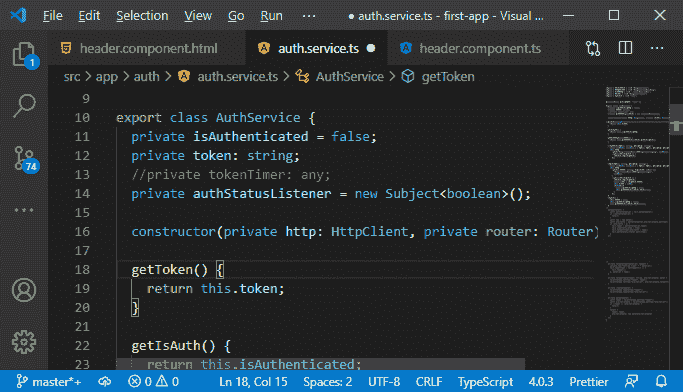

2)现在，我们将在 login()方法中使用它。在 subscribe 方法中，当我们知道我们有一个有效的令牌时，我们将到达我们的路由器并调用 navigate()方法。我们希望导航到主页，因此我们将向该函数传递斜杠(/)。

```

this.router.navigate(['/']);

```

如果我们注销，我们也想导航到那里。在那里，一旦我们清除了所有内容，我们就想离开我们所在的页面，回到主页。

```

this.router.navigate(['/']); 

```

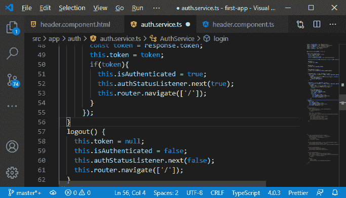

现在，我们将检查登录或注销后是否会重定向到主页。


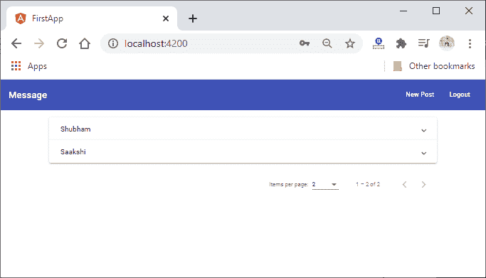

3)重定向到主页运行良好。我们可能会注意到，如果单击登录，我们必须等待很短的时间。我们发送请求并在服务器上验证用户所花费的时间。在那里展示一个旋转器会很好。这只是一件小事，但是我们想在登录和注册组件中添加这样的微调器。我们已经在应用程序中包含了微调组件，在注册和登录组件的按钮下方添加了一个微调器**。为此，我们需要知道我们是否正在加载。我们已经在两个组件中使用了 Loading 属性，我们只需要在加载时设置它。**

因此，在 onSignup()方法中，我们将把 Loading 设置为 true，在 onLogin()方法中也是如此。

**登录:**

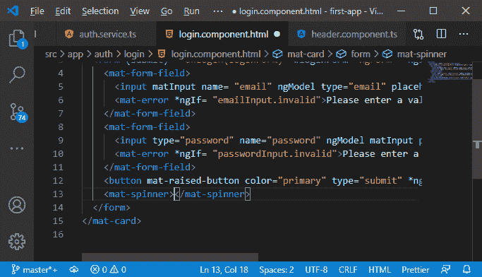
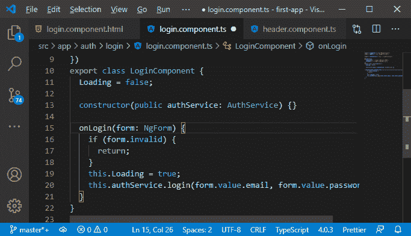

**注册:**

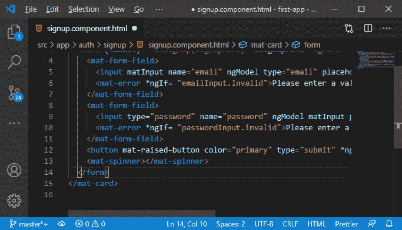
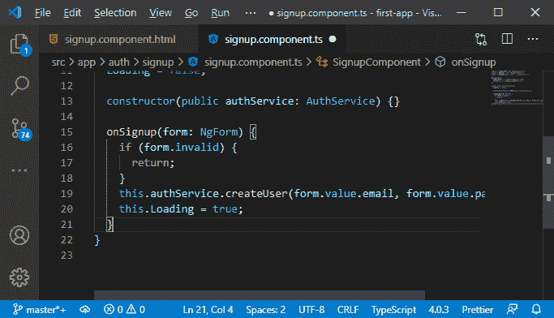

4)现在，在模板中，我们将使用它。如果我们正在加载，我们希望隐藏该按钮，同时，我们希望旋转它们。

```

    <button mat-raised-button color="primary" type="submit" *ngIf= "!Loading">Login</button>
    <mat-spinner *ngIf= "Loading"></mat-spinner>

```

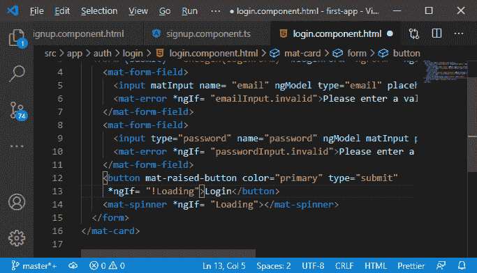

我们将为我们的注册组件实现相同的逻辑。

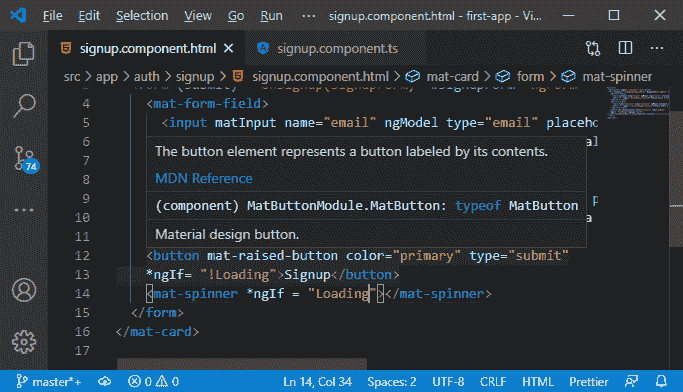

#### 注意:我们已经实现了顶部的<mat-spinner>，所以我们会建议您删除那个<mat-spinner>，我们在登录和注册组件模板中的按钮下面实现了它。</mat-spinner></mat-spinner>

现在，我们将回到我们的 angular 应用程序，并尝试登录或注册，以检查我们的 spinner 是否工作良好。

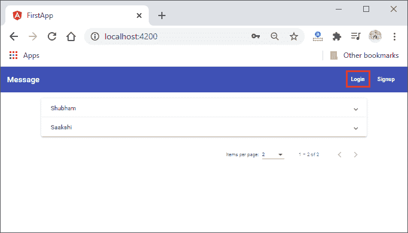
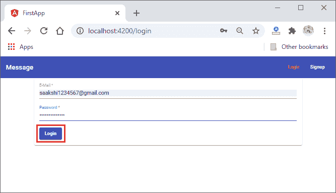
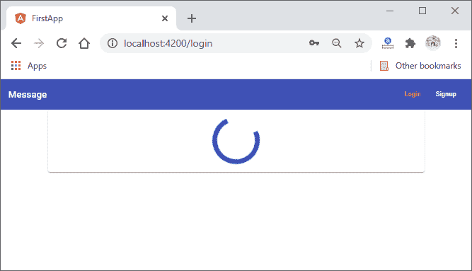
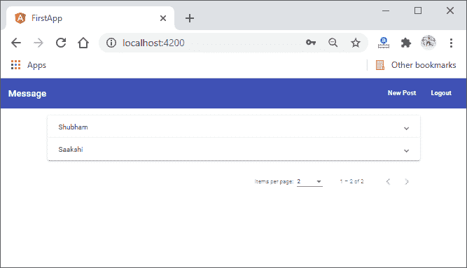

一切都很顺利。下一件事是守卫路线，因为我们可以通过访问该网址来访问新的帖子页面。我们将在下一节稍后进行。

* * *