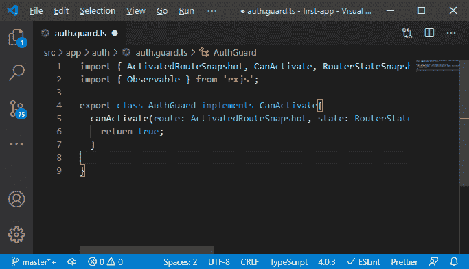

# 在MEAN 栈中添加路由保护

> 原文：<https://www.javatpoint.com/adding-route-guards-in-mean-stack>

在前面的部分中，我们成功地连接了注销按钮并重定向了用户。我们仍然可以编辑或添加一篇文章，如果我们没有通过认证，只需直接访问该网址。为了防止这种情况，我们需要守卫一些路线，这样我们就不能这样做。我们将使用以下步骤来添加防护:

1)我们将在我们的 auth 文件夹中创建一个 guard，并将它命名为 auth.guard.ts，它基本上是一个[TypeScript](https://www.javatpoint.com/typescript-tutorial)文件。


2)这是我们导出的一个类，我们把这个类命名为 **AuthGuard** 。这个 Guard 意味着 angular 添加一些接口，强制类添加某些方法， **@angular/router** 可以在加载路由之前执行这些方法，以检查它是否应该继续或做其他事情。其中一个帮助我们保护路由的接口是 **CanActive** 接口，我们需要从@angular/router 导入该接口。

```

import { CanActivate } from '@angular/router';
export class AuthGuard implements CanActivate{
}

```


3)这个激活接口是通过以下方式实现的:


```

export class AuthGuard implements CanActivate{
  canActivate(route: ActivatedRouteSnapshot, state: RouterStateSnapshot): boolean | UrlTree | Observable<boolean | UrlTree> | Promise<boolean | UrlTree> {
    throw new Error('Method not implemented.');
  }

}

```


如果您没有使用那个 [IDE](https://www.javatpoint.com/ide-full-form) ，您必须手动添加这个方法。

4)我们将删除 throw 语句，而不是返回这样一个布尔值。如果我们返回真或一个承诺或一个可观察到的结果最终为真，那么路由器将知道我们保护的路由是可访问的，用户可以访问它。如果我们返回 false，路由器将拒绝前往那里。在返回 false 之前，我们还应该引导用户离开并重定向。否则，我们只会阻止页面的加载，而不会提供替代方案。

```

export class AuthGuard implements CanActivate{
  canActivate(route: ActivatedRouteSnapshot, state: RouterStateSnapshot): boolean | UrlTree | Observable<boolean | UrlTree> | Promise<boolean | UrlTree> {
    return true;
  }
}

```



5)我们不想将真或假硬编码到该文件中。我们希望从 auth 服务中获取该信息，在那里我们存储关于用户是否经过身份验证的信息。因此，我们将通过注入它来访问该服务，为了向该 auth-guard 注入一些东西，我们必须添加@ Injectable 注释，因为我们的 auth-guard 也是一个服务。

```

@Injectable()
export class AuthGuard implements CanActivate{

  constructor(private authService: AuthService){}
  …
  …
}

```


6)现在，我们将在 **canActivate()** 中使用它。我们将创建一个新的常量 **isAuth** 并调用 Auth 服务的 getIsAuth()方法，因为它保存了用户是否通过身份验证的信息，并且在我们登录或注销时会更新。

```

const isAuth = this.authService.getIsAuth();

```


7)现在，我们将简单地检查用户是否通过身份验证。如果用户通过了身份验证，那么我们返回 true。否则，我们希望远离用户。我们将通过注入路由器来做到这一点，在注入路由器之后，我们将使用路由器的导航方法和方括号['/login '中的 pass/log in]来导航到登录页面。

```

constructor(private authService: AuthService, private router:Router){}
canActivate(route: ActivatedRouteSnapshot, state: RouterStateSnapshot): boolean | UrlTree | Observable<boolean | UrlTree> | Promise<boolean | UrlTree> {
    const isAuth = this.authService.getIsAuth();
    if(!isAuth){
      this.router.navigate(['/login']);
    }
    return isAuth;
  }

```


8)现在，我们需要添加这个 Guard，我们会将其添加到 app 路由模块中。既然是服务，我们就要提供。因此，我们将添加一个提供者数组，在这个数组中，我们将添加我们的 auth guard。

```

providers:[AuthGuard]

```


9)现在，我们需要将其附加到我们想要保护的路线上。我们希望保护、创建和编辑路由。我们可以添加另一个属性， **canActivate，**每当路由器试图加载或试图激活这些路由时，它都会采取一系列我们想要在这些路由上运行的防护。

```

const routes: Routes = [
    …
    { path: 'create', component: PostCreateComponent, canActivate: [AuthGuard]},
    { path: 'edit/:postId', component: PostCreateComponent, canActivate:[AuthGuard]},
   …
   …
  ];

```


现在，两条路由都受到保护，这意味着如果我们现在重新加载并手动输入创建和编辑页面 url，我们将导航到登录页面。


是的，我们的授权警卫工作得很好。现在，我们还将防止用户做一些注定失败的事情，这将提供糟糕的用户体验。我们现在可以避免这种情况，因为现在用户不能进入他试图做他不能做的事情的情况。

* * *