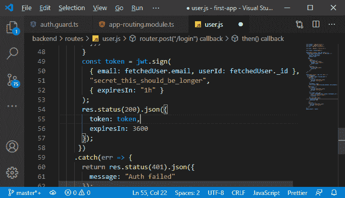
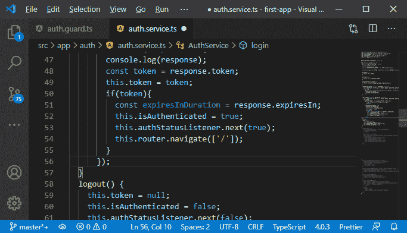
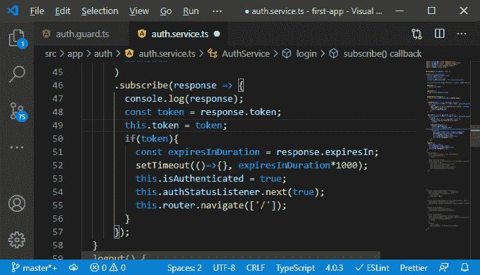
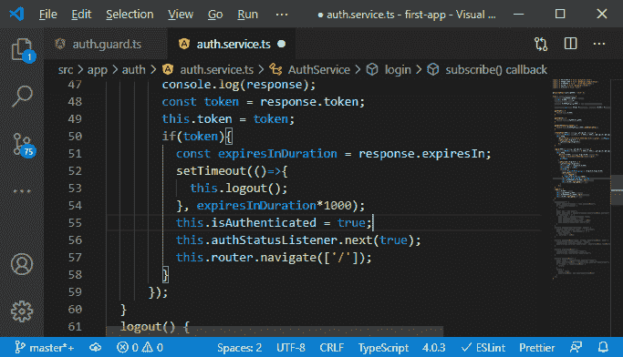
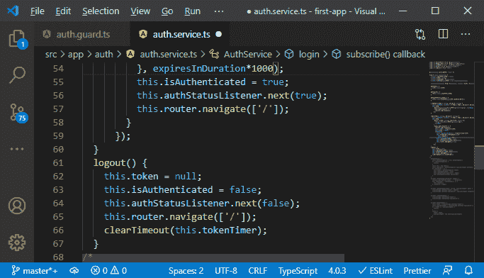

# 在MEAN 栈的用户界面中反映令牌到期

> 原文：<https://www.javatpoint.com/reflecting-token-expiration-in-the-ui-in-mean-stack>

在前面的部分中，我们成功地保护了我们的路由，从身份验证的角度来看，应用程序现在看起来不错。我们在重定向，我们在更新 UI，我们在保护，我们在保护后端。现在，剩下的部分是在 UI 中反映令牌到期。我们的用户没有意识到这一点，因为我们的用户界面不会更新。我们得到了一个令牌，它只是无效，但是在前端，我们不知道，所以我们不知道令牌过期了。我们可以知道，因为我们知道令牌将在一小时后过期，实际上，我们甚至可以将该信息与响应一起传递。我们将使用以下步骤来做到这一点:

1)我们将返回到我们的 **js** 文件，在那里我们将令牌作为响应发回。在这里，我们将添加另一个属性，即**过期**，并传递过期信息。我们知道从现在开始将是一个小时，但是一个小时后，我们不想发送硬时间戳，因为时间云的服务器偏离了客户端时间。

取而代之的是，我们发回这个持续时间，我们可以发回一个小时，让客户端解析它。

```

token: token,
expiresIn: 3600

```



2)现在，我们将在前端使用这些信息。当我们在 **service.ts** 文件的 login()方法中存储该令牌时，我们还解析它何时过期的事情，然后设置计时器。为此，在我们登录订阅方法中，我们知道我们获得了 expiresIn 信息，只有当我们获得了一个令牌时，它才对我们重要。因此，我们将在 if 检查中提取它，在那里我们将获得 expiresInDuration 属性，它将等于 response。

```

const expiresInDuration = response.expiresIn;

```



我们已经更新了泛型类型。我们已经在泛型类型中有 expireIn 属性，所以我们不会在那里得到错误。

3)现在，我们只需要设置一个计时器，我们可以使用 setTimeout()方法来实现。这个方法将返回一个 NodeJS 定时器，而且，这个方法还将采用一个应该在持续时间之后执行的函数，然后持续时间将作为第二个参数传递。

```

setTimeout(()=>{}, expiresInDuration);

```

setTimeout()方法的工作时间是毫秒，而不是秒。所以，我们必须乘以 1000，因为我们在几秒钟内就能得到它，正如我们所知。

```

setTimeout(()=>{}, expiresInDuration*1000);

```



4)过了这个时长，它会执行这个函数，在这个函数中，我们要调用注销函数。

```

setTimeout(()=>{
            this.logout();
          }, expiresInDuration*1000);

```



5)我们还应该将时间存储在某个变量中，这样如果我们确实调用了注销，我们就可以清除计时器，因为如果我们手动注销，我们希望清除计时器。因此，如果我们在那之后再次登录，我们就不会在后面有那个老的注销计时器了。因此，我们将添加一个新的私有属性，即令牌定时器，其类型为**任意**。

```

private tokenTimer: any;

```

6)现在，在这个属性中，我们存储从**setTimeout()**方法返回的结果，在 logout()方法中，我们将调用 **clearTimeout()** 方法，并在每次注销时将这个 tokenTimer 作为一个值传递给 clear timer。

```

this.tokenTimer=setTimeout(()=>{
            this.logout();
          }, expiresInDuration*1000);
logout() {
    …
    …
    …
    clearTimeout(this.tokenTimer);
  }

```



现在，一切都会好的，一切都会好的。现在，一件不好的事情是，如果我们在没有登录的情况下重新加载页面，我们必须再次登录，这是因为我们没有保持登录状态。令牌只存储在内存中，正如我们之前提到的，每当 angular app 重新启动时，这将被清除。我们将在下一节稍后通过将该令牌存储到机器的本地存储来解决这个问题。

* * *