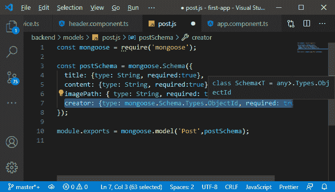
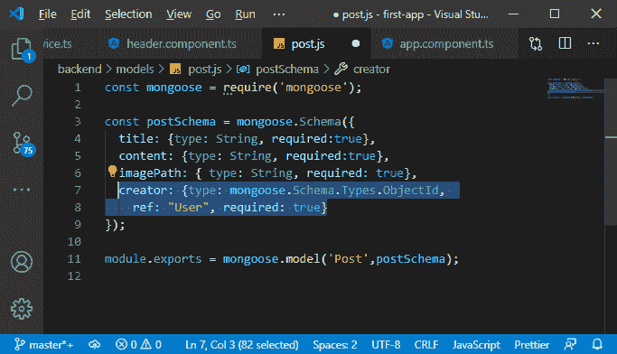

# 在均值堆栈中添加对模型的引用

> 原文：<https://www.javatpoint.com/adding-a-reference-to-the-model-in-mean-stack>

在前面的模块中，我们成功地添加了身份验证。从这一部分，我们将开始一个新的模型，即授权。身份验证和授权都是略有不同的东西。在我们的最后一部分，我们确保与我们的应用程序交互的用户需要经过身份验证，这意味着他们需要有一个帐户，以便能够创建帖子、编辑帖子或删除帖子。

授权更进一步。我们不想让每个用户编辑或删除每篇文章。用户应该连接到他们在数据库中创建的帖子。我们需要存储创建帖子的用户的 ID，然后当用户尝试删除帖子时，我们要检查尝试删除帖子的用户是否是创建此帖子的用户。我们将逐步实现授权，在本节中，我们将首先添加对模型的引用。我们将使用以下步骤来做到这一点:

1)我们希望在数据库中存储关于哪个用户创建了哪个帖子的信息。我们可以在我们的用户对象中存储一个帖子列表，或者一个用户列表，或者精确地说是一个用户，因为每个帖子只能由一个用户创建。我们将回到我们的帖子模型，即**在“模型”文件夹中的 post.js** 文件并编辑它。我们将添加一个新的字段，即 creator，并且该字段的类型不会是字符串。它将是一个猫鼬标识对象，因为它将是一个标识。我们也需要这个，所以我们将把 required 设置为 true。

```

creator: {type: mongoose.Schema.Types.ObjectId, required: true}

```



2)我们想增加一条额外的信息。我们告诉猫鼬我们将存储一个 ID，但是我们想告诉猫鼬这个 ID 将与哪个模型相关。因此，我们将增加一个额外的属性，即 **ref** 。ref 属性允许我们定义要存储的 ID 属于哪个模型。这将是我们的用户模型，因为我们将存储一个用户标识。

```

creator: {type: mongoose.Schema.Types.ObjectId, 
    ref: "User", required: true}

```



这条额外的信息将被自动添加。用户不需要将其添加到创建帖子的表单中。这将从我们传递的令牌中推断出来，请求会到达后端。接下来，我们必须先从数据库中删除所有帖子。因此，我们将从数据库中删除所有帖子。

我们成功地将创建者密钥添加到我们的数据模式中。在下一节中，我们将使用该模式，并在创建新帖子时存储该信息。

* * *