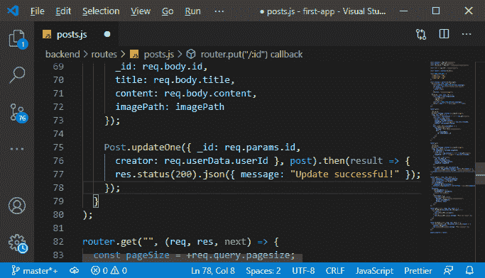
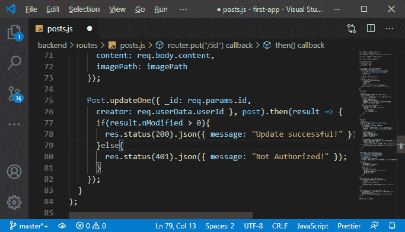
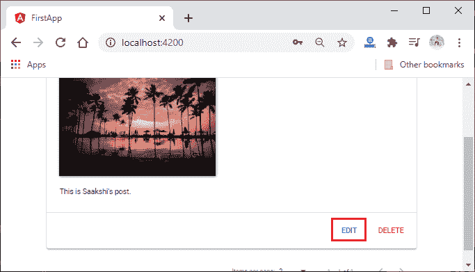
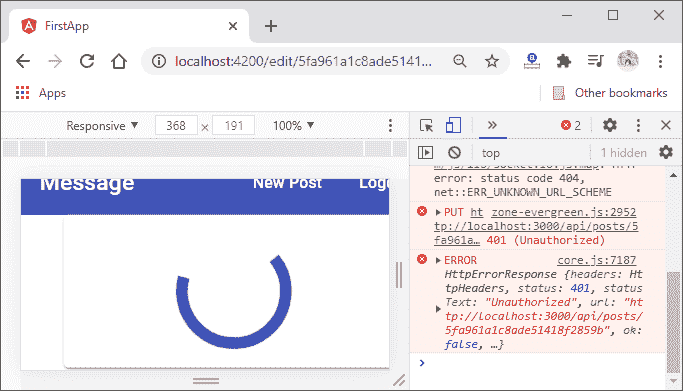
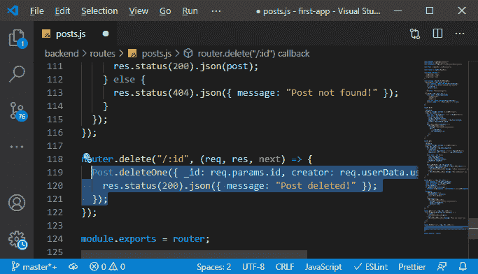
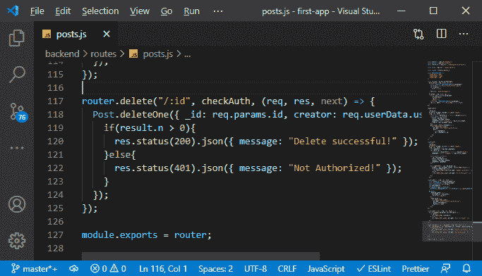
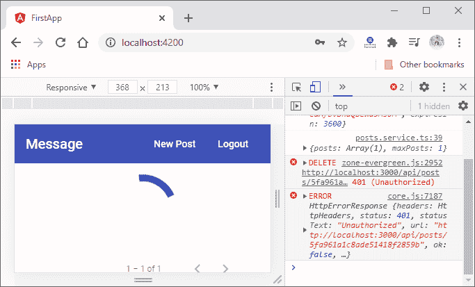

# 均值栈中授权保护资源

> 原文：<https://www.javatpoint.com/protecting-resources-with-authorization-in-mean-stack>

在我们前面的部分，我们成功地将创建者 Id 添加到我们的帖子中。简而言之，我们增加了用户和帖子之间的联系，并将这些数据返回给前端。在本节中，我们将利用此连接来拒绝未创建帖子的用户提出的删除或编辑帖子的请求。我们将使用以下步骤来做到这一点:

1)我们将回到我们的 posts.js 文件，在那里我们有路由器的 put 和 delete 方法。在 put 方法中，我们确保只有创建帖子的用户才能编辑它。这里，我们只在登录用户创建帖子时调用 Post.updateOne()方法。简单的方法是，我们将在现有条件的基础上增加另一个参数。我们将在这里检查创建者字段。创建者字段应该等于请求中用户数据的用户标识。

```

Post.updateOne({ _id: req.params.id, 
      creator: req.userData.userId }, post).then(result => {
      res.status(200).json({ message: "Update successful!" });
    });

```



updateOne()方法返回结果，这个结果包含一个属性，即 nModified。此属性返回更新记录的计数。因此，我们将使用这个变量来检查帖子是否会成功更新。如果它的值大于零，那么我们将返回旧的响应。否则，我们将发送不同的响应，即 401 状态代码，以指示用户无权执行此操作。

```

    Post.updateOne({ _id: req.params.id, 
      creator: req.userData.userId }, post).then(result => {
      if(result.nModified > 0){
        res.status(200).json({ message: "Update successful!" });
      }else{
        res.status(401).json({ message: "Not Authorized!" });
      }
    });

```



现在，我们将保存所有文件并返回到我们的 angular 应用程序。如果我们尝试从不同的帐户更新 Saakshi 的帖子，我们将获得“未授权”错误。




3)现在，我们将使用相同的逻辑删除帖子。我们将回到路由器的 delete()方法，对 **deleteOne()** 做同样的事情，我们在 JavaScript 对象中添加了与我们在 updateOne()中使用的相同的条件。

```

Post.deleteOne({ _id: req.params.id, creator: req.userData.userId }).then(result => {
    res.status(200).json({ message: "Post deleted!" });
  });

```



4)我们将简单地复制我们的更新方法的结果处理，并将其粘贴到删除方法中，因为在这里，我们还获得了存储帖子计数的 nModified 属性，该属性将被删除。

```

if(result.nModified > 0){
      res.status(200).json({ message: "Delete successful!" });
    }else{
      res.status(401).json({ message: "Not Authorized!" });
    }

```



我们保存所有文件，并返回我们的应用程序，检查它是否工作。



一切都很顺利。在这一节中，我们将把用户标识传递给前端，以便在前端使用它。

* * *