# 在MEAN 栈中使用前端的用户标识

> 原文：<https://www.javatpoint.com/using-the-user-id-on-the-frontend-in-mean-stack>

在前面的部分中，我们成功地将用户 id 传递给了前端。我们现在正在处理用户 id，在这一部分中，我们将使用创建者发布列表组件中的用户 id。我们将使用以下步骤在前端使用它:

1)我们已经在后列表组件的[TypeScript](https://www.javatpoint.com/typescript-tutorial)文件中设置了 userId 属性。我们将结合我们在每个帖子上的创作者信息来使用它。在帖子列表组件中，我们渲染到屏幕上的每个帖子都有创建者标识。我们将转到 [html](https://www.javatpoint.com/html-tutorial) 文件，在那里我们将向 ngIf 语句添加另一个条件。我们希望在用户通过身份验证，并且用户标识等于帖子的创建者时，显示编辑和删除按钮。

```

<mat-action-row *ngIf= "userIsAuthenticated && userId === post.creator">

```

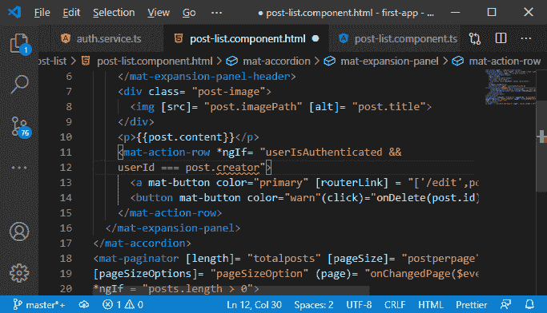

2)由于我们的帖子模型，我们在模板中得到一个错误。在帖子模型中，没有创建者字段。因此，我们将在我们的帖子模型中添加创建者字段，该字段也将是字符串类型。

```

export interface Post{
  id: string;
  title: string;
  content: string;
  imagePath: string;
  creator: string;
}

```

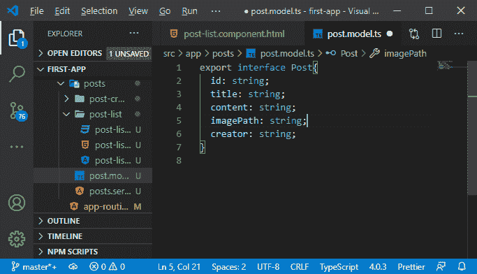

3)添加此内容后，我们将在更新帖子的 post.service.ts 文件中获得一个错误。我们得到这个错误是因为我们没有发送创建者 id。我们将简单地将创建者设置为空。

```

        postData = {
        id: id,
        title: title,
        content: content,
        imagePath: image, 
        creator: null
      };

```

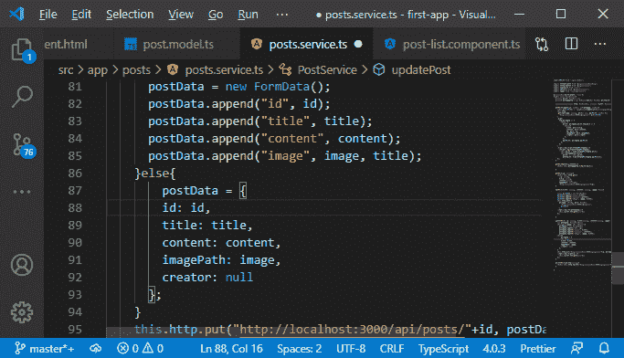

4)我们当然可以获取当前登录的用户的 Id，但是这会为用户打开一个窗口来操作它，我们不希望这样。因此，我们需要在服务器上处理这个问题。我们将返回到我们的 posts.js 路由，在那里我们更新一个 post，我们需要再次添加 creator 字段，但是这次我们从请求中的用户数据中获取数据。

```

creator: req.userData.userId

```

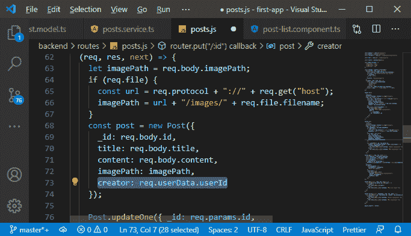

5)我们还会在后期创建组件的 typescript 文件中得到一个错误。在那里，我们有一个帖子，当我们编辑一个帖子时，我们试图加载它。这里我们缺少创建者字段，因此我们将添加如下内容:

```

creator: postData.creator

```

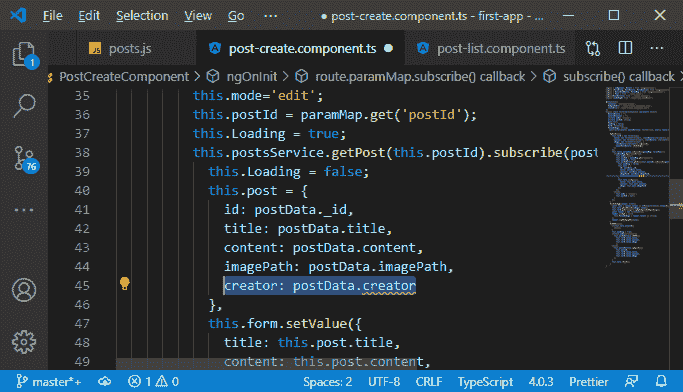

6)这将给出一个错误，因为我们没有在我们的后期服务中添加那个创建者，我们在那里得到了那个单独的帖子。因此，我们将在我们的 Post 服务的 getPost()方法中添加它:

```

  getPost(id: string){
    …
    …
      creator: string
    }>(
      "http://localhost:3000/api/posts/"+id);
  }

```

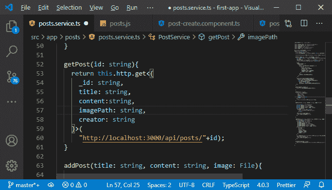

一切看起来都很好。现在我们将回到我们的 angular 应用程序，检查我们的应用程序是否正常工作。

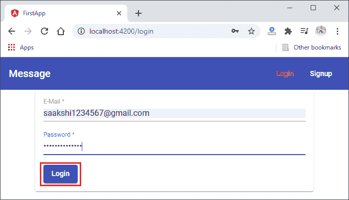
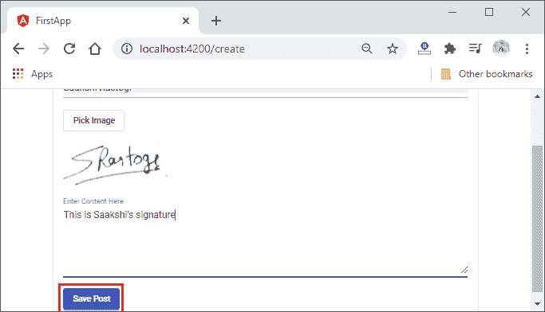
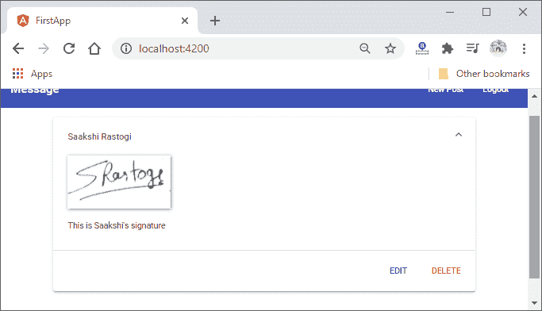
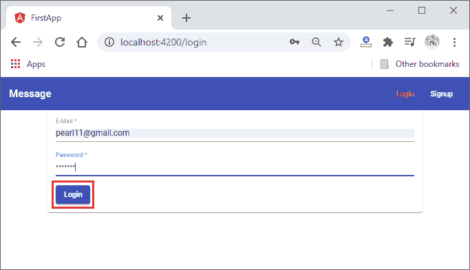
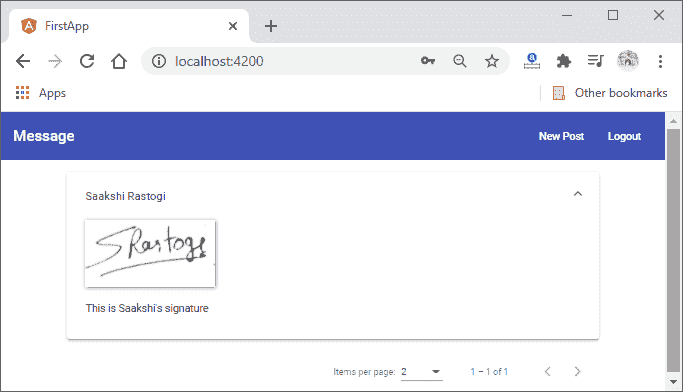

我们的应用程序运行良好，这正是我们想要的。从下一部分，我们将开始一个新的模块，即处理错误。

**下载完整项目(Authorization.zip)**

* * *