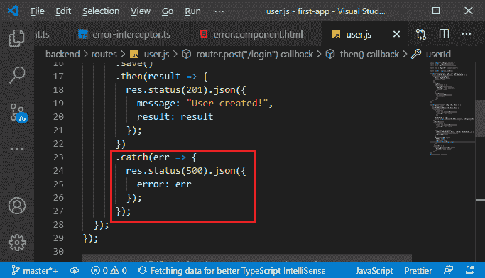
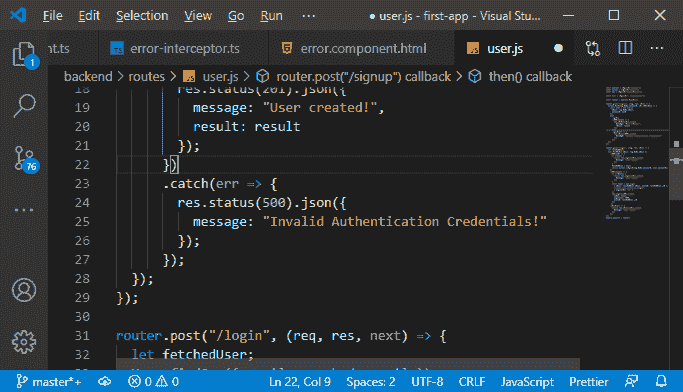
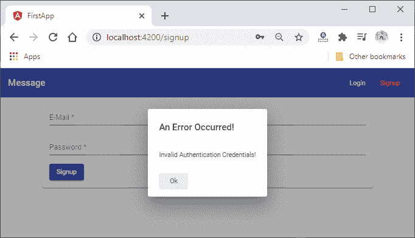
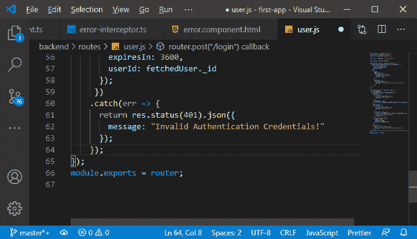
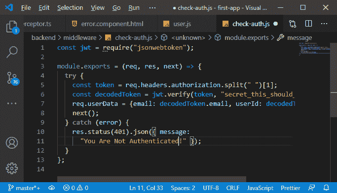
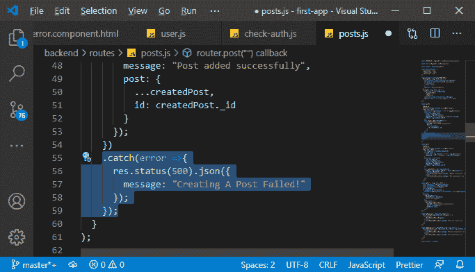
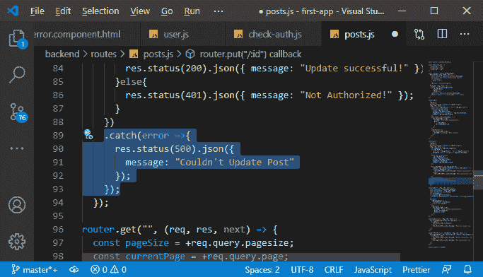
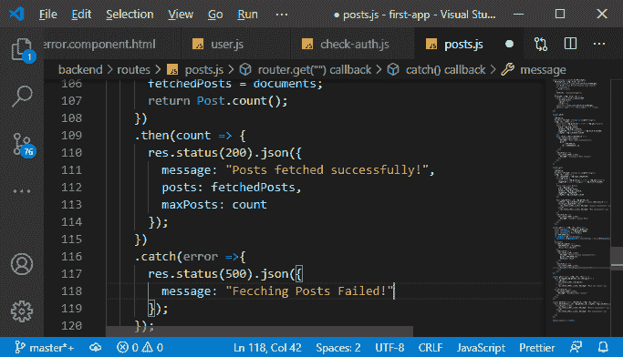
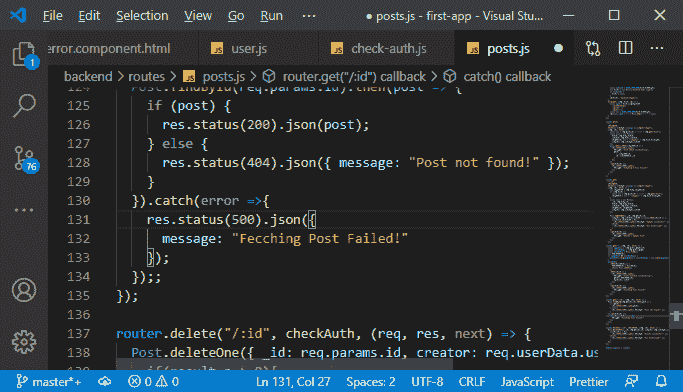
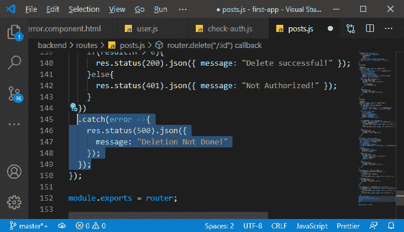

# 在 MEAN 栈中的服务器上返回错误消息

> 原文：<https://www.javatpoint.com/returning-error-message-on-the-server-in-mean-stack>

在前一节中，我们成功地获得了错误对话框。它显示了我们注册错误的标准错误消息，因为我们有唯一的猫鼬验证器用于用户路由，我们在后端创建了一个新用户。如果它检测到错误，它会自动发回错误，然后我们只发回正常的错误响应。



我们将通过以下方式改进错误:

1)我们将用我们自己的错误对象发回一个错误，在这里我们添加消息属性并设置消息**无效认证凭证**。

```

message: "Invalid Authentication Credentials!"

```



现在，如果我们回到我们的角度，并尝试用一封已经注册的电子邮件注册，我们将看到我们真正想要看到的消息。



2)让我们检查一下服务器端，确保在所有情况下都发送正确的错误消息。对于登录，我们也捕捉到了错误，我们发送验证失败。在这里，我们要显示**“无效认证凭证！”**消息太多。

```

message: "Invalid Authentication Credentials!"

```



如果我们返回到我们的 check-auth 文件，在那里，如果我们识别出用户没有有效的令牌，我们也会发回一个 auth 失败的响应。所以，我们想更新消息说**你没有通过认证！**。

```

res.status(401).json({ message: "You Are Not Authenticated!" });

```



3)现在，我们将回到我们创建新帖子的帖子路线，我们不处理错误案例。这里，我们需要在 then 块之后添加一个 catch 块。这将在某些事情失败时执行。我们将为服务器上出现的问题设置一个状态代码为 500 的响应，并添加一些 [JSON](https://www.javatpoint.com/json-tutorial) 数据，我们可以在其中设置一条消息，并用**创建帖子失败来设置它！**。

```

.catch(error =>{
      res.status(500).json({
        message: "Creating A Post Failed!"
      });
    });

```



4)现在，我们将进入更新路径，在这里我们更新我们的帖子。在这里，如果我们没有技术错误，我们已经发回了一个响应，这将进入一个 catch 块，但是如果我们根本找不到要更新的帖子，我们发回一个“未授权！”错误。我们还想捕捉技术错误，如数据库连接丢失或其他任何问题。然后我们将简单地返回一个状态代码为 500 的自定义响应，在那里我们发回我们的 JSON 代码，并将消息属性设置为**无法更新帖子！**。

```

.catch(error =>{
      res.status(500).json({
        message: "Couldn't Update Post"
      });
    });

```



5)现在，我们将继续走获取帖子的路线。在这里，我们还需要捕捉技术错误，我们将以与更新帖子相同的方式来做这件事。我们只把消息改成**取件失败！**。

```

.catch(error =>{
      res.status(500).json({
        message: "Fecching Posts Failed!"
      });
    });

```



6)我们将复制相同的 catch 块代码，并将其添加到我们尝试查找单个帖子的方法中。



7)现在，对于删除帖子，我们处理了我们没有被授权之类的情况，我们也会在这里抓住技术错误。因此，我们将在这里添加 catch 块，如下所示:

```

.catch(error =>{
    res.status(500).json({
      message: "Deletion Not Done!"
    });
  });

```



**下载完整项目(错误处理. zip)**

* * *