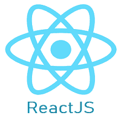

# 学习React教程

> 原文：<https://www.javatpoint.com/reactjs-tutorial>

reatjs 教程提供了 reatjs 的基本和高级概念。目前，ReactJS 是最流行的 JavaScript 前端库之一，它有着强大的基础和庞大的社区。

ReactJS 是一个用于构建可重用 UI 组件的**声明式**、**高效**和灵活 **JavaScript 库**。它是一个开源的、基于组件的前端库，只负责应用程序的视图层。它最初由脸书开发和维护，后来用于其产品，如 WhatsApp & Instagram。

我们的 reatjs 教程包括所有有助于学习 reatjs 的主题。这些是React堆简介、React堆特性、React堆安装、React堆的优缺点、React堆 JSX、React堆组件、React堆状态、React堆道具、React堆表单、React堆事件、React堆动画等等。

## 我们为什么使用 ReactJS？

ReactJS 的主要目标是开发提高应用速度的用户界面。它使用了虚拟 DOM (JavaScript 对象)，提高了应用的性能。JavaScript 虚拟 DOM 比常规 DOM 快。我们可以在客户端、服务器端以及其他框架上使用 ReactJS。它使用组件和数据模式来提高可读性，并帮助维护更大的应用程序。

* * *

## React指南索引

* * *

*   [React教程](reactjs-tutorial)
*   [React介绍](react-introduction)
*   [React版本](react-version)
*   [React装置](react-installation)
*   [创建-React-应用](react-create-react-app)
*   [React特性](react-features)
*   [前进&磋商](pros-and-cons-of-react)
*   [反作用力与角力](reactjs-vs-angularjs)
*   [React堆对React堆](reactjs-vs-reactnative)
*   [React vs 视图](react-vs-vue)
*   [React JSX](react-jsx)
*   [React成分](react-components)
*   [React状态](react-state)
*   [React道具](react-props)
*   [React道具验证](react-props-validation)

*   [React状态 vs 道具](react-state-vs-props)
*   [React构造器](react-constructor)
*   [React成分原料药](react-component-api)
*   [组件生命周期](react-component-life-cycle)
*   [React形式](react-forms)
*   [受控与非受控](react-controlled-vs-uncontrolled-component)
*   [React事件](react-events)
*   [条件渲染](react-conditional-rendering)
*   [React列表](react-lists)
*   [React键](react-keys)
*   [React参考文献](react-refs)
*   [React碎片](react-fragments)
*   [React路由器](react-router)
*   [React CSS](react-css)
*   [React动画](react-animation)

*   [React自举](react-bootstrap)
*   [React图](react-map)
*   [React表](react-table)
*   [高阶组件](react-higher-order-components)
*   [React代码拆分](react-code-splitting)
*   [React上下文](react-context)
*   [反作用钩](react-hooks)
*   [React通量概念](react-flux-concept)
*   [React通量与 MVC 的关系](react-flux-vs-mvc)
*   [React还原](react-redux)
*   [React还原示例](react-redux-example)
*   [React入口](react-portals)
*   [React错误边界](react-error-boundaries)

**面试问题**

*   [回应面试问题](react-interview-questions)

* * *

## 先决条件

在深入学习 ReactJS 之前，您必须对 JavaScript、HTML5 和 CSS 有很好的了解。ECMAScript 2015 语法的知识也可能有所帮助。

## 观众

我们为初学者和专业人士开发了这个 ReactJS 教程。我们将尝试用简单的代码示例来介绍每个概念，以便您能够容易地理解。完成所有部分后，您可以自信地使用 ReactJS。

## 问题

我们向您保证，您在我们的 ReactJS 教程中不会发现任何问题。但是，如果你发现任何错误，你可以在我们的评论区发布。

* * *