# React 环境设置

> 原文：<https://www.javatpoint.com/react-installation>

在本节中，我们将学习如何为 ReactJS 应用程序的成功开发建立一个环境。

## React 的先决条件

1.  NodeJS 和 NPM
2.  React 和 React DOM
3.  网页包
4.  巴比伦式的城市

## 安装 ReactJS 的方法

有两种方法可以为成功的 ReactJS 应用程序设置环境。它们如下所示。

1.  使用 npm 命令
2.  使用创建-React-应用程序命令

### 1.使用 npm 命令

**安装 NodeJS 和 NPM**

NodeJS 和 NPM 是开发任何 ReactJS 应用程序所需的平台。您可以通过下面给出的链接安装 NodeJS 和 NPM 包管理器。

[https://www.javatpoint.com/install-nodejs-on-linux-ubuntu-centos](install-nodejs-on-linux-ubuntu-centos)

要验证 NodeJS 和 NPM，请使用下图所示的命令。

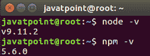

**安装反作用反作用 DOM**

在桌面或你想要的地方创建一个名为**的**根**文件夹。这里，我们在桌面上创建它。您可以直接或使用下面给出的命令创建文件夹。**

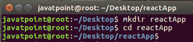

现在，您需要创建一个 **package.json** 文件。要创建任何模块，需要在项目文件夹中生成一个 package.json 文件。为此，您需要运行如下图所示的命令。

```

javatpoint@root:~/Desktop/reactApp> npm init -y

```

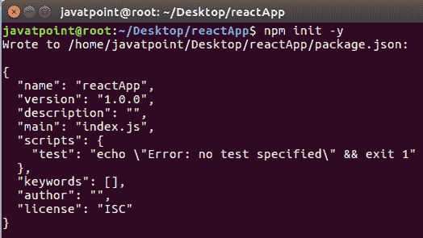

创建 package.json 文件后，需要在终端窗口使用如下 npm 命令安装 **react** 及其 DOM **包**，如下图所示。

```

javatpoint@root:~/Desktop/reactApp>npm install react react-dom --save

```

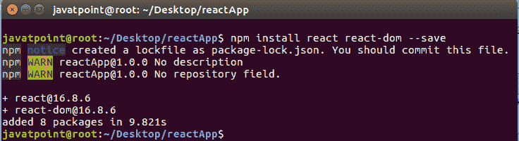

您也可以单独使用上面的命令，如下所示。

```

javatpoint@root:~/Desktop/reactApp>npm install react --save
javatpoint@root:~/Desktop/reactApp>npm install react-dom --save

```

安装网页包

Webpack 用于模块封装、开发和生产流水线自动化。我们将在开发过程中使用 **webpack-dev-server** 、 **webpack** 来创建生产构建， **webpack CLI** 提供了一组命令。Webpack 将这些编译成一个文件(包)。要安装 webpack，请使用下图所示的命令。

```

javatpoint@root:~/Desktop/reactApp>npm install webpack webpack-dev-server webpack-cli --save

```

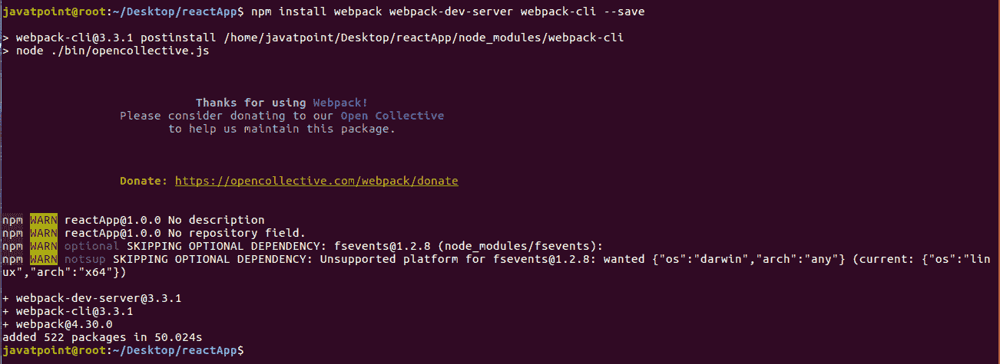

您也可以单独使用上面的命令，如下所示。

```

javatpoint@root:~/Desktop/reactApp>npm install webpack --save
javatpoint@root:~/Desktop/reactApp>npm install webpack-dev-server --save
javatpoint@root:~/Desktop/reactApp>npm install webpack-cli --save

```

**安装巴别塔**

Babel 是一个 JavaScript 编译器和 transpiler，用于将一个源代码转换成其他源代码。它将 React JSX 和 ES6 编译为 ES5 JavaScript，可以在所有浏览器上运行。我们需要**巴别塔加载器**用于 JSX 文件类型，**巴别塔预设 React**使您的浏览器在您的代码发生任何变化时自动更新，而不会丢失应用程序的当前状态。ES6 支持需要**巴别塔-预置-env** 巴别塔预置。要安装 webpack，请使用下图所示的命令。

```

javatpoint@root:~/Desktop/reactApp>npm install babel-core babel-loader babel-preset-env babel-preset-react babel-webpack-plugin --save-dev

```

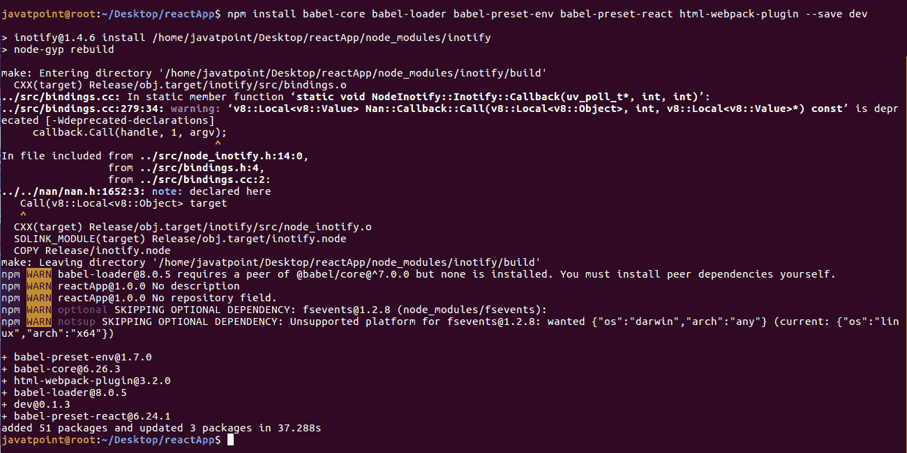

您也可以单独使用上面的命令，如下所示。

```

javatpoint@root:~/Desktop/reactApp>npm install babel-core --save-dev
javatpoint@root:~/Desktop/reactApp>npm install babel-loader --save-dev
javatpoint@root:~/Desktop/reactApp>npm install babel-preset-env --save-dev
javatpoint@root:~/Desktop/reactApp>npm install babel-preset-react --save-dev
javatpoint@root:~/Desktop/reactApp>npm install babel-webpack-plugin --save-dev

```

**创建文件**

要完成安装过程，您需要在项目文件夹中添加以下文件。这些文件是**index.html，App.js，main.js，webpack.config.js** 和， **.babelrc.** 您可以手动创建这些文件，也可以使用命令提示符创建这些文件。

```

javatpoint@root:~/Desktop/reactApp>touch index.html
javatpoint@root:~/Desktop/reactApp>touch App.js
javatpoint@root:~/Desktop/reactApp>touch main.js
javatpoint@root:~/Desktop/reactApp>touch webpack.config.js
javatpoint@root:~/Desktop/reactApp>touch .babelrc

```

### 为 React 应用程序设置编译器、加载器和服务器

**设置网页包**

您可以通过添加以下代码在 **webpack.config.js** 文件中配置 webpack。它定义了你的应用入口点，构建输出和自动解析的扩展。还将开发服务器设置为 **8080** 端口。它定义了用于处理应用程序中使用的各种文件类型的加载器，并通过添加我们开发过程中需要的插件来结束。

***网页包. config.json***

```

const path = require('path');
const HtmlWebpackPlugin = require('html-webpack-plugin');

module.exports = {
   entry: './main.js',
   output: {
      path: path.join(__dirname, '/bundle'),
      filename: 'index_bundle.js'
   },
   devServer: {
      inline: true,
      port: 8080
   },
   module: {
      rules: [
         {
            test: /\.jsx?$/,
            exclude: /node_modules/,
	    use: {
              loader: "babel-loader",
            }
         }
      ]
   },
   plugins:[
      new HtmlWebpackPlugin({
         template: './index.html'
      })
   ]
}

```

现在，打开 **package.json** 文件，删除 ***【测试】【回显】错误:未指定测试\" & &退出 1”******【脚本】*** 对象，然后改为添加 start 和 build 命令。因为我们不会在这个应用中进行任何测试。

```

{
  "name": "reactApp",
  "version": "1.0.0",
  "description": "",
  "main": "index.js",
  "scripts": {
    "start": "webpack-dev-server --mode development --open --hot",
    "build": "webpack --mode production"
  },
  "keywords": [],
  "author": "",
  "license": "ISC",
  "dependencies": {
    "react": "^16.8.6",
    "react-dom": "^16.8.6",
    "webpack-cli": "^3.3.1",
    "webpack-dev-server": "^3.3.1"
  },
  "devDependencies": {
    "@babel/core": "^7.4.3",
    "@babel/preset-env": "^7.4.3",
    "@babel/preset-react": "^7.0.0",
    "babel-core": "^6.26.3",
    "babel-loader": "^8.0.5",
    "babel-preset-env": "^1.7.0",
    "babel-preset-react": "^6.24.1",
    "html-webpack-plugin": "^3.2.0",
    "webpack": "^4.30.0"
  }
}

```

**index.html 的 HTML 网络包模板**

我们可以使用**html web-packlugin**插件添加一个自定义模板来生成**index.html**。这使我们能够添加一个视口标签来支持我们的应用程序的移动响应缩放。它还将 **div id = "app"** 设置为您的应用的根元素，并添加了 **index_bundle.js** 脚本，这是我们捆绑的应用文件。

```

<!DOCTYPE html>
<html lang = "en">
   <head>
      <meta charset = "UTF-8">
      <title>React App</title>
   </head>
   <body>
      <div id = "app"></div>
      <script src = 'index_bundle.js'></script>
   </body>
</html>

```

**App.jsx 和 main.js**

这是第一个 React 组件，即应用程序入口点。它将渲染你好世界。

**T1T3】**

```

import React, { Component } from 'react';
class App extends Component{
   render(){
      return(
         <div>
            <h1>Hello World</h1>
         </div>
      );
   }
}
export default App;

```

现在，导入这个组件，并将其渲染到您的根应用程序元素，以便您可以在浏览器中看到它。

**T1T3】**

```

import React from 'react';
import ReactDOM from 'react-dom';
import App from './App.js';

ReactDOM.render(<App />, document.getElementById('app'));

```

#### 注意:如果要使用某个东西，需要先导入。要使组件在应用程序的其他部分可用，您需要在创建后导出它，并将其导入到您想要使用它的文件中。

**创造。babelrc 文件**

创建一个名为**的文件。babelrc** 并复制以下代码到其中。

***.babelrc***

```

{
   "presets":[
  "@babel/preset-env", "@babel/preset-react"]
}

```

**运行服务器**

完成安装过程并设置应用程序后，您可以通过运行以下命令来启动服务器。

```

javatpoint@root:~/Desktop/reactApp>npm start

```

它将显示我们需要在浏览器中打开的端口号。我们打开它后，您将看到以下输出。

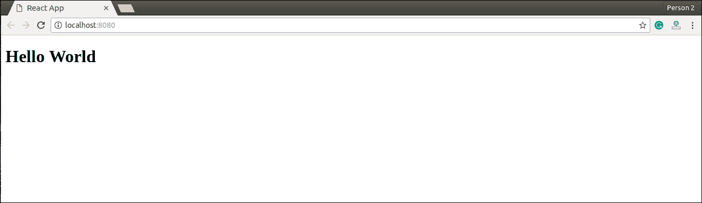

**生成捆绑包**

现在，为您的应用程序生成捆绑包。捆绑是跟随导入的文件并将其合并为单个文件的过程:a **“捆绑”**该捆绑包随后可以包含在网页上，以便一次加载整个应用程序。要生成它，您需要在命令提示符下运行 build 命令，如下所示。

```

javatpoint@root:~/Desktop/reactApp> npm run build

```

此命令将在当前文件夹(您的应用程序所属的文件夹)中生成包，如下图所示。

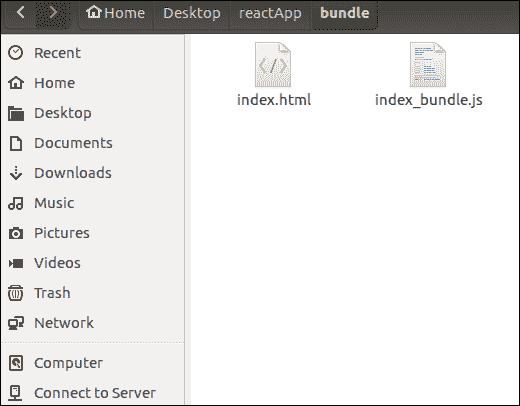

## 2.使用创建-React-应用程序命令

如果你不想用 webpack 和 babel 来安装 react，那么你可以选择 create-react-app 来安装 react。“创造-React-应用”是脸书自己维护的一个工具。这适合初学者，不需要手动处理像 webpack 和 babel 这样的传输工具。在本节中，我将向您展示如何使用 CRA 工具安装 React。

**安装 NodeJS 和 NPM**

NodeJS 和 NPM 是开发任何 ReactJS 应用程序所需的平台。您可以通过下面给出的链接安装 NodeJS 和 NPM 包管理器。

[https://www.javatpoint.com/install-nodejs-on-linux-ubuntu-centos](https://www.javatpoint.com/install-nodejs-on-linux-ubuntu-centos)

**安装反作用**

您可以使用下面的命令使用 npm 包管理器安装 React。无需担心 React 安装的复杂性。create-react-app npm 包会处理它。

```

javatpoint@root:~/>npm install -g create-react-app

```

**创建新的 React 项目**

安装完 react 后，可以使用 create-react-app 命令创建一个新的 React 项目。在这里，我为我的项目选择**jtp-react tapp**名称。

```

javatpoint@root:~/>create-react-app jtp-reactapp

```

#### 注意:您可以使用 npx 将上述两个步骤合并到一个命令中。npx 是一个包运行工具，附带 npm 5.2 和更高版本。

```

 javatpoint@root:~/>npx create-react-app jtp-reactapp

```

上面的命令将安装 react 并创建一个名为 jtp-react tapp 的新项目。默认情况下，此应用程序包含以下子文件夹和文件，如下图所示。

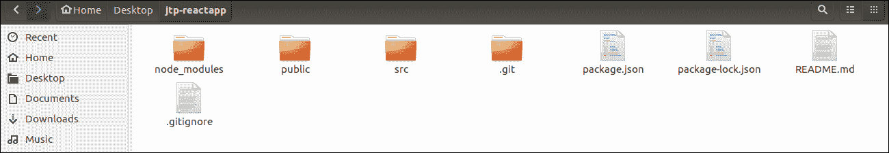

现在，要开始，打开 **src** 文件夹，并在您想要的文件中进行更改。默认情况下，src 文件夹包含以下文件，如下图所示。

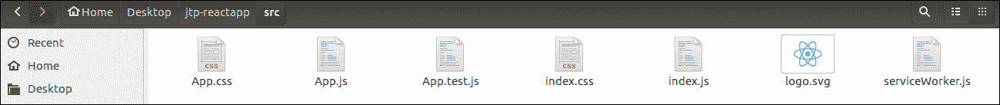

例如，我将打开 **App.js** 并对其代码进行更改，如下所示。

**T1T3】**

```

import React from 'react';
import logo from './logo.svg';
import './App.css';

function App() {
  return (
    <div className="App">
      <header className="App-header">
        
        <p>
          Welcome To JavaTpoint.

	  <p>To get started, edit src/App.js and save to reload.</p>
        </p>
        <a
          className="App-link"
          href="https://reactjs.org"
          target="_blank"
          rel="noopener noreferrer"
        >
          Learn React
        </a>
      </header>
    </div>
  );
}

export default App;

```

#### 注意:也可以选择自己喜欢的代码编辑器来编辑项目。但就我而言，我选择了 Eclipse。使用下面的链接，您可以为 Ubuntu 下载 Eclipse 并安装。

[click Here to download Eclipse for Ubuntu and install](how-to-install-eclipse-in-ubuntu)

**运行服务器**

完成安装过程后，您可以通过运行以下命令来启动服务器。

```

javatpoint@root:~/Desktop>cd jtp-reactapp
javatpoint@root:~/Desktop/jtp-reactapp>npm start

```

它将显示我们需要在浏览器中打开的端口号。我们打开它后，您将看到以下输出。

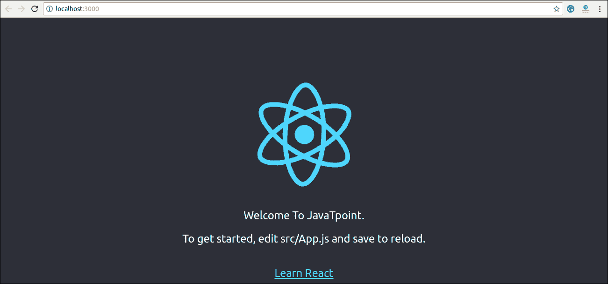

* * *