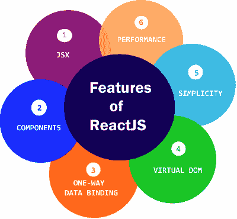

# React特征

> 原文：<https://www.javatpoint.com/react-features>

目前，ReactJS 作为 web 开发人员中最好的 JavaScript 框架迅速流行起来。它在前端生态系统中发挥着至关重要的作用。ReactJS 的重要特点如下。

*   小艾
*   成分
*   单向数据绑定
*   虚拟 DOM
*   简单
*   表演

* * *

### 小艾

JSX 代表 JavaScript XML。这是一个 JavaScript 语法扩展。这是一种类似于 ReactJS 使用的 XML 或 HTML 的语法。这个语法被处理成对 React Framework 的 JavaScript 调用。它扩展了 ES6，使得像文本这样的 HTML 可以与 JavaScript React代码共存。不必使用 JSX，但建议在 ReactJS 中使用。

### 成分

ReactJS 是关于组件的。ReactJS 应用程序由多个组件组成，每个组件都有自己的逻辑和控件。这些组件可以重用，这有助于您在处理大规模项目时维护代码。

### 单向数据绑定

ReactJS 的设计遵循单向数据流或单向数据绑定。单向数据绑定的好处使您可以更好地控制整个应用程序。如果数据流是在另一个方向，那么它需要额外的功能。这是因为组件应该是不可变的，并且其中的数据不能被更改。Flux 是一种有助于保持数据单向的模式。这使得应用程序更加灵活，从而提高了效率。

### 虚拟 DOM

虚拟 DOM 对象是原始 DOM 对象的表示。它像单向数据绑定一样工作。每当 web 应用程序中发生任何修改时，整个用户界面都会以虚拟 DOM 表示形式重新呈现。然后检查以前的 DOM 表示和新的 DOM 之间的差异。一旦它完成了，真正的 DOM 将只更新那些实际上已经改变的东西。这使得应用程序更快，并且没有内存浪费。

### 简单

ReactJS 使用 JSX 文件，这使得应用程序变得简单，易于编码和理解。我们知道 ReactJS 是一种基于组件的方法，可以根据您的需要重用代码。这使得使用和学习变得简单。

### 表演

众所周知，ReactJS 是一位伟大的表演者。这个特性使得它比现在的其他框架好得多。这背后的原因是它管理一个虚拟 DOM。DOM 是一个跨平台的编程接口，处理 HTML、XML 或 XHTML。DOM 完全存在于内存中。因此，当我们创建一个组件时，我们没有直接写入 DOM。相反，我们正在编写虚拟组件，这些组件将转化为 DOM，从而带来更流畅、更快速的性能。

* * *