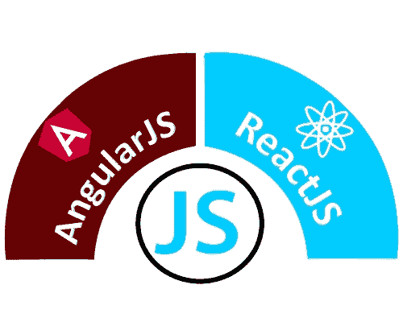

# AngularJS 和 ReactJS 的区别

> 原文：<https://www.javatpoint.com/reactjs-vs-angularjs>

## 安古斯

AngularJS 是一个开源的 JavaScript 框架，用于构建动态 web 应用程序。Misko Hevery 和 Adam Abrons 在 2009 年开发了 AngularJS，现在由谷歌维护。Angular 的最新版本是 2019 年 3 月 11 日的 1.7.8。它基于 HTML 和 JavaScript，主要用于构建单页应用程序。可以包含到带有

### AngularJS 的特点

1.  **数据绑定:** AngularJS 遵循双向数据绑定。它是模型和视图组件之间数据的自动同步。
2.  **POJO 模型:** AngularJS 使用 POJO (Plain Old JavaScript)模型，提供自发的、计划周密的对象。POJO 模型使 AngularJS 自给自足，易于使用。
3.  **模型视图控制器(MVC)框架:** MVC 是用于开发 web 应用程序的软件设计模式。AngularJS 的工作模型基于 MVC 模式。AngularJS 中的 MVC 架构简单、通用、动态。MVC 使得构建一个独立的客户端应用程序变得更加容易。
4.  **服务:** AngularJS 有几个内置的服务，比如$http 来做一个 XMLHttpRequest。
5.  **带 HTML 的用户界面:**在 AngularJS 中，用户界面是建立在 HTML 之上的。它是一种声明性语言，标签较短，易于理解。它提供了一个有组织、平滑和结构化的界面。
6.  **依赖注入:** AngularJS 有一个内置的依赖注入子系统，帮助开发人员轻松地创建、理解和测试应用程序。
7.  **Google 上的活跃社区:** AngularJS 提供了出色的社区支持。是因为谷歌维护 AngularJS。所以，如果你有任何维护问题，有很多论坛可以让你的问题得到解决。
8.  **布线:**布线是从一个视图到另一个视图的过渡。路由是单页应用程序的关键方面，因为所有内容都在单页中。在这里，开发人员不希望用户每次单击菜单时都重定向到新页面。开发人员希望在网址改变的情况下，内容加载到同一个页面上。

## ReactJS

ReactJS 是一个开源的 JavaScript 库，用于为单页应用程序构建用户界面。它只负责应用程序的视图层。它为开发人员提供了从一小段称为“组件”的独立代码组成复杂的用户界面 ReactJS 由两部分组成第一部分是组件，即包含 HTML 代码和您希望在用户界面中看到的内容的部分，第二部分是 HTML 文档，您的所有组件都将在其中呈现。

乔丹·沃克是脸书的一名软件工程师，他开发了这个软件。最初，它由脸书开发和维护，后来用于其产品，如 WhatsApp & Instagram。脸书在 2011 年为新闻提要部分开发了 ReactJS，但它于 2013 年 5 月向公众发布。

### React堆的特点

1.  **JSX:** JSX 是一个 JavaScript 语法扩展。JSX 语法被处理成对React框架的 JavaScript 调用。它扩展了 ES6，使得像文本这样的 HTML 可以与 JavaScript React 代码共存。
2.  **组件:** ReactJS 全部是关于组件的。ReactJS 应用程序由多个组件组成，每个组件都有自己的逻辑和控件。这些组件可以重用，这有助于您在处理大规模项目时维护代码。
3.  **单向数据绑定:** ReactJS 遵循单向数据流或单向数据绑定。单向数据绑定使您可以更好地控制整个应用程序。如果数据流是在另一个方向，那么它需要额外的功能。这是因为组件应该是不可变的，并且其中的数据不能改变。
4.  **虚拟 DOM:** 虚拟 DOM 对象是真实 DOM 对象的表示。每当 web 应用程序中发生任何修改时，整个用户界面都会以虚拟 DOM 表示形式重新呈现。然后，它检查以前的 DOM 表示和新的 DOM 之间的差异。一旦它完成了，真正的 DOM 将只更新被改变的东西。它使应用程序更快，并且没有内存浪费。
5.  **简单性:** ReactJS 使用 JSX 文件，这使得应用程序变得简单，易于编码和理解。此外，ReactJS 是一种基于组件的方法，可以根据需要重用代码。它使使用和学习变得简单。
6.  **表演:** ReactJS 是众所周知的伟大表演者。这背后的原因是它管理一个虚拟 DOM。DOM 完全存在于内存中。因此，当我们创建一个组件时，我们没有直接写入 DOM。相反，我们正在编写虚拟组件，这些组件将转化为 DOM，从而带来更流畅、更快速的性能。

## 安格拉 JS Vs .reactjs(React堆)

|  | 安古斯 | ReactJS |
| **作者** | 谷歌 | 脸书社区 |
| **显影剂** | 密密麻麻 | 乔丹·沃克 |
| **初始释放** | 2010 年 | 2013 年 3 月 |
| **最新版本** | 2019 年 3 月 11 日角度 1.7.8。 | 2019 年 3 月 27 日第 16.8.6 号React |
| **语言** | JavaScript，HTML | 小艾 |
| **类型** | 开源 MVC 框架 | 开源 JS 框架 |
| **渲染** | 客户端 | 服务器端 |
| **包装** | 无力的 | 强烈的 |
| **数据绑定** | 双向的 | 单向的 |
| **家** | 常规 DOM | 虚拟 DOM |
| **测试** | 单元和集成测试 | 单元测试 |
| **应用架构** | 手动音量调节 | 流量 |
| **依赖关系** | 它自动管理依赖关系。 | 它需要额外的工具来管理依赖关系。 |
| **布线** | 它的路由器配置需要模板或控制器，必须手动管理。 | 它不处理路由，但是有很多路由模块，例如 react-router。 |
| **性能** | 慢的 | 快，由于虚拟 DOM。 |
| **最适合** | 它最适合一次更新一个视图的单页应用程序。 | 它最适合一次更新多个视图的单页应用程序。 |

* * *