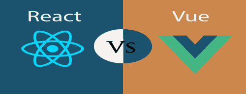

# React 与视图

> 哎哎哎:[https://www . javatppoint . com/reac-vs-view](https://www.javatpoint.com/react-vs-vue)

React 和 Vue 是当今最流行的两个用来构建成千上万个网站的 JavaScript 库。React 和 Vue 都是非常强大的框架，各有利弊。你必须选择哪一个，取决于业务需求和用例。

React 和 Vue 都有很多共同之处，比如基于组件的架构、虚拟 DOM 的使用、道具的使用、用于调试的 chrome Dev 工具等等。但是，两者都有一些显著的差异，如下所示。

|  | React | 某视频剪辑软件 |
| **定义** | React 是一个声明性、高效、灵活的开源 JavaScript 库，用于构建可重用的 UI 组件。 | Vue 是一个开源的 JavaScript 库，用于构建可重用的用户界面和单页应用程序。 |
| **历史** | 它是由脸书的软件工程师乔丹·沃克创建的。它最初由脸书开发和维护，后来用于其产品，如 WhatsApp 和 Instagram。脸书在 2011 年为新闻提要部分开发了 React，但它于 2013 年 5 月向公众发布。 | Vue 是由尤雨溪创建的，他曾是谷歌的员工，从事过许多 Angular 项目。他想做一个更好的 Angular 版本，只是提取了他喜欢的 Angular 的部分，使它更轻。Vue 的第一个版本于 2014 年 2 月推出。 |
| **学习曲线** | React 不是一个完整的框架，必须寻找更高级的框架来使用第三方库。它让核心框架的学习变得不那么容易。它增加了学习曲线的复杂性，因为它根据您对附加功能的选择而有所不同。 | Vue 提供了更高的可定制性，这使得它比 Angular 或 React 更容易学习。Vue 在功能上与 Angular 和 React 共享一些概念。因此，从角度和 React 过渡到 Vue 是一个简单的选择。此外，官方文档写得很好，涵盖了开发人员构建 Vue 应用程序所需的一切。 |
| **首选语言** | JavaScript/JavaScript XML | HTML/JavaScript |
| **尺寸** | React 库的大小为 100 千字节(大约。). | Vue 库的大小为 60 千字节(大约。). |
| **性能** | 与 Vue 相比，它的性能较慢。 | 与 React 相比，它的性能更快。 |
| **灵活性** | React 为支持第三方库提供了极大的灵活性。 | 与 React 相比，Vue 提供的灵活性有限。 |
| **编码风格** | React 使用 JSX 来编写 JavaScript 表达式，而不是常规的 JavaScript。JSX 类似于 JavaScript 表达式中的 HTML 代码。React 将一切都视为组件，每个组件都有自己的生命周期方法。 | Vue 编码风格和 Angular 有点相似。它将 HTML、JS 和 CSS 分开，就像 web 开发人员多年来已经习惯了 web 开发场景一样。但是，如果你愿意，它也允许使用 JSX。Vue 对组件生命周期的理解比 React 更直观。 |
| **数据绑定** | React 支持单向数据绑定。单向数据绑定指的是单一的真实来源。React 流向单一方向，只有模型可以改变 app 的状态。 | Vue 支持单向和双向数据绑定。双向数据绑定是一种将用户界面字段动态绑定到模型的机制。如果用户界面组件改变，模型数据也会相应地改变。 |
| **工装** | React 有强大的工具支持。它使用第三方命令行界面工具(创建-React-应用程序)，这有助于在 React 项目中创建新的应用程序和组件。它对主要的 IDEs 有很好的支持。 | 与 React 相比，Vue 提供的工具支持有限。它有一个 Vue 命令行界面工具，类似于创建-React-应用程序工具。它支持主要的 ide，但不如 React 好。 |
| **当前版本** | 2019 年 3 月 27 日 React 16.8.6 | 2019 年 3 月 20 日 Vue 2.6.10。 |
| **长期支持** | 它适合长期支撑。 | 不适合长期支持。 |

* * *