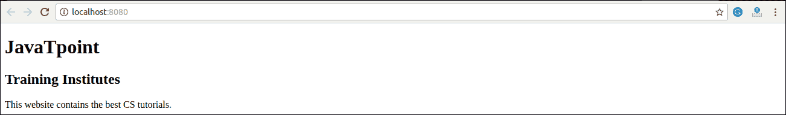
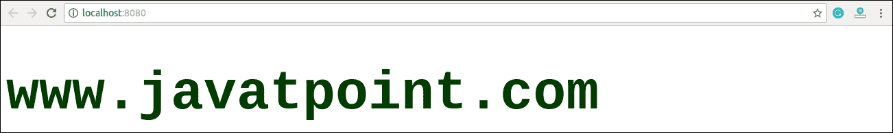

# React JSX

> 哎哎哎:# t0]https://www . javatppoint . com/reac-jsx

正如我们已经看到的，所有的 React 组件都有一个**渲染**功能。渲染函数指定 React 组件的 HTML 输出。JSX(JavaScript 扩展)，是一个 React 扩展，允许编写看起来像 HTML 的 JavaScript 代码。换句话说，JSX 是 React 使用的一种类似于 HTML 的语法，它扩展了 ECMAScript，因此**类似于 HTML 的**语法可以与 JavaScript/React 代码共存。该语法由**预处理程序**(即像巴贝尔这样的 transpilers)用来将类似 HTML 的语法转换成标准的 JavaScript 对象，JavaScript 引擎将解析这些对象。

JSX 为您提供了在您编写 JavaScript 代码的同一个文件中编写类似 HTML/XML 的结构(例如，类似 DOM 的树结构)，然后预处理器将这些表达式转换为实际的 JavaScript 代码。就像 XML/HTML 一样，JSX 标签有一个标签名、属性和子标签。

### 例子

在这里，我们将在 JSX 文件中编写 JSX 语法，并查看由预处理器(babel)转换的相应 JavaScript 代码。

**JSX 档案**

```

<div>Hello JavaTpoint</div>

```

**对应输出**

```

React.createElement("div", null, "Hello JavaTpoint");

```

上一行创建了一个 **react 元素**，并在里面传递**三个参数**，其中第一个是 div 元素的名称，第二个是 div 标签中传递的**属性**，最后一个是您传递的**内容**，即“Hello JavaTpoint”

## 为什么要用 JSX？

*   它比普通的 JavaScript 更快，因为它在将代码翻译成 JavaScript 时执行优化。
*   React 不是通过将标记和逻辑放在单独的文件中来分离技术，而是使用包含这两者的组件。我们将在下一节学习组件。
*   它是类型安全的，大多数错误都可以在编译时找到。
*   这使得创建模板变得更加容易。

## JSX 的嵌套元素

要使用多个元素，您需要用一个容器元素包装它。这里，我们使用 **div** 作为容器元素，其中有**三个**嵌套元素。

**应用程序。jsx〔t1〕**

```

import React, { Component } from 'react';
class App extends Component{
   render(){
      return(
         <div>
            <h1>JavaTpoint</h1>
	      <h2>Training Institutes</h2>
            <p>This website contains the best CS tutorials.</p>
         </div>
      );
   }
}
export default App;

```

**输出:**



## JSX 属性

JSX 使用与普通 HTML 元素相同的属性。JSX 对属性使用**camelocase**命名约定，而不是 HTML 的标准命名约定，比如 HTML 中的类在 JSX 变成了 **className** ，因为该类是 JavaScript 中的保留关键字。我们也可以在 JSX 使用自己的定制属性。对于自定义属性，我们需要使用**数据前缀**。在下面的例子中，我们使用了自定义属性 **data-demoAttribute** 作为 **< p >** 标签的属性。

### 例子

```

import React, { Component } from 'react';
class App extends Component{
   render(){
      return(
         <div>
             <h1>JavaTpoint</h1>
	       <h2>Training Institutes</h2>
             <p data-demoAttribute = "demo">This website contains the best CS tutorials.</p>
         </div>
      );
   }
}
export default App;

```

在 JSX，我们可以通过两种方式指定属性值:

**1。作为字符串文字:**我们可以用双引号指定属性值:

```

var element = 你好 JavaTpoint;

```

**例**

```

import React, { Component } from 'react';
class App extends Component{
   render(){
      return(
         <div>
            <h1 className = "hello" >JavaTpoint</h1>
            <p data-demoAttribute = "demo">This website contains the best CS tutorials.</p>
         </div>
      );
   }
}
export default App;

```

**输出:**

```
JavaTpoint
This website contains the best CS tutorials.

```

**2。作为表达式:**我们可以使用大括号{}将属性值指定为表达式:

```

var element = 你好 JavaTpoint;

```

**例**

```

import React, { Component } from 'react';
class App extends Component{
   render(){
      return(
         <div>
            <h1 className = "hello" >{25+20}</h1>
         </div>
      );
   }
}
export default App;

```

**输出:**

```
45

```

## JSX 评论

JSX 允许我们使用以/*开头、以*/结尾的注释，并用花括号{}包装它们，就像 JSX 表达式一样。下面的例子展示了如何在 JSX 使用注释。

### 例子

```

import React, { Component } from 'react';
class App extends Component{
   render(){
      return(
         <div>
            <h1 className = "hello" >Hello JavaTpoint</h1>
	    {/* This is a comment in JSX */} 
         </div>
      );
   }
}
export default App;

```

## JSX 造型

React 总是建议使用**内联**样式。要设置内联样式，您需要使用 **camelCase** 语法。自动 React 允许在特定元素的数值后追加 **px** 。下面的示例演示如何在元素中使用样式。

### 例子

```

import React, { Component } from 'react';
class App extends Component{
   render(){
     var myStyle = {
         fontSize: 80,
         fontFamily: 'Courier',
         color: '#003300'
      }
      return (
         <div>
            <h1 style = {myStyle}>www.javatpoint.com</h1>
         </div>
      );
   }
}
export default App;

```

**输出:**



#### 注:JSX 不允许使用 if-else 语句。相反，您可以使用条件(三元)表达式。从下面的例子可以看出。

### 例子

```

import React, { Component } from 'react';
class App extends Component{
   render(){
      var i = 5;
      return (
         <div>
            <h1>{i == 1 ? 'True!' : 'False!'}</h1>
         </div>
      );
   }
}
export default App;

```

**输出:**

```
False!

```

* * *