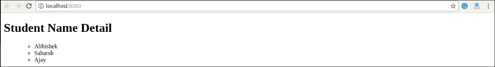

# 反应成分

> 原文：<https://www.javatpoint.com/react-components>

此前，开发人员为开发单页应用程序编写了数千行代码。这些应用程序遵循传统的 DOM 结构，在其中进行更改是一项非常具有挑战性的任务。如果发现任何错误，它会手动搜索整个应用程序并进行相应的更新。引入基于组件的方法是为了解决一个问题。在这种方法中，整个应用程序被分成一个小的逻辑代码组，称为组件。

组件被认为是 React 应用程序的核心构件。这使得构建用户界面的任务变得更加容易。每个组件都存在于同一个空间中，但是它们彼此独立工作，并合并在一个父组件中，父组件将是应用程序的最终用户界面。

每个 React 组件都有自己的结构、方法和 API。它们可以根据您的需要重复使用。为了更好地理解，请将整个用户界面视为一棵树。在这里，根是起始组件，其他每个片段都变成分支，这些分支又被进一步划分为子分支。


在 ReactJS 中，我们主要有两种类型的组件。他们是

1.  功能组件
2.  类组件

## 功能组件

在 React 中，函数组件是编写只包含一个呈现方法而没有自己状态的组件的一种方式。它们只是 JavaScript 函数，可能会也可能不会接收数据作为参数。我们可以创建一个函数，将道具(属性)作为输入，并返回应该呈现的内容。有效的功能组件可以在下面的示例中显示。

```

function WelcomeMessage(props) {
  return 欢迎来到{props.name};
}

```

功能组件也称为无状态组件，因为它们不保存或管理状态。这可以在下面的例子中解释。

### 例子

```

import React, { Component } from 'react';
class App extends React.Component {
   render() {
      return (

      );
   }
}
class First extends React.Component {
   render() {
      return (

# JavaTpoint

      );
   }
}
class Second extends React.Component {
   render() {
      return (

## www.javatpoint.com

这个网站包含伟大的 CS 教程。

      );
   }
}
export default App;

```

**输出:**


## 类组件

类组件比功能组件更复杂。它需要你从反应中延伸出来。组件并创建一个返回一个 React 元素的渲染函数。您可以将数据从一个类传递到其他类组件。您可以通过定义扩展组件并具有渲染功能的类来创建类。有效的类组件如下例所示。

```

class MyComponent extends React.Component {
  render() {
    return (
      This is main component.
    );
  }
}

```

类组件也称为有状态组件，因为它们可以保存或管理本地状态。这可以在下面的例子中解释。

### 例子

在这个例子中，我们正在创建无序元素的列表，在这里我们将为数据数组中的每个对象动态地插入 StudentName。这里，我们使用的是 ES6 箭头语法(= >)，它看起来比旧的 JavaScript 语法干净得多。它帮助我们用更少的代码创建元素。当我们需要创建一个包含很多项目的列表时，它特别有用。

```

import React, { Component } from 'react';
class App extends React.Component {
 constructor() {
      super();
      this.state = {
         data: 
         [
            {           
               "name":"Abhishek"           
            },
            {          
               "name":"Saharsh"           
            },
            {  
               "name":"Ajay"        
            }
         ]
      }
   }
   render() {
      return (

            <studentname><list data="{item}">)}</list></studentname> 
      );
   }
}
class StudentName extends React.Component {
   render() {
      return (

# 学生姓名详细信息

      );
   }
}
class List extends React.Component {
   render() {
      return (

            *   {this.props.data.name} 

      );
   }
}
export default App;

```

**输出:**



* * *