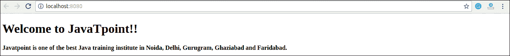
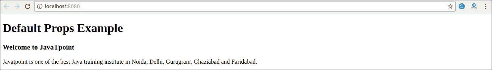
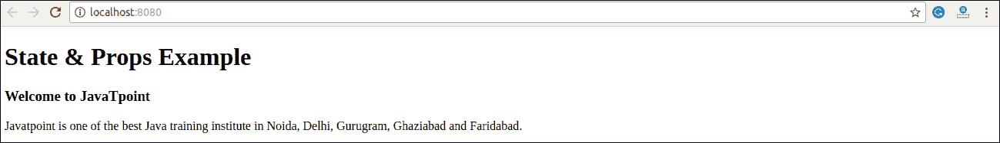

# React 道具

> 原文：<https://www.javatpoint.com/react-props>

道具代表**属性**它们是**只读**组件。它是一个存储标签属性值的对象，工作方式类似于 HTML 属性。它提供了一种将数据从一个组件传递到其他组件的方法。它类似于函数参数。道具传递给组件的方式与函数中传递参数的方式相同。

道具是**不可变的**，所以我们不能从组件内部修改道具。在组件内部，我们可以添加称为道具的属性。这些属性在组件中作为 **this.props** 可用，并且可以在我们的渲染方法中用于渲染动态数据。

当组件中需要不可变数据时，必须在 ReactJS 项目的 **main.js** 文件中的 **reactDom.render()** 方法中添加道具，并在需要的组件中使用。这可以在下面的例子中解释。

### 例子

**App.js**

```

import React, { Component } from 'react';
class App extends React.Component {
   render() {	
      return (

# 欢迎使用{ this.props.name }

#### Javatpoint 是诺伊达、德里、古鲁格拉姆、加济阿巴德和法里达巴德最好的 Java 培训机构之一。

	  );
   }
}
export default App;

```

**Main.js**

```

import React from 'react';
import ReactDOM from 'react-dom';
import App from './App.js';

ReactDOM.render(, document.getElementById('app'));

```

**输出**



## 默认道具

没有必要总是在 reactDom.render()元素中添加道具。也可以直接在组件构造器上设置**默认**道具。这可以在下面的例子中解释。

### 例子

**App.js**

```

import React, { Component } from 'react';
class App extends React.Component {
   render() {	
      return (

# 默认道具示例

### 欢迎使用{this.props.name}

Javatpoint 是诺伊达、德里、古鲁格拉姆、加济阿巴德和法里达巴德最好的 Java 培训机构之一。

        );
    }
}
App.defaultProps = {
   name: "JavaTpoint"
}
export default App;

```

**Main.js**

```

import React from 'react';
import ReactDOM from 'react-dom';
import App from './App.js';

ReactDOM.render(, document.getElementById('app'));

```

**输出**



## 状态和道具

在你的应用中，状态和道具是可以结合的。您可以在父组件中设置状态，并使用道具将其传递给子组件。可以在下面的示例中显示。

### 例子

**App.js**

```

import React, { Component } from 'react';
class App extends React.Component {
   constructor(props) {
      super(props);
      this.state = {
         name: "JavaTpoint",       
      }
   }
   render() {
      return (

      );
   }
}
class JTP extends React.Component {
   render() {
      return (

# 状态和道具示例

### 欢迎使用{this.props.jtpProp}

Javatpoint 是诺伊达、德里、古鲁格拉姆、加济阿巴德和法里达巴德最好的 Java 培训机构之一。

      );
   }
}
export default App;

```

**Main.js**

```

import React from 'react';
import ReactDOM from 'react-dom';
import App from './App.js';

ReactDOM.render(, document.getElementById('app'));

```

**输出:**



* * *