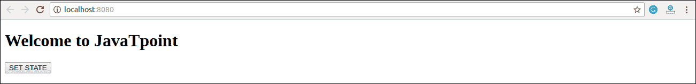
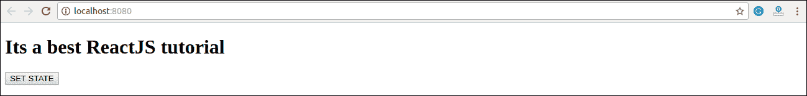
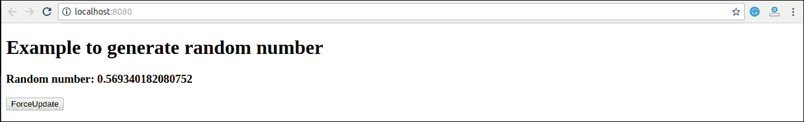
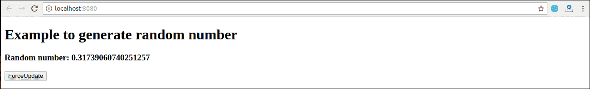
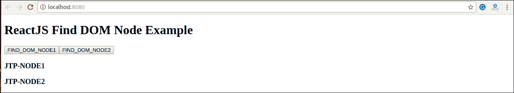
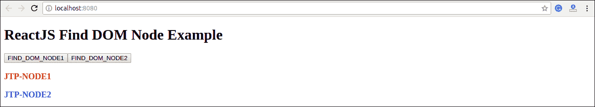

# React 组件应用编程接口

> 原文：<https://www.javatpoint.com/react-component-api>

ReactJS 组件是一个顶级的 API。它使代码完全独立，并可在应用程序中重用。它包括各种方法，用于:

*   创建元素
*   转换元素
*   碎片

在这里，我们将解释 React 组件 API 中可用的三种最重要的方法。

1.  setState()
2.  forceUpdate()
3.  findDOMNode()

## setState()

此方法用于更新组件的状态。此方法并不总是立即替换状态。相反，它只添加对原始状态的更改。这是一种主要方法，用于更新用户界面(UI)以响应事件处理程序和服务器响应。

#### 注意:在 ES6 类中，this.method.bind(this)用于手动绑定 setState()方法。

### 句法

```

this.stateState(object newState[, function callback]);

```

在上面的语法中，有一个可选的**回调**函数，一旦 setState()完成，组件被重新渲染，就会执行该函数。

### 例子

```

import React, { Component } from 'react';
import PropTypes from 'prop-types';
class App extends React.Component {
   constructor() {
      super();		
      this.state = {
          msg: "Welcome to JavaTpoint"
      };	
      this.updateSetState = this.updateSetState.bind(this);
   }
   updateSetState() {
       this.setState({
          msg:"Its a best ReactJS tutorial"
       });
   }
   render() {
      return (
         <div>
             <h1>{this.state.msg}</h1>
             <button onClick = {this.updateSetState}>SET STATE</button>
         </div>
      );
   }
}
export default App;

```

**Main.js**

```

import React from 'react';
import ReactDOM from 'react-dom';
import App from './App.js';

ReactDOM.render(<App/>, document.getElementById('app'));

```

**输出:**



当您点击**设置状态**按钮时，您将看到以下屏幕，并显示更新的信息。



## forceUpdate()

这个方法允许我们手动更新组件。

### 句法

```

Component.forceUpdate(callback);

```

### 例子

**App.js**

```

import React, { Component } from 'react';
class App extends React.Component {
   constructor() {
      super();			
      this.forceUpdateState = this.forceUpdateState.bind(this);
   }
   forceUpdateState() {
      this.forceUpdate();
   };
   render() {
      return (
         <div>
             <h1>Example to generate random number</h1>
             <h3>Random number: {Math.random()}</h3>
             <button onClick = {this.forceUpdateState}>ForceUpdate</button>
         </div>
      );
   }
}
export default App;

```

**输出:**



每次点击**强制更新**按钮，都会生成**随机**号。如下图所示。



## findDOMNode()

对于 DOM 操作，需要使用 **ReactDOM.findDOMNode()** 方法。这个方法允许我们找到或者访问底层的 DOM 节点。

### 句法

```

ReactDOM.findDOMNode(component);

```

### 例子

对于 DOM 操作，首先需要导入这一行:**从您的 **App.js** 文件中的“ **react-dom** 导入 ReactDOM** 。

**App.js**

```

import React, { Component } from 'react';
import ReactDOM from 'react-dom';
class App extends React.Component {
   constructor() {
      super();
      this.findDomNodeHandler1 = this.findDomNodeHandler1.bind(this);
      this.findDomNodeHandler2 = this.findDomNodeHandler2.bind(this);
   };
   findDomNodeHandler1() {
       var myDiv = document.getElementById('myDivOne');
       ReactDOM.findDOMNode(myDivOne).style.color = 'red';
   }
   findDomNodeHandler2() {
       var myDiv = document.getElementById('myDivTwo');
       ReactDOM.findDOMNode(myDivTwo).style.color = 'blue';
   }
   render() {
      return (
         <div>
             <h1>ReactJS Find DOM Node Example</h1>
             <button onClick = {this.findDomNodeHandler1}>FIND_DOM_NODE1</button>
             <button onClick = {this.findDomNodeHandler2}>FIND_DOM_NODE2</button>
             <h3 id = "myDivOne">JTP-NODE1</h3>
             <h3 id = "myDivTwo">JTP-NODE2</h3>
         </div>
      );
   }
}
export default App;

```

**输出:**



一旦点击**按钮**，节点的颜色就会发生变化。可以在下面的屏幕中显示。



* * ***