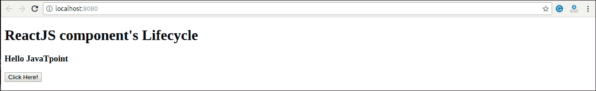
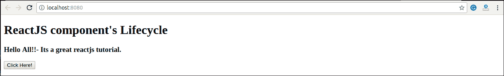

# React组件生命周期

> 原文：<https://www.javatpoint.com/react-component-life-cycle>

在 ReactJS 中，每个组件创建过程都涉及到不同的生命周期方法。这些生命周期方法被称为组件的生命周期。这些生命周期方法不是很复杂，并且在组件生命周期的不同阶段被调用。组件的生命周期分为**四个阶段**。它们是:

1.  初始相位
2.  安装阶段
3.  更新阶段
4.  卸载阶段

每个阶段都包含一些特定于特定阶段的生命周期方法。让我们逐一讨论这些阶段。

## 1.初始相位

这是 ReactJS 组件生命周期的**诞生**阶段。在这里，组件开始了它的 DOM 之旅。在这个阶段，组件包含默认的道具和初始状态。这些默认属性在组件的构造函数中完成。初始阶段只发生一次，由以下方法组成。

*   **getDefaultProps()**
    用于指定 this.props 的默认值，在创建组件或者将父组件中的任何道具传递到组件之前调用。
*   **getInitialState()**
    用于指定 this.state 的默认值，在组件创建之前调用。

## 2.安装阶段

在这个阶段，组件的实例被创建并插入到 DOM 中。它由以下方法组成。

*   **组件将挂载()**
    这在组件被渲染到 DOM 之前被立即调用。在这种情况下，当你在这个方法里面调用 **setState()** 时，组件不会**重新渲染**。
*   **componentdemont()**
    在一个组件被渲染并放置在 DOM 上之后，这个函数会被立即调用。现在，您可以执行任何 DOM 查询操作。
*   **render()**
    这个方法在每个组件中都有定义。它负责返回单个根 **HTML 节点**元素。如果不想渲染任何东西，可以返回一个 **null** 或 **false** 值。

## 3.更新阶段

这是 react 组件生命周期的下一个阶段。在这里，我们获得新的**道具**并改变**状态**。这个阶段还允许处理用户交互，并提供与组件层次结构的通信。这个阶段的主要目标是确保组件显示其自身的最新版本。与出生或死亡阶段不同，这一阶段一次又一次地重复。该阶段包括以下方法。

*   **component willerteprops()**
    当组件收到新道具时调用。如果你想更新状态以响应道具的变化，你应该使用 **this.setState()** 方法比较 this.props 和 nextProps 来执行状态转换。
*   **should component update()**
    当组件决定对 DOM 的任何更改/更新时，会调用它。它允许您控制组件更新自身的行为。如果此方法返回 true，组件将更新。否则，组件将跳过更新。
*   **component will update()**
    就在组件更新发生之前调用。这里不能通过调用 **this.setState()** 方法来改变组件状态。如果 **shouldComponentUpdate()** 返回 false，则不调用。
*   **render()**
    调用它来检查 **this.props** 和 **this.state** 并返回以下类型之一:React elements、Arrays 和 fragments、Booleans or null、String 和 Number。如果 shouldComponentUpdate()返回 false，将再次调用 render()内部的代码，以确保组件正确显示自己。
*   **componentdupdate()**
    组件更新后立即调用。在此方法中，您可以将任何想要在更新发生时执行的代码放入其中。初始渲染时不调用此方法。

## 4.卸载阶段

这是 react 组件生命周期的最后阶段。当组件实例从 DOM 中被**销毁**和**卸载**时调用。此阶段仅包含一种方法，如下所示。

*   **组件将卸载()**
    该方法在组件被永久销毁和卸载之前立即调用。它执行任何必要的**清理**相关任务，如无效定时器，事件监听器，取消网络请求，或清理 DOM 元素。如果组件实例已卸载，则不能再次装载。

### 例子

```

import React, { Component } from 'react';

class App extends React.Component {
   constructor(props) {
      super(props);
      this.state = {hello: "JavaTpoint"};
      this.changeState = this.changeState.bind(this)
   }  
   render() {
      return (

# React组件的生命周期

### 你好{this.state.hello}

             <button onclick="{this.changeState}">Click Here!</button>        

      );
   }
   componentWillMount() {
      console.log('Component Will MOUNT!')
   }
   componentDidMount() {
      console.log('Component Did MOUNT!')
   }
   changeState(){
      this.setState({hello:"All!!- Its a great reactjs tutorial."});
   }
   componentWillReceiveProps(newProps) {    
      console.log('Component Will Recieve Props!')
   }
   shouldComponentUpdate(newProps, newState) {
      return true;
   }
   componentWillUpdate(nextProps, nextState) {
      console.log('Component Will UPDATE!');
   }
   componentDidUpdate(prevProps, prevState) {
      console.log('Component Did UPDATE!')
   }
   componentWillUnmount() {
      console.log('Component Will UNMOUNT!')
   }
}
export default App;

```

**输出:**



当你点击**点击这里**按钮，你会得到更新的结果，如下图所示。



* * *