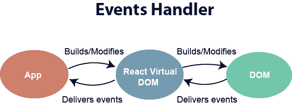
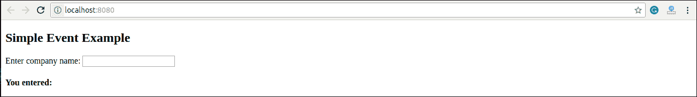
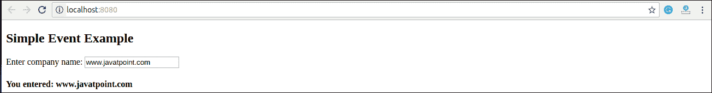

# 对事件做出React

> 原文：<https://www.javatpoint.com/react-events>

事件是可能因用户操作或系统生成的事件而触发的操作。例如，单击鼠标、加载网页、按键、调整窗口大小以及其他交互都称为事件。

React 有自己的事件处理系统，非常类似于在 DOM 元素上处理事件。React事件处理系统被称为合成事件。合成事件是浏览器本机事件的跨浏览器包装。



使用 react 处理事件与在 DOM 上处理事件有一些语法上的区别。这些是:

1.  React 事件被命名为 **camelCase** 而不是**小写**。
2.  对于 JSX，传递一个函数作为**事件处理程序**，而不是**字符串**。例如:

**纯 HTML 格式的事件声明:**

```
 Hello JavaTpoint 

```

**React中的事件声明:**

```
 Hello JavaTpoint 

```

3.在React中，我们不能返回**假**来防止**默认**行为。我们必须显式调用 **preventDefault** 事件来防止默认行为。例如:

在纯 HTML 中，为了防止打开新页面的默认链接行为，我们可以编写:

```
 Click_Me 

```

在 React 中，我们可以将其写成:

```

function ActionLink() {
    function handleClick(e) {
        e.preventDefault();
        console.log('You had clicked a Link.');
    }
    return (
        Click_Me 
    );
}

```

在上面的例子中，e 是根据 **W3C** 规范定义的**合成事件**。

现在让我们看看如何在React中使用事件。

### 例子

在下面的例子中，我们只使用了一个组件并添加了一个 onChange 事件。该事件将触发 **changeText** 功能，返回公司名称。

```

import React, { Component } from 'react';
class App extends React.Component {
    constructor(props) {
        super(props);
        this.state = {
            companyName: ''
        };
    }
    changeText(event) {
        this.setState({
            companyName: event.target.value
        });
    }
    render() {
        return (

## 简单事件示例

                <label htmlfor="name">Enter company name:</label> 
                <input type="text" id="companyName" onchange="{this.changeText.bind(this)}/">

#### 您输入了:{ this.state.companyName }

        );
    }
}
export default App;

```

**输出**

当您执行上述代码时，您将获得以下输出。



在文本框中输入名称后，您将获得如下屏幕所示的输出。



* * *