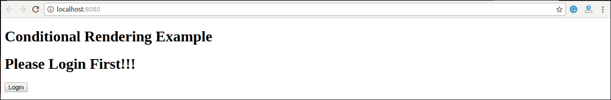

# 反应条件渲染

> 原文：<https://www.javatpoint.com/react-conditional-rendering>

在 React 中，我们可以创建多个组件来封装我们需要的行为。之后，我们可以根据某些条件或应用程序的状态来呈现它们。换句话说，基于一个或几个条件，组件决定它将返回哪些元素。在 React 中，条件渲染的工作方式与 JavaScript 中的条件相同。我们使用 JavaScript 操作符创建表示当前状态的元素，然后 React Component 更新 UI 以匹配它们。

从给定的场景中，我们可以理解条件渲染是如何工作的。考虑一个处理**登录/注销**按钮的例子。登录和注销按钮将是独立的组件。如果用户登录，渲染**注销组件**显示注销按钮。如果用户没有登录，渲染**登录组件**显示登录按钮。在 React 中，这种情况称为**条件渲染**。

在“反应”中，有多种方法可以进行条件渲染。它们如下所示。

*   如果
*   三元算子
*   逻辑&&运算符
*   开关盒操作器
*   带枚举的条件渲染

## 如果

在渲染方法的“反应”中进行条件渲染是最简单的方法。它仅限于组件的总块。如果条件为**真**，则返回要渲染的元素。在下面的例子中可以理解。

### 例子

```

function UserLoggin(props) {
  return 欢迎回来！;
}
function GuestLoggin(props) {
  return 请报名。;
}
function SignUp(props) {
  const isLoggedIn = props.isLoggedIn;
  if (isLoggedIn) {
    return ;
  }
  return <guestlogin>;
}

ReactDOM.render(
  <signup isloggedin="{false}">,
  document.getElementById('root')
);</signup></guestlogin> 
```

## 逻辑&&运算符

该运算符用于检查条件。如果条件为**真**，则在 **& &** 后返回元素**右**，如果为**假**，则**忽略**跳过。

### 句法

```

{
    condition &&
    // whatever written after && will be a part of output.
}

```

我们可以从下面的例子中理解这个概念的行为。

如果运行以下代码，您将看不到**警报**消息，因为条件不匹配。

```

('javatpoint' == 'JavaTpoint') && alert('This alert will never be shown!')

```

如果运行以下代码，您将看到**警告**消息，因为条件匹配。

```

(10 > 5) && alert('This alert will be shown!')

```

### 例子

```

import React from 'react'; 
import ReactDOM from 'react-dom'; 
// Example Component 
function Example() 
{ 
    return( 
            { 
                (10 > 5) && alert('This alert will be shown!')
            } 

        ); 
} 

```

您可以在上面的输出中看到，当条件 **(10 > 5)** 评估为真时，警报消息成功呈现在屏幕上。

## 三元算子

三元运算符用于给定特定条件下两个块交替的情况。这个运算符使 if-else 语句更加简洁。它采用**三个**操作数，用作 if 语句的快捷方式。

### 句法

```

condition ?  true : false

```

如果条件**为真**，则呈现**陈述 1** 。否则，将渲染**假**。

### 例子

```

render() {
  const isLoggedIn = this.state.isLoggedIn;
  return (

      Welcome {isLoggedIn ? 'Back' : 'Please login first'}.

  );
}

```

## 开关盒操作器

有时可能有多个条件渲染。在切换情况下，基于不同的状态应用条件呈现。

### 例子

```

function NotificationMsg({ text}) {
  switch(text) {
    case 'Hi All':
      return ;
    case 'Hello JavaTpoint':
      return <message text="{text}">;
    default:
      return null;
  }
}</message> 
```

## 带枚举的条件渲染

一个**枚举**是一个多条件渲染的好方法。与开关盒操作器相比，它更具 T2 可读性。非常适合在不同的**状态**之间**映射**。它也非常适合在多个条件下进行映射。在下面的例子中可以理解。

### 例子

```

function NotificationMsg({ text, state }) {
  return (

      {{
        info: <message text="{text}">,
        warning: <message text="{text}">,
      }[state]}</message></message> 
  );
}

```

## 条件渲染示例

在下面的例子中，我们创建了一个名为**应用程序**的**状态**组件，它维护登录控制。这里，我们创建了三个组件，分别代表注销、登录和消息组件。有状态组件应用将根据其当前**状态**渲染或。

```

import React, { Component } from 'react';  
// Message Component 
function Message(props) 
{ 
    if (props.isLoggedIn) 
        return 欢迎回来！！！; 
    else
        return 请先登录！！！; 
} 
// Login Component 
function Login(props) 
{ 
   return( 
            Login  
       ); 
}  
// Logout Component 
function Logout(props) 
{ 
    return( 
            Logout  
       ); 
} 
class App extends Component{  
   constructor(props) 
    { 
        super(props);  
        this.handleLogin = this.handleLogin.bind(this);
    	  this.handleLogout = this.handleLogout.bind(this); 
	  this.state = {isLoggedIn : false}; 
    } 
   handleLogin() 
    { 
        this.setState({isLoggedIn : true}); 
    } 
    handleLogout() 
    { 
        this.setState({isLoggedIn : false}); 
    } 
    render(){ 
        return( 

# 条件渲染示例

                <message isloggedin="{this.state.isLoggedIn}/">{ 
                    (this.state.isLoggedIn)?( 
                    <logout clickinfo="{this.handleLogout}">) : ( 
                    <login clickinfo="{this.handleLogin}">) 
                }</login></logout></message>        
            ); 
    } 
} 
export default App;  

```

**输出:**

当您执行上述代码时，您将看到以下屏幕。



单击注销按钮后，您将看到下面的屏幕。


## 阻止组件表单呈现

有时，一个组件隐藏了自己，即使另一个组件渲染了它。为此(防止组件渲染)，我们将不得不返回 **null** 而不是它的渲染输出。从下面的例子可以理解:

### 例子

在本例中，是基于名为**的道具显示消息**的值渲染的。如果 prop 值为 false，则组件不会呈现。

```

import React from 'react'; 
import ReactDOM from 'react-dom'; 
function Show(props) 
{ 
    if(!props.displayMessage) 
        return null; 
    else
        return 组件已呈现; 
} 
ReactDOM.render( 

# 消息

        ,  
    document.getElementById('app') 
);

```

**输出:**


* * *