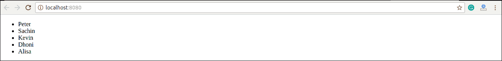
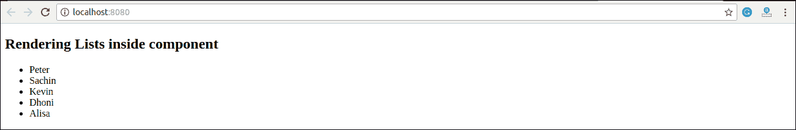

# React列表

> 原文：<https://www.javatpoint.com/react-lists>

列表用于以有序格式显示数据，主要用于在网站上显示菜单。在 React 中，列表的创建方式与我们在 JavaScript 中创建列表的方式类似。让我们看看如何在普通的 JavaScript 中转换列表。

map()函数用于遍历列表。在下面的示例中，map()函数接受一个数字数组，并将它们的值乘以 5。我们将 map()返回的新数组分配给变量 multiplyNums 并记录下来。

### 例子

```

var numbers = [1, 2, 3, 4, 5]; 
const multiplyNums = numbers.map((number)=>{ 
	return (number * 5); 
}); 
console.log(multiplyNums); 

```

**输出**

上面的 JavaScript 代码将在控制台上记录输出。代码的输出如下所示。

```
[5, 10, 15, 20, 25]

```

现在，让我们看看如何在 React 中创建一个列表。为此，我们将使用 map()函数遍历列表元素，对于更新，我们将它们括在**大括号{}** 之间。最后，我们将数组元素分配给列表项。现在，将这个新列表包含在**<【ul】></ul>**元素中，并将其渲染到 DOM 中。

### 例子

```

import React from 'react'; 
import ReactDOM from 'react-dom'; 

const myList = ['Peter', 'Sachin', 'Kevin', 'Dhoni', 'Alisa']; 
const listItems = myList.map((myList)=>{ 
	return {myList}; 
}); 
ReactDOM.render( 
	 {listItems} , 
	document.getElementById('app') 
); 
export default App;

```

**输出**



## 组件内的渲染列表

在前面的例子中，我们已经直接将列表呈现给了 DOM。但是在 React 中呈现列表并不是一个好的做法。在《React》中，我们已经看到一切都是作为单独的组件构建的。因此，我们需要在组件内部呈现列表。我们可以在下面的代码中理解它。

### 例子

```

import React from 'react'; 
import ReactDOM from 'react-dom'; 

function NameList(props) {
  const myLists = props.myLists;
  const listItems = myLists.map((myList) =>
    {myList}
  );
  return (

## 在组件内呈现列表

  );
}
const myLists = ['Peter', 'Sachin', 'Kevin', 'Dhoni', 'Alisa']; 
ReactDOM.render(
  ,
  document.getElementById('app')
);
export default App; 
```

**输出**



* * *