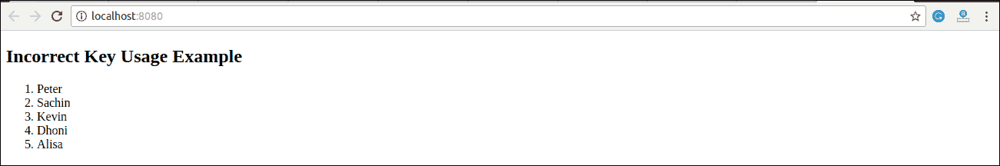
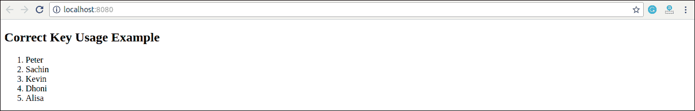
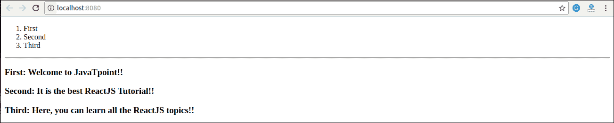

# 反应键

> 原文：<https://www.javatpoint.com/react-keys>

密钥是唯一的标识符。在“反应”中，它用于识别哪些项目已从列表中更改、更新或删除。当我们动态地创建组件或者当用户改变列表时，它是有用的。它还有助于确定集合中哪些组件需要重新呈现，而不是每次都重新呈现整个组件集。

应该在数组内部给定键，以给元素一个稳定的标识。选择关键字作为唯一标识列表中项目的字符串的最佳方式。通过下面的例子可以理解。

### 例子

```

const stringLists = [ 'Peter', 'Sachin', 'Kevin', 'Dhoni', 'Alisa' ]; 

const updatedLists = stringLists.map((strList)=>{ 
    {strList}; 
}); 

```

如果渲染项目没有稳定的标识，您可以将项目**索引**指定为列表的键。可以在下面的示例中显示。

### 例子

```

const stringLists = [ 'Peter', 'Sachin', 'Kevin', 'Dhoni', 'Alisa' ]; 

const updatedLists = stringLists.map((strList, index)=>{ 
    {strList}; 
});

```

#### 注意:如果项目的顺序将来可能会改变，则不建议对键使用索引。它会给开发人员造成混乱，并可能导致组件状态的问题。

## 将密钥与组件一起使用

假设您已经为**列表项**创建了一个单独的组件，并从该组件中提取了列表项。在这种情况下，您应该在数组中的 **<列表项/ >** 元素上分配键，而不是在列表项本身的 **< li >** 元素上分配键。为了避免错误，您必须记住，键只有在周围数组的上下文中才有意义。因此，从 map()函数返回的任何内容都建议分配一个键。

### 示例:不正确的密钥用法

```

import React from 'react'; 
import ReactDOM from 'react-dom'; 

function ListItem(props) {
  const item = props.item;
  return (
    // Wrong! No need to specify the key here.
    {item}
  );
}
function NameList(props) {
  const myLists = props.myLists;
  const listItems = myLists.map((strLists) =>
    // The key should have been specified here.
    );
  return (

## 不正确的密钥使用示例

  );
}
const myLists = ['Peter', 'Sachin', 'Kevin', 'Dhoni', 'Alisa'];
ReactDOM.render(
  <namelist mylists="{myLists}/">,
  document.getElementById('app')
);
export default App;</namelist> 
```

在给定的示例中，列表被成功呈现。但是我们没有给 map()迭代器分配一个键，这不是一个好的做法。

**输出**



### 示例:正确的密钥用法

为了纠正上面的例子，我们应该给 map()迭代器赋值。

```

import React from 'react'; 
import ReactDOM from 'react-dom'; 

function ListItem(props) {
  const item = props.item;
  return (
    // No need to specify the key here.
    {item}
  );
}
function NameList(props) {
  const myLists = props.myLists;
  const listItems = myLists.map((strLists) =>
    // The key should have been specified here.
    );
  return (

## 正确的密钥使用示例

  );
}
const myLists = ['Peter', 'Sachin', 'Kevin', 'Dhoni', 'Alisa'];
ReactDOM.render(
  <namelist mylists="{myLists}/">,
  document.getElementById('app')
);
export default App;</namelist> 
```

**输出**



## 兄弟中键的唯一性

我们已经讨论过数组中的键分配在它们的**兄弟**中必须是唯一的。然而，这并不意味着钥匙应该是**全球唯一的**。我们可以使用同一组键来产生两个不同的数组。在下面的例子中可以理解。

### 例子

```

import React from 'react'; 
import ReactDOM from 'react-dom'; 
function MenuBlog(props) {
  const titlebar = (

      {props.data.map((show) =>
        1.  {show.title}
      )}

  );
  const content = props.data.map((show) =>

### {show.title}: {show.content}

  );
  return (

      {titlebar}

* * *

      {content}

  );
}
const data = [
  {id: 1, title: 'First', content: 'Welcome to JavaTpoint!!'},
  {id: 2, title: 'Second', content: 'It is the best ReactJS Tutorial!!'},
  {id: 3, title: 'Third', content: 'Here, you can learn all the ReactJS topics!!'}
];
ReactDOM.render(
  ,
  document.getElementById('app')
);
export default App; 
```

**输出**



* * *