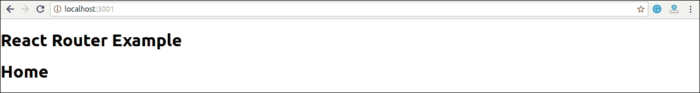
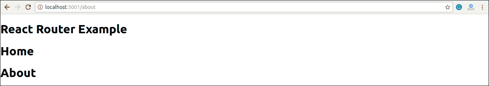
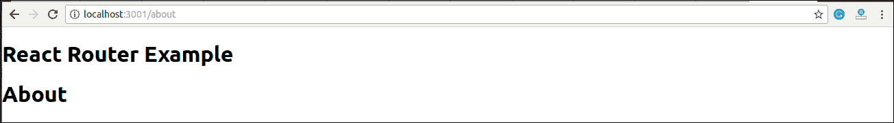
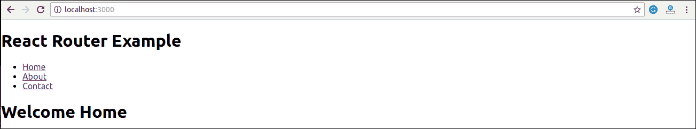
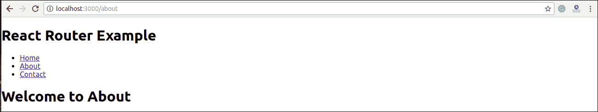
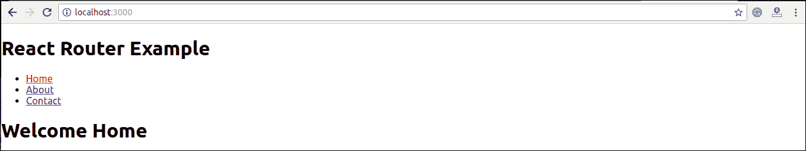
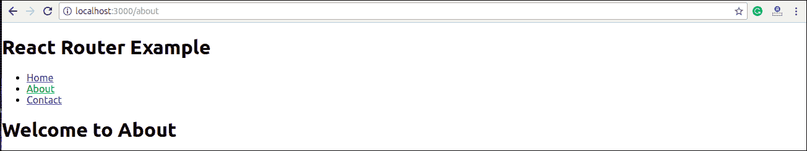
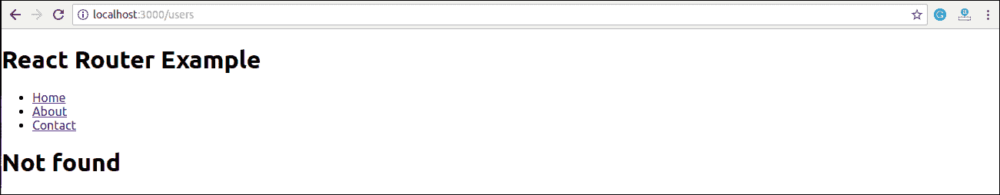
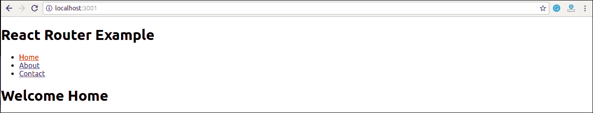
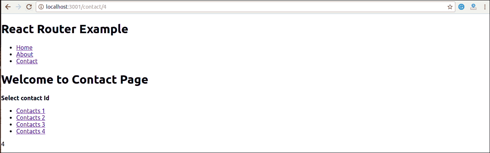

# 反应路由器

> 原文：<https://www.javatpoint.com/react-router>

路由是根据用户的操作或请求将用户定向到不同页面的过程。ReactJS 路由器主要用于开发单页 Web 应用程序。React Router 用于在应用程序中定义多条路由。当用户在浏览器中键入特定的网址时，如果该网址路径与路由器文件中的任何“路由”匹配，用户将被重定向到该特定路由。

反应路由器是建立在反应之上的标准库系统，用于使用反应路由器包在反应应用程序中创建路由。它为浏览器上的同步网址提供了将在网页上显示的数据。它维护应用程序的标准结构和行为，主要用于开发单页 web 应用程序。

## 反应路由器的需求

React Router 在单页应用程序中显示多个视图方面发挥着重要作用。如果没有反应路由器，就不可能在反应应用程序中显示多个视图。像脸书、Instagram 等大多数社交媒体网站都使用 React Router 来呈现多个视图。

## 反应路由器安装

React 包含三个不同的路由包。这些是:

1.  **react-router:** 它为 React Router 应用程序提供核心路由组件和功能。
2.  **react-router-native:** 用于移动应用。
3.  **react-router-dom:** 用于 web 应用程序设计。

不可能直接在应用程序中安装 react-router。要使用 react 路由，首先，您需要在应用程序中安装 react-router-dom 模块。以下命令用于安装 react 路由器 dom。

```

$ npm install react-router-dom --save 

```

## 反应路由器中的组件

有两种类型的路由器组件:

*   **<浏览器> :** 用于处理动态网址。
*   **<有一个定时器> :** 用于处理静态请求。

### 例子

**步骤-1:** 在我们的项目中，我们将创建另外两个组件以及已经存在的 **App.js** 。

**约. js**

```

import React from 'react'
class About extends React.Component {
  render() {
    return <h1>About</h1>
  }
}
export default About

```

**联系方式**

```

import React from 'react'
class Contact extends React.Component {
  render() {
    return <h1>Contact</h1>
  }
}
export default Contact

```

**App.js**

```

import React from 'react'
class App extends React.Component {
  render() {
    return (
      <div>
        <h1>Home</h1>
      </div>
    )
  }
}
export default App

```

**步骤-2:** 对于 Routing，打开 index.js 文件，导入其中的所有三个组件文件。这里需要导入线路:**从【反应-路由器-DOM】**导入{路由，链接，浏览器作为路由器}帮助我们实现路由。现在，我们的 index.js 文件如下所示。

## 什么是路线？

它用于根据指定的路径定义和呈现组件。它将接受组件并呈现以定义应该呈现的内容。

**Index.js**

```

import React from 'react';
import ReactDOM from 'react-dom';
import { Route, Link, BrowserRouter as Router } from 'react-router-dom'
import './index.css';
import App from './App';
import About from './about'
import Contact from './contact'

const routing = (
  <Router>
    <div>
      <h1>React Router Example</h1>
      <Route path="/" component={App} />
      <Route path="/about" component={About} />
      <Route path="/contact" component={Contact} />
    </div>
  </Router>
)
ReactDOM.render(routing, document.getElementById('root'));

```

**步骤 3:** 打开**命令提示符**，转到您的项目位置，然后键入 **npm 启动**。您将看到以下屏幕。



现在，如果在浏览器中手动输入**:**本地主机:3000/关于**，屏幕上会出现**关于**组件渲染。**

**

**步骤-4:** 在上面的画面中，可以看到 **Home** 组件仍然在渲染。因为主路径是“ **/** ”，左右路径是“**/左右**”，所以可以观察到**斜线**在渲染两个组件的两条路径中都很常见。要停止这种行为，您需要使用**精确的**道具。从下面的例子可以看出。

**Index.js**

```

import React from 'react';
import ReactDOM from 'react-dom';
import { Route, Link, BrowserRouter as Router } from 'react-router-dom'
import './index.css';
import App from './App';
import About from './about'
import Contact from './contact'

const routing = (
  <Router>
    <div>
      <h1>React Router Example</h1>
      <Route exact path="/" component={App} />
      <Route path="/about" component={About} />
      <Route path="/contact" component={Contact} />
    </div>
  </Router>
)
ReactDOM.render(routing, document.getElementById('root'));

```

**输出**



## 使用链接组件添加导航

有时候，我们想在一个页面上需要**多个**链接。当我们点击任何一个特定的**链接**时，它应该加载与该路径相关的页面，而无需**重新加载**网页。为此，我们需要在 **index.js** 文件中导入 **< Link >** 组件。

### < Link>成分是什么？

该组件用于创建链接，允许**在不同的**网址**上导航**，并在不重新加载网页的情况下呈现其内容。

**例**

**Index.js**

```

import React from 'react';
import ReactDOM from 'react-dom';
import { Route, Link, BrowserRouter as Router } from 'react-router-dom'
import './index.css';
import App from './App';
import About from './about'
import Contact from './contact'

const routing = (
  <Router>
    <div>
      <h1>React Router Example</h1>
      <ul>
        <li>
          <Link to="/">Home</Link>
        </li>
        <li>
          <Link to="/about">About</Link>
        </li>
        <li>
          <Link to="/contact">Contact</Link>
        </li>
      </ul>
      <Route exact path="/" component={App} />
      <Route path="/about" component={About} />
      <Route path="/contact" component={Contact} />
    </div>
  </Router>
)
ReactDOM.render(routing, document.getElementById('root'));

```

**输出**



添加链接后，您可以看到路线呈现在屏幕上。现在，如果你点击**关于**，你会看到网址正在改变，关于组件被渲染。



现在，我们需要在链接中添加一些**样式**。这样当我们点击任何一个特定的链接时，就可以很容易地**识别出**哪个链接是**激活的**。为了做到这一点，react router 提供了一个新的技巧**导航链接**而不是**链接**。现在，在 index.js 文件中，从 Navlink 替换 Link，并添加属性 **activeStyle** 。活动样式属性意味着当我们点击链接时，它应该有一个特定的样式，这样我们就可以区分哪个是当前活动的。

```

import React from 'react';
import ReactDOM from 'react-dom';
import { BrowserRouter as Router, Route, Link, NavLink } from 'react-router-dom'
import './index.css';
import App from './App';
import About from './about'
import Contact from './contact'

const routing = (
  <Router>
    <div>
      <h1>React Router Example</h1>
      <ul>
        <li>
          <NavLink to="/" exact activeStyle={
             {color:'red'}
          }>Home</NavLink>
        </li>
        <li>
          <NavLink to="/about" exact activeStyle={
             {color:'green'}
          }>About</NavLink>
        </li>
        <li>
          <NavLink to="/contact" exact activeStyle={
             {color:'magenta'}
          }>Contact</NavLink>
        </li>
      </ul>
      <Route exact path="/" component={App} />
      <Route path="/about" component={About} />
      <Route path="/contact" component={Contact} />
    </div>
  </Router>
)
ReactDOM.render(routing, document.getElementById('root'));

```

**输出**

当我们执行上面的程序时，我们会得到下面的屏幕，在其中我们可以看到 **Home** 链接的颜色是**红色**，并且是当前唯一一个**活动的**链接。



现在，当我们点击**关于**链接时，其颜色显示为**绿色**，这是当前**活动的**链接。



### <link> vs<navlink></navlink>

链接组件允许在网站上导航不同的路线，而导航组件用于向活动路线添加样式。

## 反应路由器交换机

<**切换** >组件仅在路径匹配**时用于渲染组件。否则，返回到**未找到的**组件。**

为了理解这一点，首先，我们需要创建一个**未找到的**组件。

**注意到了。js**

```

import React from 'react'
const Notfound = () => 未发现
export default Notfound

```

现在，在 index.js 文件中导入<switch>组件。可以在下面的代码中看到。</switch>

**Index.js**

```

import React from 'react';
import ReactDOM from 'react-dom';
import { BrowserRouter as Router, Route, Link, NavLink, Switch } from 'react-router-dom'
import './index.css';
import App from './App';
import About from './about'
import Contact from './contact'
import Notfound from './notfound'

const routing = (
  <Router>
    <div>
      <h1>React Router Example</h1>
      <ul>
        <li>
          <NavLink to="/" exact activeStyle={
             {color:'red'}
          }>Home</NavLink>
        </li>
        <li>
          <NavLink to="/about" exact activeStyle={
             {color:'green'}
          }>About</NavLink>
        </li>
        <li>
          <NavLink to="/contact" exact activeStyle={
             {color:'magenta'}
          }>Contact</NavLink>
        </li>
      </ul>
      <Switch>
         <Route exact path="/" component={App} />
         <Route path="/about" component={About} />
         <Route path="/contact" component={Contact} />
         <Route component={Notfound} />
      </Switch>
    </div>
  </Router>
)
ReactDOM.render(routing, document.getElementById('root'));

```

**输出**

如果我们手动输入**错误的**路径，会给出未找到的错误。



## 反应路由器

在我们的应用程序中，一个<redirect>组件用于重定向到另一条路由，以维护旧的网址。它可以放置在路线层次结构中的任何位置。</redirect>

### 反应中的嵌套路由

嵌套布线允许您在应用程序中渲染**子布线**。在下面的例子中可以理解。

**例**

**index.js**

```

import React from 'react';
import ReactDOM from 'react-dom';
import { BrowserRouter as Router, Route, Link, NavLink, Switch } from 'react-router-dom'
import './index.css';
import App from './App';
import About from './about'
import Contact from './contact'
import Notfound from './notfound'

const routing = (
  <Router>
    <div>
      <h1>React Router Example</h1>
      <ul>
        <li>
          <NavLink to="/" exact activeStyle={
             {color:'red'}
          }>Home</NavLink>
        </li>
        <li>
          <NavLink to="/about" exact activeStyle={
             {color:'green'}
          }>About</NavLink>
        </li>
        <li>
          <NavLink to="/contact" exact activeStyle={
             {color:'magenta'}
          }>Contact</NavLink>
        </li>
      </ul>
      <Switch>
         <Route exact path="/" component={App} />
         <Route path="/about" component={About} />
         <Route path="/contact" component={Contact} />
         <Route component={Notfound} />
      </Switch>
    </div>
  </Router>
)
ReactDOM.render(routing, document.getElementById('root'));

```

在 **contact.js** 文件中，我们需要导入**反应路由器**组件来实现**子路径**。

**contact.js**

```

import React from 'react'
import { Route, Link } from 'react-router-dom'

const Contacts = ({ match }) => <p>{match.params.id}</p>

class Contact extends React.Component {
  render() {
    const { url } = this.props.match
    return (
      <div>
        <h1>Welcome to Contact Page</h1>
        <strong>Select contact Id</strong>
        <ul>
          <li>
            <Link to="/contact/1">Contacts 1 </Link>
          </li>
          <li>
            <Link to="/contact/2">Contacts 2 </Link>
          </li>
          <li>
            <Link to="/contact/3">Contacts 3 </Link>
          </li>
          <li>
            <Link to="/contact/4">Contacts 4 </Link>
          </li>
        </ul>
        <Route path="/contact/:id" component={Contacts} />
      </div>
    )
  }
}
export default Contact

```

**输出**

当我们执行上述程序时，我们将获得以下输出。



点击**联系人**链接后，我们会得到联系人列表。现在，选择任何联系人，我们将获得相应的输出。可以在下面的示例中显示。



## 反应路由器的优势

React 路由器的优势如下:

*   在这种情况下，没有必要手动设置浏览器历史。
*   链接用于导航应用程序中的内部链接。它类似于锚点标签。
*   它使用切换功能进行渲染。
*   路由器只需要一个子元素。
*   在这种情况下，每个组件都在<route>中指定。</route>

* * ***