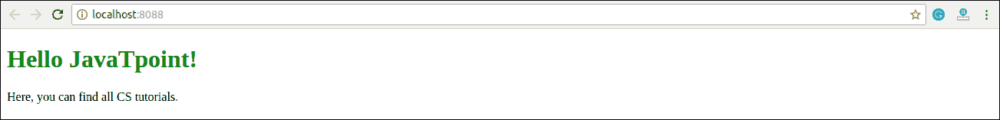
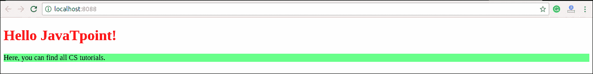
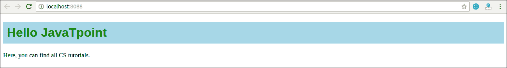
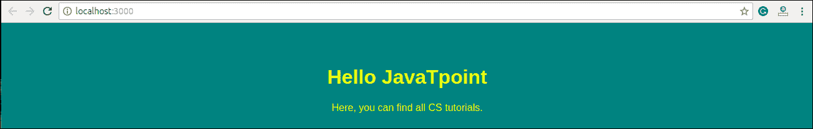
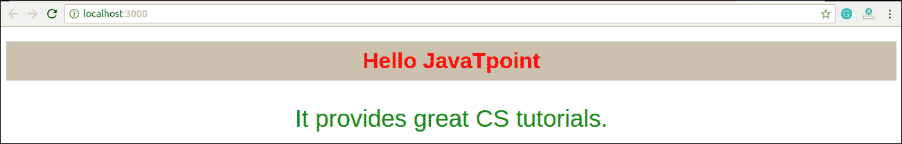
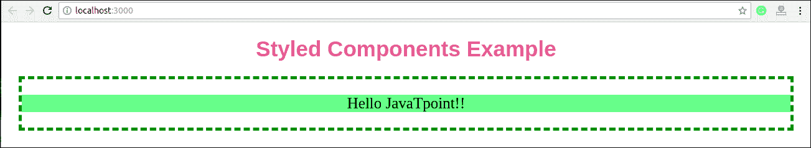
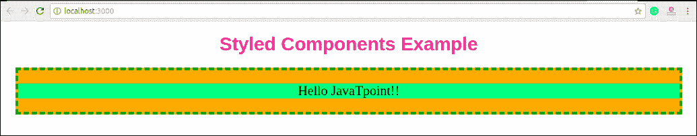

# React CSS

> 原文：<https://www.javatpoint.com/react-css>

“React”中的 CSS 用于设置“React”应用程序或组件的样式。**样式**属性是 React 应用程序中最常用的样式属性，它在渲染时添加动态计算的样式。它接受一个在**属性中的 JavaScript 对象，而不是一个 CSS 字符串。有很多方法可以为你的 React 应用或组件添加样式。在这里，我们将主要讨论**四种**方式来设计 React 组件，如下所示:**

1.  内嵌样式
2.  CSS 样式表
3.  CSS 模块
4.  样式化组件

## 1.内嵌样式

内联样式是用样式名的 camelCase 版本中的 JavaScript 对象指定的。它的价值在于风格？s 值，我们通常将它放入字符串中。

### 例子

**App.js**

```

import React from 'react';
import ReactDOM from 'react-dom';

class App extends React.Component {
  render() {
    return (
      <div>
      <h1 style={{color: "Green"}}>Hello JavaTpoint!</h1>
      <p>Here, you can find all CS tutorials.</p>
      </div>
    );
  }
}
export default App;

```

#### 注意:你可以在上面的例子中看到，我们在:
<h1 style = { { color:【Green】}>Hello JavaTpoint！< /h1 > 。
是因为，在 JSX，JavaScript 表达式是写在花括号里面的，JavaScript 对象也是用花括号的，所以上面的样式是写在两组花括号里面的{{}}。

**输出**



### camelCase 属性名称

如果属性有两个名字，比如**背景色**，必须用 camel case 语法写。

**例**

**App.js**

```

import React from 'react';
import ReactDOM from 'react-dom';

class App extends React.Component {
  render() {
    return (
      <div>
      <h1 style={{color: "Red"}}>Hello JavaTpoint!</h1>
      <p style={{backgroundColor: "lightgreen"}}>Here, you can find all CS tutorials.</p>
      </div>
    );
  }
}
export default App;

```

**输出**



### 使用 JavaScript 对象

内联样式还允许我们创建一个带有样式信息的对象，并在样式属性中引用它。

**例**

**App.js**

```

import React from 'react';
import ReactDOM from 'react-dom';

class App extends React.Component {
  render() {
    const mystyle = {
      color: "Green",
      backgroundColor: "lightBlue",
      padding: "10px",
      fontFamily: "Arial"
    };
    return (
      <div>
      <h1 style={mystyle}>Hello JavaTpoint</h1>
      <p>Here, you can find all CS tutorials.</p>
      </div>
    );
  }
}
export default App;

```

**输出**



## 2.CSS 样式表

您可以在单独的文件中为您的 React 应用程序编写样式，并用. css 扩展名保存该文件。现在，您可以在应用程序中**导入**这个文件。

### 例子

**App.js**

```

import React from 'react';
import ReactDOM from 'react-dom';
import './App.css';

class App extends React.Component {
  render() {
    return (
      <div>
      <h1>Hello JavaTpoint</h1>
      <p>Here, you can find all CS tutorials.</p>
      </div>
    );
  }
}
export default App;

```

app . CSS

```

body {
  background-color: #008080;
  color: yellow;
  padding: 40px;
  font-family: Arial;
  text-align: center;
}

```

**Index.html**

```

<!DOCTYPE html>
<html lang="en">
  <head>
    <meta charset="utf-8" />
    <meta name="viewport"
      content="width=device-width, initial-scale=1" />
    <title>React App</title>
  </head>
  <body>
    <div id="app"></div>
  </body>
</html>

```

**输出**



## 3.CSS 模块

CSS 模块是向应用程序添加样式的另一种方式。这是一个 **CSS 文件**，默认情况下，所有类名和**动画**名称都在本地范围内。它仅适用于导入它的组件，这意味着未经您的许可，您添加的任何样式都不能应用于其他组件，并且您永远不需要担心名称冲突。你可以用 **.module.css** 扩展来创建 CSS Module，就像一个 **myStyles.module.css** 名字一样。

### 例子

**App.js**

```

import React from 'react';
import ReactDOM from 'react-dom';
import styles from './myStyles.module.css'; 

class App extends React.Component {
  render() {
    return (
      <div>
      <h1 className={styles.mystyle}>Hello JavaTpoint</h1>
      <p className={styles.parastyle}>It provides great CS tutorials.</p>
      </div>
    );
  }
}
export default App;

```

**mysilys . module . CSS**

```

.mystyle {
  background-color: #cdc0b0;
  color: Red;
  padding: 10px;
  font-family: Arial;
  text-align: center;
}

.parastyle{
  color: Green;
  font-family: Arial;
  font-size: 35px;
  text-align: center;
}

```

**输出**



## 4.样式化组件

样式化组件是一个用于 React 的**库**。它使用增强的 CSS 来设计应用程序中的 React 组件系统，这是用 JavaScript 和 CSS 混合编写的。

**风格化组件提供:**

*   自动关键 CSS
*   没有类名错误
*   更容易删除 CSS
*   简单的动态造型
*   无痛保养

### 装置

样式化组件库只需要一个命令就可以安装到您的 React 应用程序中。这就是:

```

$ npm install styled-components --save

```

**例**

在这里，我们通过选择一个特定的 HTML 元素来创建一个变量，比如**<【div】>**、**<【Title】>**和 **<段落>** 来存储我们的样式属性。现在我们可以使用变量的名称作为 React 组件的包装器**<【Div】></Div>**。

**App.js**

```

import React from 'react';
import ReactDOM from 'react-dom';
import styled from 'styled-components';

class App extends React.Component {
  render() {
    const Div:any = styled.div`
            margin: 20px;
            border: 5px dashed green;
            &:hover {
            background-color: ${(props:any) => props.hoverColor};
            }
            `;
    const Title = styled.h1`
            font-family: Arial;
            font-size: 35px;
            text-align: center;
            color: palevioletred;
            `;
    const Paragraph = styled.p`
            font-size: 25px;
            text-align: center;
            background-Color: lightgreen;
            `;
    return (
       <div>          
            <Title>Styled Components Example</Title>
            <p></p>
            <Div hoverColor="Orange">
                 <Paragraph>Hello JavaTpoint!!</Paragraph>
            </Div>
        </div>
    );
  }
}
export default App;

```

**输出**

现在，执行 App.js 文件，我们将获得如下所示的输出。



当我们将鼠标指针移动到图像上时，它的颜色将会改变，如下图所示。



* * *