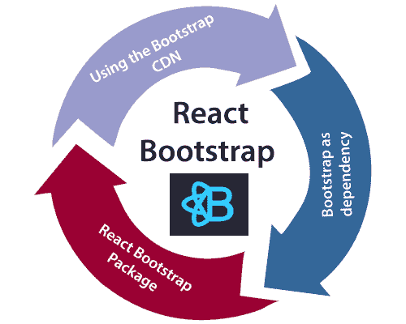
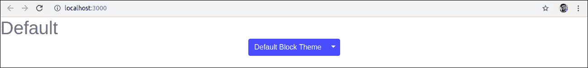
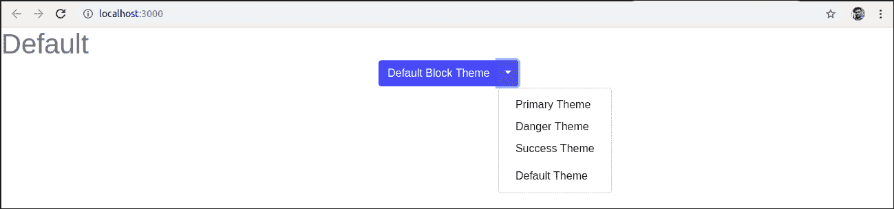
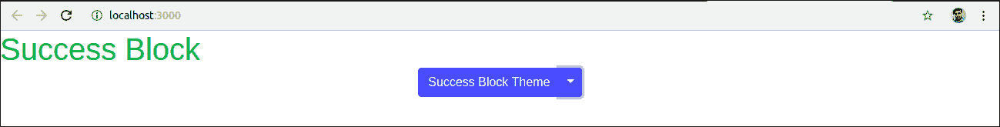
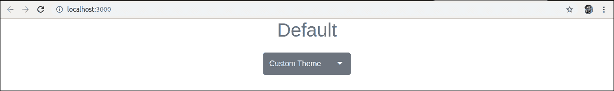
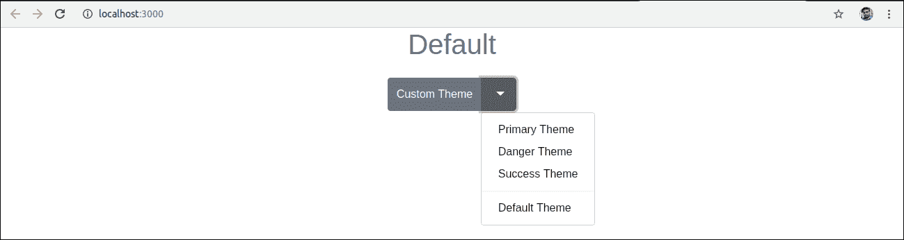
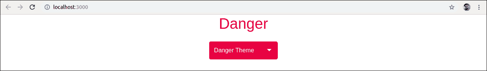

# 反应自举

> 原文：<https://www.javatpoint.com/react-bootstrap>

单页应用程序在过去几年越来越受欢迎，因此引入了许多前端框架，如 Angular、React、Vue.js、Ember 等。因此，jQuery 不是构建 web 应用程序的必要条件。如今，React 拥有构建 web 应用程序最常用的 JavaScript 框架，Bootstrap 成为最流行的 CSS 框架。因此，有必要了解 Bootstrap 可以在 React 应用程序中使用的各种方法，这是本节的主要目的。

## 添加用于反应的引导

我们可以通过几种方式将 Bootstrap 添加到 React 应用程序中。最常见的三种方式如下:

1.  使用引导 CDN
2.  作为依赖的引导
3.  反应引导包



## 使用引导 CDN

这是将 Bootstrap 添加到 React 应用程序的最简单方法。不需要安装或下载引导程序。我们可以简单地将 **<链接>** 放入 React app 的**【index.html】**文件的 **<头>** 部分，如下图所示。

```

<link rel="stylesheet" href="https://stackpath.bootstrapcdn.com/bootstrap/4.3.1/css/bootstrap.min.css" integrity="sha384-ggOyR0iXCbMQv3Xipma34MD+dH/1fQ784/j6cY/iJTQUOhcWr7x9JvoRxT2MZw1T" crossorigin="anonymous">

```

如果需要在 React 应用程序中使用依赖于 JavaScript/jQuery 的 Bootstrap 组件，我们需要在文档中包含 **jQuery** 、 **Popper.js** 、 **Bootstrap.js** 。在关闭**文件的**</正文>** 标签附近的 **<脚本>** 标签中添加以下导入。**

```

<script src="https://code.jquery.com/jquery-3.3.1.slim.min.js" integrity="sha384-q8i/X+965DzO0rT7abK41JStQIAqVgRVzpbzo5smXKp4YfRvH+8abtTE1Pi6jizo" crossorigin="anonymous"></script>

<script src="https://cdnjs.cloudflare.com/ajax/libs/popper.js/1.14.7/umd/popper.min.js" integrity="sha384-UO2eT0CpHqdSJQ6hJty5KVphtPhzWj9WO1clHTMGa3JDZwrnQq4sF86dIHNDz0W1" crossorigin="anonymous"></script>

<script src="https://stackpath.bootstrapcdn.com/bootstrap/4.3.1/js/bootstrap.min.js" integrity="sha384-JjSmVgyd0p3pXB1rRibZUAYoIIy6OrQ6VrjIEaFf/nJGzIxFDsf4x0xIM+B07jRM" crossorigin="anonymous"></script>

```

在上面的代码片段中，我们使用了 jQuery 的 slim 版本，尽管我们也可以使用完整版本。现在，Bootstrap 已成功添加到 React 应用程序中，我们可以在 React 应用程序中使用 Bootstrap 提供的所有 CSS 实用程序和 UI 组件。

## 作为依赖的引导

如果我们使用的是构建工具或模块捆绑器(如 Webpack)，那么将 Bootstrap 作为依赖项导入是将 Bootstrap 添加到 React 应用程序的首选选项。我们可以安装 Bootstrap 作为 React 应用程序的依赖项。要安装引导程序，请在终端窗口中运行以下命令。

```

$ npm install bootstrap --save

```

安装 Bootstrap 后，我们可以将其导入到 React 应用程序条目文件中。如果使用 **create-react-app** 工具创建了 React 项目，请打开 **src/index.js** 文件，并添加以下代码:

```

import 'bootstrap/dist/css/bootstrap.min.css';

```

现在，我们可以在 React 应用程序中使用 CSS 类和实用程序。此外，如果我们想使用 JavaScript 组件，我们需要从 **npm** 安装 **jquery** 和 **popper.js** 包。要安装以下软件包，请在终端窗口中运行以下命令。

```

$ npm install jquery popper.js

```

接下来，转到 **src/index.js** 文件，添加以下导入。

```

import $ from 'jquery';
import Popper from 'popper.js';
import 'bootstrap/dist/js/bootstrap.bundle.min';

```

现在，我们可以在 React 应用程序中使用引导 JavaScript 组件。

## 反应引导包

反应引导包是在反应应用程序中添加引导的最常见方式。社区构建了许多引导包，旨在将引导组件重建为反应组件。两个最受欢迎的引导包是:

1.  **react-bootstrap:** 它是 bootstrap 组件作为 react 组件的完全重新实现。它不需要像 bootstrap.js 或 jQuery 这样的依赖关系。如果安装了反应设置和反应引导，我们就拥有了所需的一切。
2.  **React trap:**是一个包含有利于合成和控制的 React Bootstrap 4 组件的库。它不依赖于 jQuery 或 Bootstrap JavaScript。但是，对于工具提示、弹出窗口和自动翻转下拉菜单等内容的高级定位，需要使用 react-popper。

## 反应引导安装

让我们使用**创建-反应-应用程序**命令创建一个新的反应应用程序，如下所示。

```

$ npx create-react-app react-bootstrap-app

```

创建 React 应用程序后，安装 Bootstrap 的最佳方式是通过 npm 包。要安装引导程序，请导航到反应应用程序文件夹，并运行以下命令。

```

$ npm install react-bootstrap bootstrap --save

```

### 正在导入引导

现在，打开 **src/index.js** 文件，添加以下代码导入 Bootstrap 文件。

```

import 'bootstrap/dist/css/bootstrap.min.css';

```

我们还可以从“反应-引导”中导入单个组件**，如导入{ SplitButton，Dropdown }；**代替整个库。它提供了我们需要使用的特定组件，并且可以显著减少代码量。

在 React 应用程序中，在 **src** 目录中创建新文件 **ThemeSwitcher.js** ，并放入以下代码。

```

import React, { Component } from 'react';
import { SplitButton, Dropdown } from 'react-bootstrap';

class ThemeSwitcher extends Component {

  state = { theme: null }

  chooseTheme = (theme, evt) => {
    evt.preventDefault();
    if (theme.toLowerCase() === 'reset') { theme = null }
    this.setState({ theme });
  }

  render() {
    const { theme } = this.state;
    const themeClass = theme ? theme.toLowerCase() : 'default';

    const parentContainerStyles = {
      position: 'absolute',
      height: '100%',
      width: '100%',
      display: 'table'
    };

    const subContainerStyles = {
      position: 'relative',
      height: '100%',
      width: '100%',
      display: 'table-cell',
    };

    return (
      <div style={parentContainerStyles}>
        <div style={subContainerStyles}>

          <span className={`h1 center-block text-center text-${theme ? themeClass : 'muted'}`} style={{ marginBottom: 25 }}>{theme || 'Default'}</span>

          <div className="center-block text-center">
            <SplitButton bsSize="large" bsStyle={themeClass} title={`${theme || 'Default Block'} Theme`}>
              <Dropdown.Item eventKey="Primary Block" onSelect={this.chooseTheme}>Primary Theme</Dropdown.Item>
              <Dropdown.Item eventKey="Danger Block" onSelect={this.chooseTheme}>Danger Theme</Dropdown.Item>
              <Dropdown.Item eventKey="Success Block" onSelect={this.chooseTheme}>Success Theme</Dropdown.Item>
              <Dropdown.Item divider />
              <Dropdown.Item eventKey="Reset Block" onSelect={this.chooseTheme}>Default Theme</Dropdown.Item>
            </SplitButton>
          </div>  
        </div>
      </div>
    ); 
  } 
}
export default ThemeSwitcher;

```

现在，用下面的代码片段更新 **src/index.js** 文件。

**Index.js**

```

import 'bootstrap/dist/css/bootstrap.min.css';
import React from 'react';
import ReactDOM from 'react-dom';
import App from './App.js';
import './index.css';
import ThemeSwitcher from './ThemeSwitcher';

ReactDOM.render(<ThemeSwitcher />, document.getElementById('root'));

```

**输出**

当我们执行 React 应用程序时，我们应该得到如下输出。



点击下拉菜单。我们将看到下面的屏幕。



现在，如果我们选择**成功主题**，我们将获得下面的屏幕。



## 使用 reactstrap

让我们使用如下创建-反应-应用命令创建一个新的反应应用。

```

$ npx create-react-app reactstrap-app

```

接下来，通过 npm 包安装**反应堆捕集器**。要安装 reactstrap，请导航到 React 应用程序文件夹，并运行以下命令。

```

$ npm install bootstrap reactstrap --save

```

### 正在导入引导

现在，打开 **src/index.js** 文件，添加以下代码导入 Bootstrap 文件。

```

import 'bootstrap/dist/css/bootstrap.min.css';

```

我们还可以从“reactstrap”导入单个组件**，如导入{ Button，download }；**代替整个库。它提供了我们需要使用的特定组件，并且可以显著减少代码量。

在 React 应用程序中，在 **src** 目录中创建新文件 **ThemeSwitcher.js** ，并放入以下代码。

```

import React, { Component } from 'react';
import { Button, ButtonDropdown, DropdownToggle, DropdownMenu, DropdownItem } from 'reactstrap';

class ThemeSwitcher extends Component {

  state = { theme: null, dropdownOpen: false }

  toggleDropdown = () => {
    this.setState({ dropdownOpen: !this.state.dropdownOpen });
  }

  resetTheme = evt => {
    evt.preventDefault();
    this.setState({ theme: null });
  }

  chooseTheme = (theme, evt) => {
    evt.preventDefault();
    this.setState({ theme });
  }
  render() {
    const { theme, dropdownOpen } = this.state;
    const themeClass = theme ? theme.toLowerCase() : 'secondary';

    return (
      <div className="d-flex flex-wrap justify-content-center align-items-center">

        <span className={`h1 mb-4 w-100 text-center text-${themeClass}`}>{theme || 'Default'}</span>

        <ButtonDropdown isOpen={dropdownOpen} toggle={this.toggleDropdown}>
          <Button id="caret" color={themeClass}>{theme || 'Custom'} Theme</Button>
          <DropdownToggle caret size="lg" color={themeClass} />
          <DropdownMenu>
            <DropdownItem onClick={e => this.chooseTheme('Primary', e)}>Primary Theme</DropdownItem>
            <DropdownItem onClick={e => this.chooseTheme('Danger', e)}>Danger Theme</DropdownItem>
            <DropdownItem onClick={e => this.chooseTheme('Success', e)}>Success Theme</DropdownItem>
            <DropdownItem divider />
            <DropdownItem onClick={this.resetTheme}>Default Theme</DropdownItem>
          </DropdownMenu>
        </ButtonDropdown>

      </div>
    );  
  }
}
export default ThemeSwitcher;

```

现在，用下面的代码片段更新 **src/index.js** 文件。

**Index.js**

```

import 'bootstrap/dist/css/bootstrap.min.css';
import React from 'react';
import ReactDOM from 'react-dom';
import App from './App.js';
import './index.css';
import ThemeSwitcher from './ThemeSwitcher';

ReactDOM.render(<ThemeSwitcher />, document.getElementById('root'));

```

**输出**

当我们执行 React 应用程序时，我们应该得到如下输出。



点击下拉菜单。我们将看到下面的屏幕。



现在，如果我们选择**危险主题**，我们将获得下面的屏幕。



* * ***