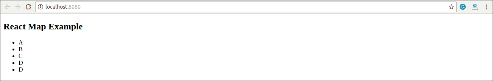
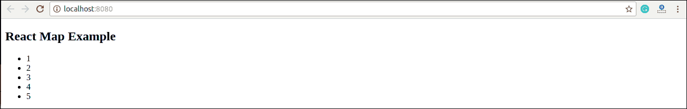

# React 图

> 原文：<https://www.javatpoint.com/react-map>

地图是一种数据收集类型，其中数据以对的形式存储。它包含一个唯一的密钥。存储在映射中的值必须映射到键。我们无法在映射()中存储重复的对。这是因为每个存储的密钥都是唯一的。它主要用于快速搜索和查找数据。

在 React 中？地图？用于遍历和显示组件的相似对象列表的方法。地图不是“React”的特征。相反，它是标准的 JavaScript 函数，可以在任何数组上调用。map()方法通过对调用数组中的每个元素调用提供的函数来创建一个新数组。

### 例子

在给定的示例中，map()函数接受一个数字数组并将其值加倍。我们将 map()返回的新数组赋给变量 doubleValue 并记录下来。

```

var numbers = [1, 2, 3, 4, 5]; 
const doubleValue = numbers.map((number)=>{ 
	return (number * 2); 
}); 
console.log(doubleValue); 

```

## 在“React”中，map()方法用于:

1.遍历列表元素。

**例**

```

import React from 'react'; 
import ReactDOM from 'react-dom'; 

function NameList(props) {
  const myLists = props.myLists;
  const listItems = myLists.map((myList) =>
    {myList}
  );
  return (

## React 图示例

  );
}
const myLists = ['A', 'B', 'C', 'D', 'D']; 
ReactDOM.render(
  ,
  document.getElementById('app')
);
export default App; 
```

**输出**



2.用键遍历列表元素。

**例**

```

import React from 'react'; 
import ReactDOM from 'react-dom'; 

function ListItem(props) {
  return {props.value};
}

function NumberList(props) {
  const numbers = props.numbers;
  const listItems = numbers.map((number) =>
    );
  return (

## React 图示例

  );
}

const numbers = [1, 2, 3, 4, 5];
ReactDOM.render(
  <numberlist numbers="{numbers}">,
  document.getElementById('app')
);
export default App;</numberlist> 
```

**输出**



* * *