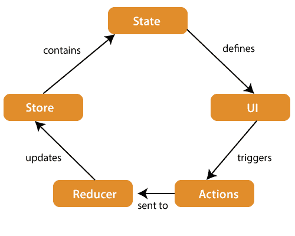
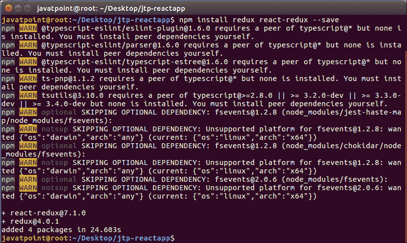

# React还原

> 原文：<https://www.javatpoint.com/react-redux>

Redux 是一个用于管理应用程序状态的开源 JavaScript 库。React 使用 Redux 构建用户界面。最早由**丹·阿布拉莫夫**和**安德鲁·克拉克**在 **2015** 推出。

React Redux 是 Redux 的官方 React 绑定。它允许 React 组件从 Redux 商店读取数据，并将**操作**发送到**商店**以更新数据。Redux 通过提供一种通过单向数据流模型管理状态的合理方法来帮助应用程序扩展。React Redux 在概念上很简单。它订阅 Redux 存储，检查您的组件想要的数据是否已经改变，并重新呈现您的组件。

Redux 的灵感来自 Flux。Redux 研究了 Flux 架构，省略了不必要的复杂性。

*   Redux 没有 Dispatcher 概念。
*   Redux 只有一个商店，而 Flux 有很多商店。
*   商店将直接接收和处理操作对象。

## 为什么要用 React Redux？

使用 React Redux 的主要原因是:

*   React Redux 是 react Application 的官方 **UI 绑定**。它与任何应用编程接口变化保持同步，以确保您的React组件按预期运行。
*   它鼓励良好的“React”架构。
*   它在内部实现了许多性能优化，这允许组件仅在实际需要时重新呈现。

## Redux 架构



Redux 体系结构的组件解释如下。

**STORE:**STORE 是你的应用程序的整个状态列表的地方。它管理应用程序的状态，并具有调度(操作)功能。它就像是 Redux 中负责所有运动部件的大脑。

**动作:**从视图中发送或分派动作，这些动作是可由减速器读取的有效载荷。它是为存储用户事件信息而创建的纯对象。它包括动作类型、发生时间、发生位置、坐标以及它打算改变的状态等信息。

**REDUCER:** Reducer 从动作中读取有效载荷，然后通过状态相应地更新存储。从初始状态返回新状态是一个纯函数。

## Redux 安装

**要求:** React Redux 需要 React 16.8.3 或更高版本。

要将 React Redux 与 React 应用程序一起使用，您需要安装以下命令。

```

$ npm install redux react-redux --save

```



* * *