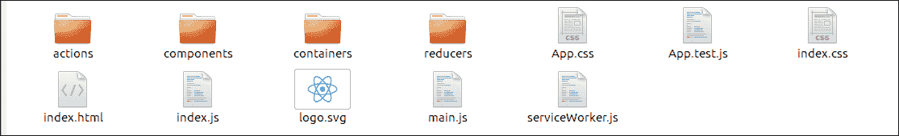
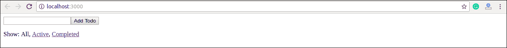
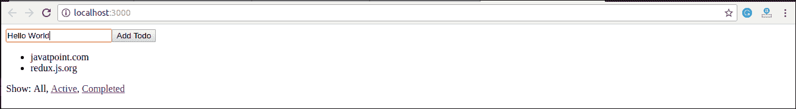

# React 还原示例

> 原文：<https://www.javatpoint.com/react-redux-example>

在本节中，我们将学习如何在 React 应用程序中实现 Redux。这里，我们提供一个简单的例子来连接 Redux 和 React。

**步骤 1** 使用**创建-React-应用程序**命令创建一个新的 React 项目。我选择项目名称:“**重新立项**现在，安装 **Redux** 和 **React-Redux** 。

```

javatpoint@root:~/Desktop$ npx create-react-app reactproject
javatpoint@root:~/Desktop/reactproject$ npm install redux react-redux --save

```

**步骤 2 创建文件和文件夹**

在这一步中，我们需要为动作、减速器、组件和容器创建文件夹和文件。创建文件夹和文件后，我们的项目如下图所示。



**第 3 步动作**

它使用“**类型**属性来通知应该发送到**商店**的数据。在这个文件夹中，我们将创建两个文件: **index.js** 和 **index.spec.js** 。这里，我们创建了一个**动作创建器**，它返回我们的动作，并为每个创建的项目设置一个 **id** 。

**Index.js**

```

let nextTodoId = 0
export const addTodo = text => ({
  type: 'ADD_TODO',
  id: nextTodoId++,
  text
})

export const setVisibilityFilter = filter => ({
  type: 'SET_VISIBILITY_FILTER',
  filter
})

export const toggleTodo = id => ({
  type: 'TOGGLE_TODO',
  id
})

export const VisibilityFilters = {
  SHOW_ALL: 'SHOW_ALL',
  SHOW_COMPLETED: 'SHOW_COMPLETED',
  SHOW_ACTIVE: 'SHOW_ACTIVE'
}

```

**Index.spec.js**

```

import * as actions from './index'

describe('todo actions', () => {
  it('addTodo should create ADD_TODO action', () => {
    expect(actions.addTodo('Use Redux')).toEqual({
      type: 'ADD_TODO',
      id: 0,
      text: 'Use Redux'
    })
  })

  it('setVisibilityFilter should create SET_VISIBILITY_FILTER action', () => {
    expect(actions.setVisibilityFilter('active')).toEqual({
      type: 'SET_VISIBILITY_FILTER',
      filter: 'active'
    })
  })

  it('toggleTodo should create TOGGLE_TODO action', () => {
    expect(actions.toggleTodo(1)).toEqual({
      type: 'TOGGLE_TODO',
      id: 1
    })
  })
})

```

**第 4 步减速器**

正如我们所知，动作只触发应用程序中的更改，而减压器指定这些更改。减速器是一个函数，它采用两个参数“动作”和“状态”来计算和返回更新的状态。它从“动作”中读取有效载荷，然后通过状态相应地更新“存储”。

在给定的文件中，每个 Reducer 管理自己的全局状态部分。每个减速器的状态参数都不同，并且对应于它所管理的“状态”部分。当应用程序变得更大时，我们可以将 Reducers 分割成单独的文件，并保持它们完全独立，管理不同的数据域。

在这里，我们使用“组合减少器”助手函数来添加我们将来可能使用的任何新的减少器。

**index.js**

```

import { combineReducers } from 'redux'
import todos from './todos'
import visibilityFilter from './visibilityFilter'

export default combineReducers({
  todos,
  visibilityFilter
})

```

全部。js

```

const todos = (state = [], action) => {
  switch (action.type) {
    case 'ADD_TODO':
      return [
        ...state,
        {
          id: action.id,
          text: action.text,
          completed: false
        }
      ]
    case 'TOGGLE_TODO':
      return state.map(todo =>
        (todo.id === action.id)
          ? {...todo, completed: !todo.completed}
          : todo
      )
    default:
      return state
  }
}
export default todos

```

**全部。spec.js**

```

import todos from './todos'

describe('todos reducer', () => {
  it('should handle initial state', () => {
    expect(
      todos(undefined, {})
    ).toEqual([])
  })

  it('should handle ADD_TODO', () => {
    expect(
      todos([], {
        type: 'ADD_TODO',
        text: 'Run the tests',
        id: 0
      })
    ).toEqual([
      {
        text: 'Run the tests',
        completed: false,
        id: 0
      }
    ])

    expect(
      todos([
        {
          text: 'Run the tests',
          completed: false,
          id: 0
        }
      ], {
        type: 'ADD_TODO',
        text: 'Use Redux',
        id: 1
      })
    ).toEqual([
      {
        text: 'Run the tests',
        completed: false,
        id: 0
      }, {
        text: 'Use Redux',
        completed: false,
        id: 1
      }
    ])

    expect(
      todos([
        {
          text: 'Run the tests',
          completed: false,
          id: 0
        }, {
          text: 'Use Redux',
          completed: false,
          id: 1
        }
      ], {
        type: 'ADD_TODO',
        text: 'Fix the tests',
        id: 2
      })
    ).toEqual([
      {
        text: 'Run the tests',
        completed: false,
        id: 0
      }, {
        text: 'Use Redux',
        completed: false,
        id: 1
      }, {
        text: 'Fix the tests',
        completed: false,
        id: 2
      }
    ])
  })

  it('should handle TOGGLE_TODO', () => {
    expect(
      todos([
        {
          text: 'Run the tests',
          completed: false,
          id: 1
        }, {
          text: 'Use Redux',
          completed: false,
          id: 0
        }
      ], {
        type: 'TOGGLE_TODO',
        id: 1
      })
    ).toEqual([
      {
        text: 'Run the tests',
        completed: true,
        id: 1
      }, {
        text: 'Use Redux',
        completed: false,
        id: 0
      }
    ])
  })
})

```

能见度滤波器. js

```

import { VisibilityFilters } from '../actions'

const visibilityFilter = (state = VisibilityFilters.SHOW_ALL, action) => {
  switch (action.type) {
    case 'SET_VISIBILITY_FILTER':
      return action.filter
    default:
      return state
  }
}
export default visibilityFilter

```

**第 5 步组件**

它是一个表示组件，关注事物的外观，如标记、样式。它专门通过道具接收数据并调用回调。它不知道数据来自哪里，也不知道如何改变它。它只呈现给他们的东西。

**App.js**

它是呈现用户界面中所有内容的根组件。

```

import React from 'react'
import Footer from './Footer'
import AddTodo from '../containers/AddTodo'
import VisibleTodoList from '../containers/VisibleTodoList'

const App = () => (

)
export default App

```

**页脚**

它告诉用户在哪里将当前可见的**更改为**。

```

import React from 'react'
import FilterLink from '../containers/FilterLink'
import { VisibilityFilters } from '../actions'

const Footer = () => (
  显示:<filterlink filter="{VisibilityFilters.SHOW_ALL}">全部</filterlink> 
 { '，' } 
 <filterlink filter="{VisibilityFilters.SHOW_ACTIVE}">激活</filterlink> 
 { '，' } 
 <filterlink filter="{VisibilityFilters.SHOW_COMPLETED}">完成</filterlink> 
)
export default Footer

```

**Link.js**

这是一个带有回调的链接。

```

import React from 'react'
import PropTypes from 'prop-types'

const Link = ({ active, children, onClick }) => {
  if (active) {
    return {children}
  }

  return (

  )
}

Link.propTypes = {
  active: PropTypes.bool.isRequired,
  children: PropTypes.node.isRequired,
  onClick: PropTypes.func.isRequired
}

export default Link

```

全部。js

它代表一个显示**文本**的待办事项。

```

import React from 'react'
import PropTypes from 'prop-types'

const Todo = ({ onClick, completed, text }) => (

```

*   {text}) Todo.propTypes = { onClick: PropTypes.func.isRequired, completed: PropTypes.bool.isRequired, text: PropTypes.string.isRequired } export default Todo

**TodoList.js【第一季第 1 集】**

这是一个显示可见 todos { id，text，completed }的列表。

```

import React from 'react'
import PropTypes from 'prop-types'
import Todo from './Todo'

const TodoList = ({ todos, onTodoClick }) => (

```

<todo key="{index}" onclick="{()">onTodoClick(index)} /> ))}</todo>

) TodoList.propTypes = { todos: PropTypes.arrayOf( PropTypes.shape({ id: PropTypes.number.isRequired, completed: PropTypes.bool.isRequired, text: PropTypes.string.isRequired }).isRequired ).isRequired, onTodoClick: PropTypes.func.isRequired } export default TodoList

**第 6 步容器**

它是一个容器组件，关注诸如数据获取、状态更新等工作方式。它向表示组件或其他容器组件提供数据和行为。它使用 Redux 状态来读取数据，并调度 Redux 动作来更新数据。

**无论如何。js**

它包含带有添加(提交)按钮的输入字段。

```

import React from 'react'
import { connect } from 'react-redux'
import { addTodo } from '../actions'

const AddTodo = ({ dispatch }) => {
  let input

  return (

<form onsubmit="{e"> {
        e.preventDefault()
        if (!input.value.trim()) {
          return
        }
        dispatch(addTodo(input.value))
        input.value = ''
      }}>
        <input ref="{node"> input = node} />
        <button type="submit">Add Todo</button> 
      </form>

  )
}
export default connect()(AddTodo)

```

**过滤链接. js**

它表示当前可见性过滤器并呈现链接。

```

import { connect } from 'react-redux'
import { setVisibilityFilter } from '../actions'
import Link from '../components/Link'

const mapStateToProps = (state, ownProps) => ({
  active: ownProps.filter === state.visibilityFilter
})

const mapDispatchToProps = (dispatch, ownProps) => ({
  onClick: () => dispatch(setVisibilityFilter(ownProps.filter))
})

export default connect(
  mapStateToProps,
  mapDispatchToProps
)(Link)

```

**可见 TodoList.js**

它过滤 todos 并呈现 TodoList。

```

import { connect } from 'react-redux'
import { toggleTodo } from '../actions'
import TodoList from '../components/TodoList'
import { VisibilityFilters } from '../actions'

const getVisibleTodos = (todos, filter) => {
  switch (filter) {
    case VisibilityFilters.SHOW_ALL:
      return todos
    case VisibilityFilters.SHOW_COMPLETED:
      return todos.filter(t => t.completed)
    case VisibilityFilters.SHOW_ACTIVE:
      return todos.filter(t => !t.completed)
    default:
      throw new Error('Unknown filter: ' + filter)
  }
}

const mapStateToProps = state => ({
  todos: getVisibleTodos(state.todos, state.visibilityFilter)
})

const mapDispatchToProps = dispatch => ({
  toggleTodo: id => dispatch(toggleTodo(id))
})

export default connect(
  mapStateToProps,
  mapDispatchToProps
)(TodoList)

```

**第 7 步储存**

所有容器组件都需要访问 Redux Store 才能订阅它。为此，我们需要将其作为一个道具传递(存储)给每个容器组件。然而，它变得乏味。因此，我们建议使用名为<provider>的特殊 React Redux 组件，该组件使存储可用于所有容器组件，而无需显式传递它。它在渲染根组件时使用过一次。</provider>

**index.js**

```

import React from 'react'
import { render } from 'react-dom'
import { createStore } from 'redux'
import { Provider } from 'react-redux'
import App from './components/App'
import rootReducer from './reducers'

const store = createStore(rootReducer)

render(
  ,
  document.getElementById('root')
)

```

**输出**

当我们执行应用程序时，它给出的输出如下图所示。



现在，我们将能够在列表中添加项目。



React-Redux 示例的详细解释可以在这里显示:[https://redux.js.org/basics/usage-with-react](https://redux.js.org/basics/usage-with-react)。

* * *