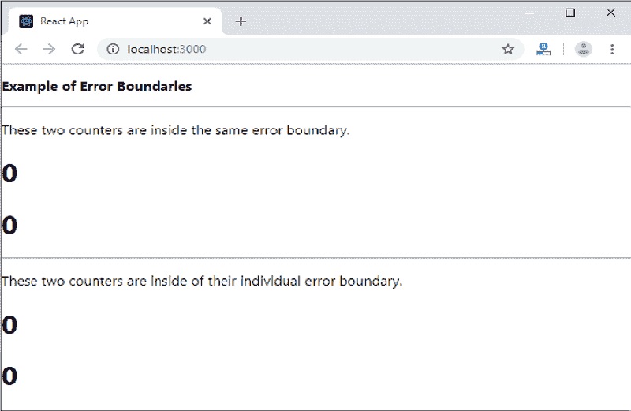
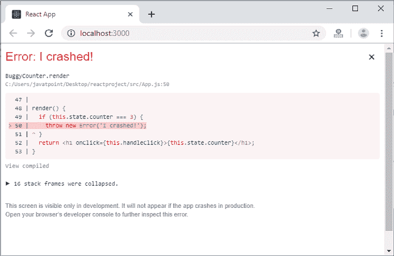

# React错误边界

> 原文：<https://www.javatpoint.com/react-error-boundaries>

在过去，如果我们在组件内部得到任何 JavaScript 错误，就会破坏 React？的内部状态，并在下次渲染时将 React 置于断开状态。React 组件中没有处理这些错误的方法，也没有提供任何方法来从中恢复。但是， **React 16** 引入了一个新概念，通过使用**误差边界**来处理误差。现在，如果在用户界面的一部分发现任何 JavaScript 错误，它不会破坏整个应用程序。

错误边界是 React 组件，它在我们的应用程序中的任何地方捕捉 JavaScript 错误，记录这些错误，并显示回退用户界面。它不会破坏整个应用程序组件树，只在组件出现错误时呈现回退用户界面。错误边界捕捉组件生命周期方法中呈现的错误，以及它们下面的整个树的构造函数。

<fieldset><legend class="legendfont">Note:</legend>

有时，不可能在 React 应用程序中捕捉错误边界。这些是:

*   事件处理程序
*   异步代码(例如 setTimeout 或 requestAnimationFrame 回调)
*   服务器端渲染
*   错误是在错误边界本身而不是其子级中抛出的。

</fieldset>

对于简单的 React 应用程序，我们可以声明一次错误边界，并可以将其用于整个应用程序。对于具有多个组件的复杂应用程序，我们可以声明多个错误边界来恢复整个应用程序的每个部分。

我们还可以将错误报告给类似 **Rollbar** 的错误监控服务。这种监控服务能够跟踪有多少用户受到错误的影响，找到错误的原因，并改善用户体验。

## 类中的错误边界

如果一个类组件定义了一个新的生命周期方法，或者是静态的 getDerivedStateFromError()或者是组件捕获(error，info)，那么这个类组件就会成为一个错误边界。当抛出错误时，我们可以使用静态 getDerivedStateFromError()来呈现回退 UI，并且可以使用 componentDidCatch()来记录错误信息。

一个错误边界可以吗？不要抓住错误本身。如果错误边界未能呈现错误消息，错误将转到它上面最近的错误边界。它类似于 JavaScript 中的 catch {}块。

## 如何实现错误边界

**第 1 步**创建一个类，扩展 React 组件并传递其中的道具。

**步骤-2** 现在，添加 componentDidCatch()方法，该方法允许您捕获树中它们下面的组件中的错误。

**Step-3** 接下来添加 render()方法，负责组件应该如何渲染。例如，它将显示类似“有问题”的错误消息

### 例子

```

class ErrorBoundary extends React.Component {
  constructor(props) {
    super(props);
    this.state = { hasError: false };
  }
  static getDerivedStateFromError(error) {
    // It will update the state so the next render shows the fallback UI.
    return { hasError: true };
  }
  componentDidCatch(error, info) {
    // It will catch error in any component below. We can also log the error to an error reporting service.
    logErrorToMyService(error, info);
  }
  render() {
    if (this.state.hasError) {
        return (
      	<div>Something is wrong.</div>;
	);
    }
    return this.props.children; 
  }
}

```

**Step-4** 现在，我们可以将其作为常规组件使用。在 HTML 中添加新组件，您希望将它包含在错误边界中。在这个例子中，我们在 MyWidgetCounter 组件周围添加了一个错误边界。

```

<ErrorBoundary>
       <MyWidgetCounter/>
</ErrorBoundary>

```

## 错误边界的位置

一个错误的边界完全取决于你。您可以在应用程序组件的顶层使用错误边界，或者将其包装在单个组件上，以防止它们破坏应用程序的其他部分。

让我们看一个例子。

```

import React from 'react';
import './App.css'

class ErrorBoundary extends React.Component {
  constructor(props) {
    super(props);
    this.state = { error: false, errorInfo: null };
  }

  componentDidCatch(error, errorInfo) {
    // Catch errors in any components below and re-render with error message
    this.setState({
      error: error,
      errorInfo: errorInfo
    })
  }

  render() {
    if (this.state.errorInfo) {
      return (
        <div>
          <h2>Something went wrong.</h2>
          <details style={{ whiteSpace: 'pre-wrap' }}>
            {this.state.error && this.state.error.toString()}
            <br />
            {this.state.errorInfo.componentStack}
          </details>
        </div>
      );
    }
    return this.props.children;
  }  
}

class BuggyCounter extends React.Component {
  constructor(props) {
    super(props);
    this.state = { counter: 0 };
    this.handleClick = this.handleClick.bind(this);
  }

  handleClick() {
    this.setState(({counter}) => ({
      counter: counter + 1
    }));
  }

  render() {
    if (this.state.counter === 3) {
      throw new Error('I crashed!');
    }
    return <h1 onClick={this.handleClick}>{this.state.counter}</h1>;
  }
}

function App() {
  return (
    <div>
      <p><b>Example of Error Boundaries</b></p>
      <hr />
      <ErrorBoundary>
        <p>These two counters are inside the same error boundary.</p>
          <BuggyCounter />
          <BuggyCounter />
      </ErrorBoundary>
      <hr />
      <p>These two counters are inside of their individual error boundary.</p>
        <ErrorBoundary><BuggyCounter /></ErrorBoundary>
        <ErrorBoundary><BuggyCounter /></ErrorBoundary>
    </div>
  );
}
export default App

```

在上面的代码片段中，当我们点击**数字**时，它会增加**计数器**。计数器编程为当到达 **3** 时**抛出**错误。它模拟组件中的一个 JavaScript 错误。这里，我们在**两种方式**中使用了一个错误边界，如下所示。

**首先**，这两个计数器在同一误差边界内。如果有人崩溃，错误边界将取代他们两个。

```

<ErrorBoundary>
          <BuggyCounter />
          <BuggyCounter />
</ErrorBoundary>

```

**其次**，这两个计数器在其各自的误差边界内。因此，如果有人崩溃，另一个人不会受到影响。

```

<ErrorBoundary><BuggyCounter /></ErrorBoundary>
<ErrorBoundary><BuggyCounter /></ErrorBoundary>

```

**输出:**

当我们执行上述代码时，我们将获得以下输出。



当计数器达到 3 时，它给出以下输出。



## 未捕获错误的新行为

这是一个与错误边界相关的重要含义。如果错误没有被任何错误边界捕捉到，将导致整个 React 应用程序的**卸载**。

## 事件处理程序中的错误边界

错误边界不允许在事件处理程序中捕获错误。React 不需要任何错误边界来从事件处理程序中的错误中恢复。如果需要在事件处理程序中捕捉错误，可以使用 JavaScript **try-catch** 语句。

在下面的示例中，您可以看到事件处理程序将如何处理错误。

```

class MyComponent extends React.Component {
  constructor(props) {
    super(props);
    this.state = { error: null };
    this.handleClick = this.handleClick.bind(this);
  }

  handleClick() {
    try {
      // Do something which can throw error
    } catch (error) {
      this.setState({ error });
    }
  }

  render() {
    if (this.state.error) {
      return 
          <h2>It caught an error.</h2>
    }
    return <div onClick={this.handleClick}>Click Me</div>
  }
}

```

* * *