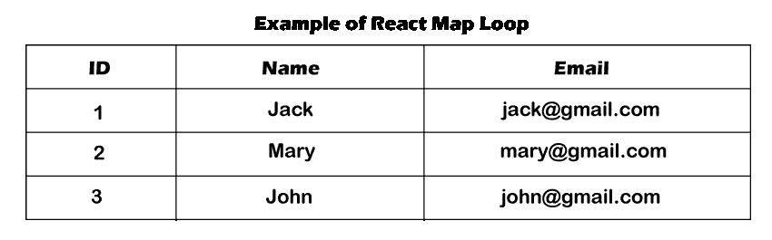

# React JS 中的循环数组|React每个循环示例

> 原文：<https://www.javatpoint.com/loop-array-in-reactjs>

在本节中，我们将使用数组来解释渲染中的 reach native 循环。为此，我们在渲染中描述了一个 react 循环数组示例。当我们想要构建任何 web 应用程序时，掌握处理大量数据的知识是非常重要的。在这个例子中，我们将看到循环在 [react js](https://www.javatpoint.com/reactjs-tutorial) 中的使用。在我们给出的例子中，我们将在 react js 中使用 for 循环。要执行此操作，我们必须遵循一些步骤。

在这一部分，我们将使用 react app。当我们需要一个 map、foreach 循环和 for 循环 in react 时，我们可以看下面的例子来学习循环数组 n react js 的用法。在数组中，我们总是想要 for 循环和 foreach 循环。当我们想要在 reach 中循环数组时，需要一张地图来完成。因此，我们将解释 react native 中的地图示例。map()方法会创建一个新数组。在调用数组中，它提供对每个元素调用函数的结果。这样可以简化循环过程。当我们使用映射时，我们不需要使用 forEach 函数和 for 循环。Map，forEach 循环，for 循环有很多区别。map 函数使用数据并创建一个新数组，而不是覆盖现有数据。由于地图功能的所有特性和简单性，React 文档强烈鼓励我们使用地图功能。

我们将在 react app 中提供两个例子来解释这个简单的概念。在第一个例子中，我们将描述 react 循环，它有一个一维数组。在第二个例子中，我们将描述一个具有多维数组的循环。这两个例子如下:

**例 1:**

RC/app . js

```

import React from 'react';

function App() {

  const myArray = ['Jack', 'Mary', 'John', 'Krish', 'Navin'];

  return (
    <div className="container">	
        <h1> Example of React Map Loop </h1>

        {myArray.map(name => (
          <li>
            {name}
          </li>
        ))}

    </div>
  );
}

export default App;

```

**例 2:**

**src/App.js**

```

import React from 'react';

function App() {

 const students = [
              {
                'id': 1, 
                'name': Jack, 
                'email': 'jack@gmail.com'
              },
              {
                'id': 2, 
                'name': 'Mary', 
                'email': ?mary@gmail.com'
              },
              {
                'id': 3, 
                'name': 'John', 
                'email': 'john@gmail.com'
              },
          ];

  return (
    <div className="container">
        <h1> Example of React Map Loop </h1>

        <table className="table table-bordered">
            <tr>
                <th>ID</th>
                <th>Name</th>
                <th>Email</th>
            </tr>

            {students.map((student, index) => (
              <tr data-index={index}>
                <td>{student.id}</td>
                <td>{student.name}</td>
                <td>{student.email}</td>
              </tr>
            ))}

        </table>

    </div>
  );
}

export default App;

```

运行此示例后，我们将获得以下预览:



* * *