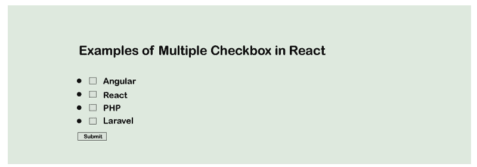

# React 多个复选框

> 原文：<https://www.javatpoint.com/react-multiple-checkbox>

在本节中，我们将学习在 React 中使用多个复选框。我们将看到使用 ReachJS 来获取所有选中的值。在下面的例子中，我们将展示如何从多个复选框中获取价值。

有时我们必须根据用户需求设置多个复选框。我们可以设置选择水果的选项，用户可以根据自己的选择进行选择。如果用户希望从列表中选择多个选项，他们也可以这样做。在这种情况下，我们需要在 [ReactJS](https://www.javatpoint.com/reactjs-tutorial) 中放置多个复选框。为此，以下示例将帮助我们理解 react 中多个复选框的使用。

在我们下面的例子中，我们将采用一个类别的数组，它将包含 React、 [Laravel](https://www.javatpoint.com/laravel) 、 [PHP](https://www.javatpoint.com/php-tutorial) 、Angular 等。我们将使用地图循环显示动态的多个复选框。我们将创建一个名为“checkedItems”的变量来存储用户选择的复选框的信息。当用户提交表单时，他们将获得所有选中复选框的值。执行此操作的示例代码如下:

**示例代码:**

```

import React, { Component } from 'react';
import { render } from 'react-dom';

class App extends Component {
  constructor() {
    super();
    this.state = {
      categories: [
        {id: 1, value: "Angular"},
        {id: 2, value: "React"},
        {id: 3, value: "PHP"},
        {id: 4, value: "Laravel"}
      ],
      checkedItems: new Map()
    };

    this.handleChange = this.handleChange.bind(this);
    this.handleSubmit = this.handleSubmit.bind(this);
  }

  handleChange(event) {
        var isChecked = event.target.checked;
        var item = event.target.value;

        this.setState(prevState => ({ checkedItems: prevState.checkedItems.set(item, isChecked) }));
  }

  handleSubmit(event) {
    console.log(this.state);
    event.preventDefault();
  }

  render() {
    return (
      <div>
        <h1> Examples of Multiple Checkbox in React </h1>

        <form onSubmit={this.handleSubmit}>

          {
            this.state.categories.map(item => (
              <li>
                <label>
                  <input
                    type="checkbox"
                    value={item.id}
                    onChange={this.handleChange}
                  /> {item.value}
                </label>
              </li>
            ))
          }

          <br/>
          <input type="submit" value="Submit" />
        </form>
      </div>
    );
  }
}

render(<App />, document.getElementById('root'));

```

当我们执行上述代码时，我们将获得以下输出:



* * *