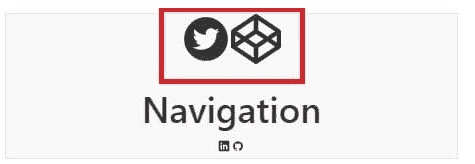

# React图标

> 原文：<https://www.javatpoint.com/react-icons>


计算机世界中的图标被定义为显示在计算机屏幕上传达某种含义的**图形表示**或**表意文字**。图标传达的特征使它们彼此分离，并使一个事物独特地存在。在所有这些方面下，它们也被通俗地称为符号，可以快速理解关于软件工具、函数、文件、数据的思想。图标代表真实世界的实体，包含详细的插图，并被设计成一个符号就能说明一切。

在本文中，我们将具体讨论React图标。React 是一个强大的动态智能库。它拥有所有这些独特的资产。在本文中，我们还将学习如何以及为什么使用React图标，并通过实际实施来进行讨论。让我们了解更多关于React图标。

## 什么是React图标？

React 是一个 JavaScript 库。同样，React Icons 也是一个开源库，它可以将应用程序世界中的所有图标一次性放在一个目录中。

## 为什么React图标？

以下原因可以正确证明为什么选择React图标。

1.  在某些情况下，一个库可能不包含所有必要的使用图标。因此，出现了安装一些其他库以将其导入项目目录的问题。React Icons 让开发人员不必为这类图标安装不同类型的软件包。
2.  ES6 导入被 React Icons 极大地利用，它允许我们只包含当前项目必需的图标。因此，它消除了与空间相关的混乱。
3.  React图标专为React而设计。这意味着它只为 react 量身定制，在我们的 React 项目中使用它不存在任何问题。
4.  实现起来很简单。

## 入门指南

要开始使用 React Icons 的实际可视化，我们只需要添加一个节点包并导入我们想要的组件。为此，我们需要通过下面给出的命令使用 npm 安装这个包。

### 安装(标准项目)

```

$ npm i react-icons--save    // NPM

$ yarn add react-icons  // Yarn

```

### 使用

```

import { FaBeer } from 'react-icons/fa';
class Question extends React.Component {
  render() {
    return <h3> Lets go for a <FaBeer />? </h3>
  }
}

```

### 安装(适用于流星、盖茨比等)

```

$ npm install @react-icons/all-files --save

```

### 使用

```

import { FaBeer } from "@react-icons/all-files/fa/FaBeer";
class Question extends React.Component {
  render() {
    return <h3> Lets go for a <FaBeer />? </h3>
  }
}

```

### 导入React图标

导入React图标非常简单。它遵循这个规则或语法。

```

import { IconName } from "react-icons/"; 
```

例如，假设我们从库中导入了多个图标。我们可以使用 ES6 的析构特性在一行代码中做到这一点。参考下面的代码。

```

import { IconName1, IconName2, ..., IconNameN } from "react-
icons/"; 
```

现在，为了实现这一点，在 App.js 文件中添加下面的代码，并导入所有必要的图标。导入多个图标的方法如下所示。

```

import { AiFillTwitterCircle } from "react-icons/ai";
import { DiGithubBadge } from "react-icons/di";
import { FaCodepen } from "react-icons/fa";
import { IoLogoLinkedin } from "react-icons/io";

```

### 输入图标标签

从 App.js 文件中的 React Icons 导入图标后，我们可以在文件中的任何地方使用它，就像我们知道的任何 HTML 标记一样。例如，考虑下面的代码，我们将只在 navbar 头的 div 标签内的 nav 部分工作。在 h1 标签前输入两个图标，在 h1 标签后输入两个图标，如下所示。

```

<div className="navbar-header">
          <AiFillTwitterCircle />
          <FaCodepen />

          <h1>Navigation</h1>

          <IoLogoLinkedin />
          <DiGithubBadge />
  </div>

```

图标会像这样出现。


就像这样，我们可以在应用程序的不同部分添加多个图标。就这么简单。

### 图标样式

图标的样式通常有多种方法。在这种情况下，我们将只使用两种方式来设计 React 图标的样式，以保持它们的整洁和易于理解。

1.  React上下文应用编程接口。
2.  样式化组件。

**使用React上下文应用编程接口**

我们可以选择在“React”中设置一个图标或多个图标的样式。我们需要包装标签中的所有图标，并设计标签中所需图标的样式。

为了理解它是如何完成的，请导入上下文应用编程接口并将其添加到文件的顶部，如下所示。

```

import { IconContext } from "react-icons";
Styling more than one Let's wrap the first 2 icons and assign a 
className to it like so:
<div className="navbar-header">
  <IconContext.Provider value={{ className: "top-react-icons" }}>
    <AiFillTwitterCircle />
    <FaCodepen />
  </IconContext.Provider>
  <h1>Navigation</h1>
  <IoLogoLinkedin />
  <DiGithubBadge />
</div>

```

让我们为 App.js 文件中添加的React图标设置样式，如下所示。

```

.top-react-icons{
  font-size: 5rem;
}

```

上面的 CSS 代码会增加字体大小。要可视化这一点，打开浏览器，结果应该如下所示。



让我们通过设计单个元素来继续前进。要做到这一点，首先，改变在另一边出现的每个图标的颜色。下面给出了完整的代码片段来帮助我们。

```

<div className="navbar-header">
{/* styling multiple icons */}
   <IconContext.Provider value={{ className: "top-react-icons" }}>

     <AiFillTwitterCircle />
     <FaCodepen />
   </IconContext.Provider>
   <h1>Navigation</h1>

   {/* styling individual icons */}
   <IconContext.Provider value={{ color: "blue" }}>
     <IoLogoLinkedin />
   </IconContext.Provider>
   <IconContext.Provider value={{ color: "green" }}>
     <DiGithubBadge />
   </IconContext.Provider>
</div>

```

### React图标中的样式组件

假设我们熟悉 Styled 组件，让我们通过命令行安装这个组件，如下所示。

```

$ npm install --save styled-components --save

```

**导入样式组件**

```

import styled from from 'styled-components

```

用法

```

<div className="jumbotron">
    <BsFillAlarmFill />
    <h1>Header</h1>
    <BsFillArchiveFill />
  </div>

```

现在，向下移动到 App.js 中的最后一行，添加如下所示的样式。

```

const Archive  = styled(BsFillArchiveFill)`
  color: purple;
  transform: scale(2);
  margin: 5%;
`;

```

添加另一个样式化的组件，如**报警，**，如下所示。

```

const Alarm = styled(BsFillAlarmFill)`
  color: red;
  transform: scale(2);

  margin: 5%;
`;

```

要将这些样式化的组件应用于 App.js 文件中使用的图标，请使用如下所示的方法。

```

<div className="jumbotron">
          <Alarm />
          <h1>Header</h1>
          <Archive />
        </div>

```

值得注意的是，我们所做的只是将组件重命名为样式化组件并保存更改。就这么简单。最终输出可能看起来像这样。


这是让我们熟悉React图标以及React图标的不同组件如何用于在网站或网络应用程序上添加不同类型的图标的例子之一。

让我们看看使用React图标的一些优点和缺点。

### 优势

优点如下:

1.  React图标的特点是一次只导入一个所需的图标，或者根据需要导入多个图标。
2.  “React”中的图标很容易使用。使用React图标，一个库在一个地方提供所有图标。需要其他图标生成器或目录来添加或安装现有项目的依赖项，但 React Icons 的情况并非如此。
3.  对于 JavaScript 开发人员来说，React 很容易学习，而且有了 React Icons 的特性，他们不需要为在他们正在处理的应用程序上生成图标编写任何额外的 CSS。
4.  CSS 需要精准，但是有了 React Icons，我们就不需要太在意 CSS 了。虽然大小和颜色可以很容易地修改，但它比React图标相对容易。

### 不足之处

1.  React图标需要多次导入。即使对于 App.js 文件中需要导入的一个或多个图标，导入的数量也与图标的数量成正比。
2.  除了导入，React图标仅限于React。虽然它们可以在没有库和框架的情况下使用，但它们最适合 React，这可能是其他框架的另一个缺点。

### 结论

图标是不可或缺的一部分，不需要任何解释。它们在分离软件的用户界面并使它们在他们的类中独一无二方面起着至关重要的作用。它还能吸引用户了解用户看到的一些重要功能以及他们如何使用这些功能。许多图标保留在React图标中，用户只需简单的导入就可以随时使用它。

除此之外，有趣的是，我们可以在一个包中获得 react 项目所需的所有图标。让 React 图标独一无二的另一个原因是它们非常容易使用。在本教程中，我们看到了除了React图标之外的不同类型的其他组件如何被用来设计和开发我们的项目。我们还遇到了如何开始使用 React 图标，并为标准项目和其他框架安装它们。我们后来了解了React图标的优点和缺点。React 很容易学习和实现，前提是你需要对 JavaScript 有很好的掌握，并且添加更多。React图标也有助于思路清晰。

* * *