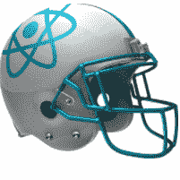

# 反应头盔

> 原文：<https://www.javatpoint.com/react-helmet>



每个开发者都渴望自己的网站出现在浏览器的搜索结果页面的顶部。不幸的是，在某些情况下，搜索引擎爬虫不能证明是可靠的。出现此问题是因为浏览器无法呈现 JavaScript。这意味着建立在 **React** 或 **Angular 平台**上的 SPA 无法偏向搜索引擎爬虫。这是开发人员面临的最重要的问题之一，将他们的页面放在网页的顶部。因此，为了解决这个问题，可以使用服务器端渲染，但它通常有适应的限制。这就是反应头盔来救援的地方。

## 什么是反应头盔？

反应头盔可以被称为基于反应的应用的文档**头部管理器**。使用它，开发人员更新服务器端和客户端的元标签变得非常容易。这个库可以被称为完美的应用程序，其中搜索引擎优化发挥着至关重要的作用。这也是一个媒体友好的库，具有不同的依赖关系和功能，使其在任何 React 应用程序中都易于使用。我们将研究本教程中的所有方面，并看看如何将反应头盔添加到您的项目中。

### 设置

在进一步行动之前，我们需要使用传统且最有效的 npm 方法安装 React 头盔。我们将首先使用一些命令初始化一个新的 React 项目，并在服务器准备好之后开始开发过程。

要安装和初始化反应头盔，请遵循以下命令。

```

 npx create-react-app react-helmet-tutorial
cd react-helmet-tutorial
npm start 

```

确保系统端口 3000 已被占用，然后您可以直接前往 **http://localhost:3000** 查看您的应用程序。

## 新创建的反应应用程序

我们可能已经知道，像大多数可用的 SPa 一样，我们的应用程序将有一个默认的元素。如果我们移动到浏览器进行检查，并在 Chrome 中按 F12 或在 Firefox 浏览器中使用 Ctrl+Shift+C，就可以很容易地验证这一点。分析 Chrome 上的内容，我们可能会看到元素是什么样子的。

```

<head>
    <meta charset="utf-8">
    <link rel="icon" href="/favicon.ico">
    <meta name="viewport" content="width=device-width, initial-scale=1">
    <meta name="theme-color" content="#000000">
    <meta name="description" content="Web site created using create-react-app">
    <link rel="apple-touch-icon" href="/logo192.png">

    <link rel="manifest" href="/manifest.json">

    <title>React App</title>
  <style type="text/css">
   <!-- CSS -->
  </style>
</head>

```

还有另一种方法来管理。这是通过更新 public/index.html 目录来完成的，但不应该总是一种替代方法，因为这是一种不好的做法。在这一步之后，我们需要在我们的项目中安装和使用反应头盔。

## 安装和设置

反应头盔可以安装到你的反应项目通过纱或 npm 使用下面给出的命令。

```

npm install react-helmet

# OR, using Yarn:

yarn add react-helmet

```

接下来是导入头盔组件的过程。一旦完成，我们可以轻松地将元素添加到文档的中。请参见下面的代码片段中如何实现以下步骤。

```

// src/App.js

import React from "react";
import "./App.css";
import { Helmet } from "react-helmet";

function App() {
  return (
    <div className="App">

      <Helmet>
        <html lang="en" />
        <title>React Helmet Tutorial</title>
        <meta name="description" content="Tutorial for React Helmet" />
        <meta name="theme-color" content="#E6E6FA" />
      </Helmet>

      <header className="App-header">Title will be React Helmet 
Tutorial</header>
    </div>
  );
}
export default App;

```

只要将上述代码片段更新到目录 src/App.js 文件中，我们就会注意到 React 应用程序中的变化。

在这段代码中，为了便于理解，我们仅使用了<title>、和<meta/>标签元素进行描述，并且还对其他元素(如<strong>基础、元、链接、脚本、</strong>等)使用了一定量的主题颜色。这些元素通常被视为头盔的孩子。下面是我们可以看到为 body 标签和 html 标签定义的属性的例子。</title>

```

 <Helmet>
        {/* html attributes */}
        <html lang="en" />

        {/* body attributes */}
        <body className="dark" />

        {/* title element */}
        <title>React Helmet Tutorial</title>

        {/* base element */}
        <base target="_blank" href="https://blog.logrocket.com/" />

        {/* meta elements */}
        <meta name="description" content="Tutorial for React Helmet" />

        <meta name="theme-color" content="#E6E6FA" />

        {/* link elements */}
        <link rel="canonical" href="https://blog.logrocket.com/" />
</Helmet>

// src/Child.js

import React from "react";
import { Helmet } from "react-helmet";
function Child() {
  return (
    <div>
      <Helmet>
        <title>Child Component Rocks!</title>
      </Helmet>
     {"  "}  This time title will be  Child Component Rocks! 
    </div>
  );
}
export default Child;

```

#### 注意:在上面的例子中有歧义，因为我们可能不知道偏好是给孩子还是给父母。

为了澄清这一点，优先考虑子组件。考虑下面的代码:

```

// src/Child.js

import React from "react";
import { Helmet } from "react-helmet";
function Child() {
  return (
    <div>
      <Helmet>
        <title>Child Component Rocks!</title>
      </Helmet>
     {"  "}  This time title will be  Child Component Rocks! 
    </div>
  );
}
export default Child;

```

现在，要将子组件(即 Child.js 文件)导入到父组件(即 App.js 文件)中，我们一定不要忘记根据子组件更改文档的标题。但是，了解元数据和主题颜色不能被覆盖也很重要。下面给出的代码片段显示了相同的演示。

```

// src/App.js

import React from "react";
import "./App.css";
import { Helmet } from "react-helmet";
import Child from "./Child";
function App() {
  return (
    <div className="App">
      <Helmet>
        <title>React Helmet Tutorial</title>
        <meta name="description" content="Tutorial for React Helmet" />
        <meta name="theme-color" content="#E6E6FA" />
      </Helmet>

      <header className="App-header">
        Title will not be React Helmet Tutorial <Child />
      </header>
    </div>
  );
}
export default App;

```

这里要考虑的另一个例子是，在两个子组件之间，稍后发生的那个总是被给予最大的优先权。例如，考虑两个子组件<child1>和<child2>，那么<child2>将被给予优先权，反之亦然。下面给出了支持这一说法的演示。</child2></child2></child1>

```

// src/App.js
import React from "react";
import "./App.css";
import { Helmet } from "react-helmet";
import Child1 from "./Child1";
import Child2 from "./Child2";
function App() {
  return (
    <div className="App">
      <Helmet>
        <title>React Helmet Tutorial</title>
        <meta name="description" content="Tutorial for React Helmet" />
        <meta name="theme-color" content="#E6E6FA" />
      </Helmet>
      <header className="App-header">
        Title will not be React Helmet Tutorial 

        <Child1 />
        <Child2 />
      </header>
    </div>
  );
}
export default App;

```

从上面的代码可以明显看出，标题将根据<child2>组件进行设置。如果顺序颠倒，则<child1>将被设置为首选项。这可以通过下面显示的代码片段来显示。</child1></child2>

```

 <header className="App-header">
        Title will not be React Helmet Tutorial 
        <Child2 />
        <Child1 />
</header>

```

## 带安全气囊系统集成的反应头盔

正如我们之前所讨论的，React 头盔大多被提名为驻留在应用服务器端的应用渲染的最佳合作伙伴；通过设置一个示例 React SSR 应用程序，您可以轻松地引用这些术语。因此，在应用程序的服务器端代码中，就在 ReactDOMServerr 的 renderToString 或 renderToStaticMarkup 之后，我们需要在头盔中应用呈现静态的方法。为了说明它是如何实现的，请考虑下面的代码片段。

```

// server/index.js
import React from "react";
import { renderToString } from "react-dom/server";
import express from "express";
import App from "./src/App";
import { Helmet } from "react-helmet";
const app = express();  

app.get("/*", (req, res) => {
  const app = renderToString(<App />);
  const helmet = Helmet.renderStatic();

  const html = `
  <!DOCTYPE html>
  <html ${helmet.htmlAttributes.toString()}>
    <head>
      ${helmet.title.toString()}
      ${helmet.meta.toString()}
      ${helmet.link.toString()}
    </head>
    <body ${helmet.bodyAttributes.toString()}>
      <div id="root">
        ${app}
      </div>
      </body>
  </html>
`;
    res.send(html);
});
app.listen(8000);

```

重要的是要理解，在每个头盔属性中，都有一个 toString()的方法。这个方法主要用在 HTML 字符串内部。它也是头盔渲染静态的一个实例，通常返回所有的属性，如**脚本、链接、标题、**等。，所有这些属性都包含默认的 toString()方法。

同步工作并不总是一个好的选择，以继续进行反应头盔的 SSR 实施。如果我们是开放的或者被绑定来进行像流式传输这样的异步请求，那么反应头盔将会导致潜在的威胁和错误。因此，为了解决这个问题，我们使用了 react-头盔-async 方法。该方法通过显式分叉 React 头盔来解决这个问题。要安装它，我们需要在节点环境中运行以下终端命令。

```

 npm i react-helmet-async

```

在运行这个命令之后，我们需要确保除了只使用 HelmetProvider 之外的所有内容都被保留下来，以便在服务器端和客户端封装反应树。这方面的简单演示如下所示。

```

// src/App.js
import React from "react";
import "./App.css";
import  {Helmet, HelmetProvider } from 'react-helmet-async';
function App() {
  return (
    <HelmetProvider>
    <div className="App">
      <Helmet>
        <title>React Helmet Tutorial</title>
        <meta name="description" content="Tutorial for React Helmet" />
        <meta name="theme-color" content="#E6E6FA" />
      </Helmet>
      <header className="App-header">
        Title will be React Helmet Tutorial 
      </header>
    </div>
    </HelmetProvider>
  );
}
export default App;

```

## 反应头盔和反应路由器

如果正在构建的应用程序使用 React Router 进行路由，React 头盔会非常有效。与之相关的一个问题是，我们需要在每台路由器上使用 React 头盔，因此路由保持不变，这可以通过下面的代码片段来演示。

```

// src/App.js
import React from "react";
import { Helmet } from "react-helmet";
import { BrowserRouter, Switch, Route, Link } from "react-router-dom";
import Home from './Home'
import About from './About'
export default function App() {
  return (
    <div>
      <BrowserRouter>
        <Switch>
          <Route exact path="/">
            <Home />
          </Route>
          <Route path="/about">
            <About />
          </Route>
        </Switch>
      </BrowserRouter>
    </div>
  );
}
Where Home.js is:

// src/Home.js
import React from "react";
import { Helmet } from "react-helmet";
import {  Link } from "react-router-dom";

const Home = () => (
  <div>
    <Helmet>
      <title>Home</title>
    </Helmet>
    <h2>Home.</h2>
    <Link to="/about">About</Link>
  </div>
);

export default Home
And About.js is:

// src/About.js
import React from "react";
import { Helmet } from "react-helmet";
import {  Link } from "react-router-dom";

const About = () => (
  <div>
    <Helmet>
      <title>About</title>
    </Helmet>
    <h2>About.</h2>
    <Link to="/">Home</Link>
  </div>
);
export default About;

```

这就是如何使用反应头盔和反应路由器进行路由，并且该方法可以使用尽可能多的路由。

## 结论

在本教程中，我们学习了如何安装，设置和使用反应头盔。React 头盔是一个强大的库，主要用作文档头管理器，将我们的搜索引擎优化带到网页的顶部。它体积小，使用方便，如果构建应用程序的目的是保持在图表的顶端，那么它比同类库中的任何库都要持久。

* * *